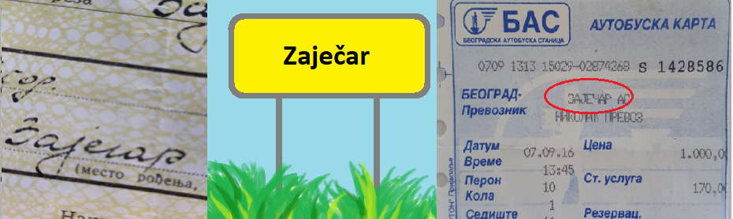

ИКТ у савременом друштву
=========================

Информационо-комуникационе технологије - где и како их користимо?
-----------------------------------------------------------------

Од давнина је човек прикупљао и обрађивао податке. Рачунао на прсте, помоћу каменчића, штапића, записима у дрвету, на зиду пећине, глиненим плочицама… 

Касније су настале разне врсте рачунаљки и других помагала за бележење података, рачунање, чување и прослеђивање информација. Технолошка средства за прикупљање, обраду, складиштење и дистрибуирање информација развијала су се вековима и што се више развијало људско друштво, што је више било научних открића, сазнања, фабрика, становништва, вести, путовања, информационо-комуникационе технологије постајале су све значајније и имале све већи утицај на људско друштво.  

Из прича твојих старијих укућана и рођака, из књига и филмова, сигурно знаш како се комуницирало пре 10, 50 или 100 година. Ако желиш да знаш како је и шта ради неко ко живи на другом крају планете, данас то можеш да сазнаш са пар секунди - довољно је да сте обоје присутни на неком сервису на интернету, а цена те комуникације, под условом да већ имаш рачунар или „паметни” телефон и интернет-везу, је занемарљива. Пре десетак година чули бисте се путем мобилног телефона и тај разговор би био веома скуп. Пре 50 година разменили бисте писма, која би што авионским што железничким саобраћајем стигла за неколико дана или можда пар недеља. Пре сто година, писмо би путовало бродом и можда би били потребни месеци да писмо стигне на одредиште.

Слична се промена одиграла кад је у питању јавно информисање - од „добошара” на сред села и коњаника, преко штампаних новина, телеграфа, радија и телевизије, до данашњих дана кад у року од неколико минута од неког догађаја било где на планети, може о томе да се види вест на интернету.

Ово су само два примера где видимо како је информационо друштво преобликовало путовање вести. Али, промене су се десиле у свим областима друштва. Данас можеш да купиш нешто преко интернета на пример у Кини или Јапану, да сазнаш где се у протеклих пола сата десио земљотрес, где пада киша, где се тренутно налази авион којим путује неко кога очекујеш, да платиш рачуне, да сазнаш било шта што те интересује из неке научне области без одласка у библиотеку, завршиш преко интернета факултет у некој страној земљи а све време си код своје куће… 

За све те промене које су се десиле у људском друштву а које карактерише брзина и количина преноса информација и њихова важност, каже се да живимо у „информационом друштву”. Хајде да откријемо шта то значи...
 

Информатика - шта је то?
------------------------

Број "5" је податак. Међутим кад се тај податак нађе на различитим местима, у различитим контекстима, добијамо различите информације.
Погледај слику. Какве нам све информације даје податак "5" на ситуацијама приказаним на слици

.. image:: ../../_images/1_broj5.png
   :width: 600px   
   :align: center 

|

Реч "Зајечар" је такође податак, а стављена у различите контексте даје нам и различите информације:

.. infonote:: 

   **Податак** може да буде број, симбол, текст, боја...

   **Информација** се добија када се податак протумачи у контексту.

Може се рећи још и да информацију чини скуп података о неком објекту који имају неко значење, смисао...

На пример, кад сте се уписивали у школу, у формулар за упис сте унели податке о себи: име, презиме, датум и место рођења, адресу становања, назив школе смера који уписујете... Ти подаци заједно, стављени у контекст тог формулара, дају  информацију о теби, као ученику који се уписује у школу.

.. questionnote::
   
   Пронађи у свом окружењу примере појављивања једног податка у различитим контекстима, тако да дају различите информације. 

Пре него што кренемо даље, само да те подсетимо нечега што сигурно знаш из основне школе: у раду ми не уписујемо и не учитавамо појединачне податке. Ни информације. Скуп података који се чува у меморији рачунара под заједничким именом назива се **датотека** или **фајл** (енгл. file). Некада ћемо користити и израз **документ**.

Реч **"информатика"** настала је од француске речи "Informatique" што је кованица речи "информација" и "аутоматика", а то указује на предмет изучавања информатике - наука о аутоматској обради информација. У англосаксонској литератури се користи термин "Computer Science" (наука о рачунарима).

Врло често данас чујемо изразе и скраћенице попут „ИТ” (енгл. IT, ај-ти) или „ИКТ” (и-ка-те). Да ли знаш шта оне значе?

.. infonote:: 

   **ИТ** је скраћеница за појам **информационе технологије** - обухватају рачунаре и друге електронске уређаје  за прикупљање, обраду, чување, пренос и заштиту информација. Када томе додамо комуникационе технологије - којима се све то што спада у „информационе технологије” повезује ради комуникације, размене информација, долазимо до ширег појма - **информационо-комуникационе технологије** - **ИКТ** (енгл. ICT, ај-си-ти).

Сигурно често чујеш да се каже како ми данас живимо у информационом друштву - то је друштво у којем производња, обрада, чување и пренос информација обухватају велики део људске делатности.

Значај и примена рачунарске технологије у информационом друштву
---------------------------------------------------------------

Информација може да буде и роба, капитал, да обезбеди нека преимућства. На основу информација које се добијају обрадом података (као резултата мерења или истраживања) доносе се одлуке које даље одређују људске судбине, постављају се прогнозе, дијагнозе, праве планови и пројекти…

Проналазак парне машине иницирао је *прву индустријску револуцију*, електрицитет и нафта изазвали су *другу индустријску револуцију*. Појава дигитализације осамдесетих година прошлог века обележиле су *трећу индустријску револуцију*. Данашње време, време брзих комуникација, робота, вештачке интелигенције, доступности великих количина података, „интернета ствари”, виртуелне реалности и „блокчејна” сматра се периодом *четврте индустријске револуције*, када буквално све области људске делатности доживљавају трансформацију захваљујући примени рачунарске технологије.

.. image:: ../../_images/1_undraw_design_tools_42tf.png
   :width: 450px   
   :align: center

Једна од значајних карактеристика информационог друштва је прелазак са „папирног” на електронско пословање у практично свим областима људске делатности. Примере срећемо свакодневно: рачуне плаћамо електронски, код лекара сви налази и извештаји су у информационом систему, у школи више немате папирни већ електронски дневник, купује се преко интернета, заказују се термини за вађење пасоша или личне карте, када сте се уписивали у гимназију, извод из матичне књиге рођених је електронски послат из матичне службе школи,  а за време епидемије видели смо да је могуће многе послове радити преко интернета -  образовање, канцеларијске послове, састанке, па чак и неке раније незамисливе активности попут хорског певања, одласка у позориште, виртуелних путовања и посета музејима… Државе и институције чине да огромне количине података постану јавно доступне (тзв. „отворени подаци”) што омогућује свакоме да их преузме, обради и доноси самостално закључке. Највећи број занимања је данас тесно везан за ИКТ - без обзира да ли је у питању административни посао или рад у фабрици уз употребу робота и других програмабилних машина. Захваљујући ИКТ-у комуникација између најудаљенијих тачака на планети може да се обавља у „реалном времену”. Све више се користе електронски медији - уместо папирних новина читају се интернет-издања. Уместо папирних географских мапа користе се географски информациони системи, који пружају прецизнију слику и веће могућности. 

.. infonote:: 

   Пре десетак година донета је стратегија развоја информационог друштва у Републици Србији до 
   2020. године - управо до момента када је креиран и овај наставни материјал. 
   Иако је тај текст доступан на овом линку 
   `Стратегију развоја информационог друштва у Републици Србији до 2020.г <https://mtt.gov.rs/download/3/Strategija_razvoja_informacionog_drustva_2020.pdf>`_.  ми га нећемо читати у целости, али ћемо цитирати неке делове који нам могу помоћи да схватимо 
   који су то све сегменти људске делатности и које су то активности које утичу на развој информационог 
   друштва:

   „Информационе и комуникационе технологије су током само једне људске генерације револуционарно промениле начин живота, учења, рада и забаве. ИКТ све дубље трансформишу начин интеракције људи, предузећа и јавних институција.” 

Области у оквиру којих се дешавају значајне промене у смислу развоја информационог друштва су:

- Електронске комуникације

- Е-управа, е-здравство и е-правосуђе

- ИКТ у образовању, науци и култури

- Електронска трговина (е-трговина)

- Пословни сектор ИКТ

- Информациона безбедност

|

.. reveal:: dugmeupr
   :showtitle: Кад смо код е-управе…
   :hidetitle: Сакриј прозор
   
   .. infonote::
   
      Погледај које су све услуге доступне преко сервиса `еУправа <https://euprava.gov.rs/>`_.

.. questionnote::

   Знаш ли да набројиш из сваке од наведених области у оквиру којих се дешавају значајне промене у смислу развоја информационог друштва по неколико услуга за које знаш да су доступне у Србији путем интернета? Да ли неке од њих користиш ти или чланови твоје породице?

Како су ИКТ постале незамењиве у многим областима и како се ИКТ стално развија, то нам даје још једну важну карактеристику информационог друштва: сталну потребу за учењем и усавршавањем како бисмо знали како да сврсисходно употребимо технологију. Истовремено, ИКТ је и средство за то „целоживотно учење”. 

То што су ИКТ постале тако велики и важан сегмент свих људских делатности, не значи да су безопасне и да треба да се препустимо „прекомерној употреби” технологије. О томе ће бити више речи у наредним лекцијама.

.. image:: ../../_images/1_undraw_in_progress_ql6.png
   :width: 350px   
   :align: center

Друштвено организовање
----------------------

Интересантна је и једна важна тенденција - све чешће и све снажније организовање људи путем друштвених мрежа. Поводи и разлози су разноврсни: на пример, у последње време сведоци смо  многобројних еколошких и других иницијатива којима се повезују људи из разних места широм једне државе или чак широм планете како би сачували реке, шуме, чист ваздух, пијаћу воду, угрожене животињске врсте, људска права...

.. questionnote::

   Људи који се без интернета можда никада не би срели и имали прилике да се међусобно информишу и размене идеје, сада се организују у снажне еколошке покрете како би заштити животну средину. Да ли знаш за неке такве грађанске иницијативе? Потражи их на интернету.