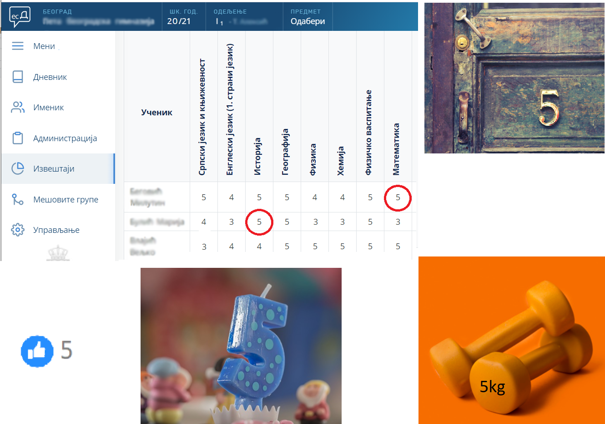
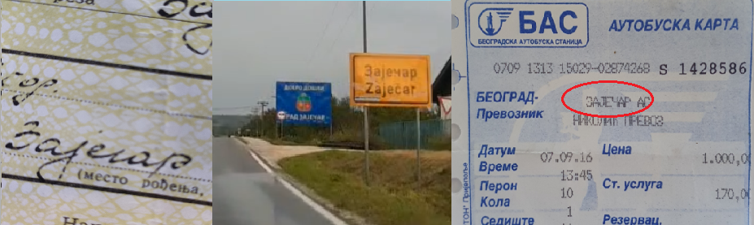

ИКТ у свакодневном окружењу
===========================

|

Информатика - шта је то?
------------------------

Број „5” је податак. Међутим кад се тај податак нађе на различитим местима, у различитим контекстима, добијамо различите информације.
Погледај слику. Какве нам све информације даје податак „5” на ситуацијама приказаним на слици?

|

Реч „Зајечар” је такође податак, а стављена у различите контексте даје нам и различите информације:

.. infonote:: 

   **Податак** може да буде број, симбол, текст, боја...

   **Информација** се добија када се податак протумачи у контексту.

Може се рећи још и да информацију чини скуп података о неком објекту који имају неко значење, смисао...

На пример, приликом уписа у школу, у формулар за уносиш податке о себи: име, презиме, датум и место рођења, адресу становања, назив школе смера који уписујеш... Ти подаци заједно, стављени у контекст тог формулара, дају  информацију о теби, као ученику који се уписује у школу.

.. questionnote::
   
   Пронађи у свом окружењу примере појављивања једног податка у различитим контекстима, тако да дају различите информације. 

Пре него што кренемо даље, само да те подсетимо на нешто што сигурно знаш из основне школе: у раду ми не уписујемо и не учитавамо ни појединачне податке ни информације. Скуп података који се чува у меморији рачунара под заједничким именом назива се **датотека** или **фајл** (енгл. *file*). У неким случајевима, (нпр. када се у датотеци налазе пословни подаци, текстуални или бројчани), користимо и израз **документ**. Осим докумената разних типова, датотека може да буде програм, аудио снимак песме, слика, видео итд.

Реч **„информатика”** настала је од француске речи „Informatique” што је кованица речи „информација” и „аутоматика”, а то указује на предмет изучавања информатике - наука о аутоматској обради информација. У англосаксонској литератури се користи термин „Computer Science” (наука о рачунарима).

Врло често данас чујемо изразе и скраћенице попут „ИТ” или „ИКТ”. Да ли знаш шта оне значе?

.. infonote:: 

   **ИТ** (енгл. IT, ај-ти) је скраћеница за појам **информационе технологије** - обухватају рачунаре и друге електронске уређаје  за прикупљање, обраду, чување, пренос и заштиту информација. Када томе додамо комуникационе технологије - којима се све то што спада у „информационе технологије” повезује ради комуникације, размене информација, долазимо до ширег појма - **информационо-комуникационе технологије** - **ИКТ** (енгл. ICT, ај-си-ти). Ови појмови се у свакодневном говору често поистовећују, јер су врло испреплетани, тако да нема пуно смисла инсистирати на разликама. 

|

Значај и примена рачунарске технологије у информационом друштву
---------------------------------------------------------------

На основу информација које се добијају обрадом података (нпр. резултата мерења или истраживања, или јавно доступних података), доносе се одлуке које даље одређују људске судбине, постављају се прогнозе, дијагнозе, праве планови и пројекти итд. То нам јасно указује на велики и растући значај информација. Сасвим је јасно да информације имају своју материјалну вредност, па могу да се схвате и као роба, односно капитал, тако да се информацијама и тргује.

Проналазак парне машине иницирао је *прву индустријску револуцију*, електрицитет и нафта изазвали су *другу индустријску револуцију*. Појава дигитализације почетком друге половине двадесетог века обележила је *трећу индустријску револуцију*. Данашње време, време брзих комуникација, робота, вештачке интелигенције, доступности великих количина података, „интернета ствари”, виртуелне реалности и „блокчејна” сматра се периодом *четврте индустријске револуције*, када буквално све области људске делатности доживљавају трансформацију захваљујући примени рачунарске технологије.

Једна од значајних карактеристика информационог друштва је прелазак са „папирног” на електронско пословање у практично свим областима људске делатности. Примере срећемо свакодневно: рачуне плаћамо електронски, код лекара сви налази и извештаји су у информационом систему, у школи имамо електронски дневник, купује се преко интернета, заказују се термини за издавање пасоша или личне карте, када сте се уписивали у гимназију, извод из матичне књиге рођених је електронски послат из матичне службе школи, а током епидемије 2020. и 2021. године видели смо да многе активности могу да се обављају преко интернета - настава, канцеларијски послови, састанци, па чак и неке раније незамисливе активности попут хорског певања, одласка у позориште, виртуелних путовања и посета музејима… 

Државе и институције омогућавају да огромне количине података постану јавно доступне (тзв. „отворени подаци”) што омогућује свакоме да их преузме, обради и самостално доноси закључке. Највећи број занимања је данас тесно повезан са ИКТ - без обзира на то да ли је у питању административни посао или рад у фабрици уз употребу робота и других програмабилних машина. Захваљујући ИКТ, комуникација између најудаљенијих тачака на планети може да се обавља у „реалном времену”. Све више се користе електронски медији - уместо папирних новина читају се интернет-издања. Уместо папирних географских мапа користе се географски информациони системи, који пружају прецизнију слику и веће могућности.

.. infonote:: 

   Пре десетак година донета је `Стратегија развоја информационог друштва у Републици Србији до 2020. године <https://mtt.gov.rs/download/3/Strategija_razvoja_informacionog_drustva_2020.pdf>`_ - управо до момента када је креиран и овај наставни материјал. 
   Иако је тај текст доступан на интернету, ми га нећемо читати у целости, али ћемо цитирати неке делове који нам могу помоћи да схватимо 
   који су то све сегменти људске делатности и које су то активности које утичу на развој информационог друштва:

   „Информационе и комуникационе технологије су током само једне људске генерације револуционарно промениле начин живота, учења, рада и забаве. ИКТ све дубље трансформишу начин интеракције људи, предузећа и јавних институција.” 

Неке од области у оквиру којих се дешавају значајне промене у смислу развоја информационог друштва су:

- Електронске комуникације

- Е-управа, е-здравство и е-правосуђе

- ИКТ у образовању, науци и култури

- Електронска трговина (е-трговина)

- Пословни сектор ИКТ

- Информациона безбедност

|

.. reveal:: dugmeupr
   :showtitle: Кад смо код е-управе…
   :hidetitle: Сакриј прозор
   
   .. infonote::
   
      Погледај које су све услуге доступне преко сервиса `еУправа <https://euprava.gov.rs/>`_.

.. questionnote::

   Можеш ли да набројиш из сваке од наведених области у оквиру којих се дешавају значајне промене у смислу развоја информационог друштва по неколико услуга за које знаш да су доступне у Србији путем интернета? Да ли неке од њих користиш ти или чланови твоје породице?

ИКТ су постале незамењиве у многим областима, а како се стално развијају унапређују и појефтињују, њихово ширење и даље је врло интензивно. Управо тај брзи развој нам даје још једну важну карактеристику информационог друштва: сталну потребу за учењем и усавршавањем како бисмо знали како да сврсисходно употребимо технологију. Истовремено, ИКТ је и средство за то „целоживотно учење”. 

То што су ИКТ постале тако велики и важан сегмент свих људских делатности, не значи да треба само да се препустимо употреби свеприсутне технологије. О опасностима, ризицима и прекомерној употреби технологије ће бити више речи у наредним лекцијама.

|

Друштвено организовање
----------------------

Интересантна је и једна важна тенденција - све чешће и све снажније организовање људи путем друштвених мрежа. Поводи и разлози су разноврсни: на пример, у последње време сведоци смо  многобројних еколошких и других иницијатива којима се повезују људи из разних места широм једне државе или чак широм планете како би сачували реке, шуме, чист ваздух, пијаћу воду, угрожене животињске врсте, људска права...

.. questionnote::

   Људи који се без интернета можда никада не би срели и имали прилике да се међусобно информишу и размене идеје, сада се организују у снажне еколошке покрете како би заштити животну средину. Да ли знаш за неке такве грађанске иницијативе? Потражи их на интернету.
