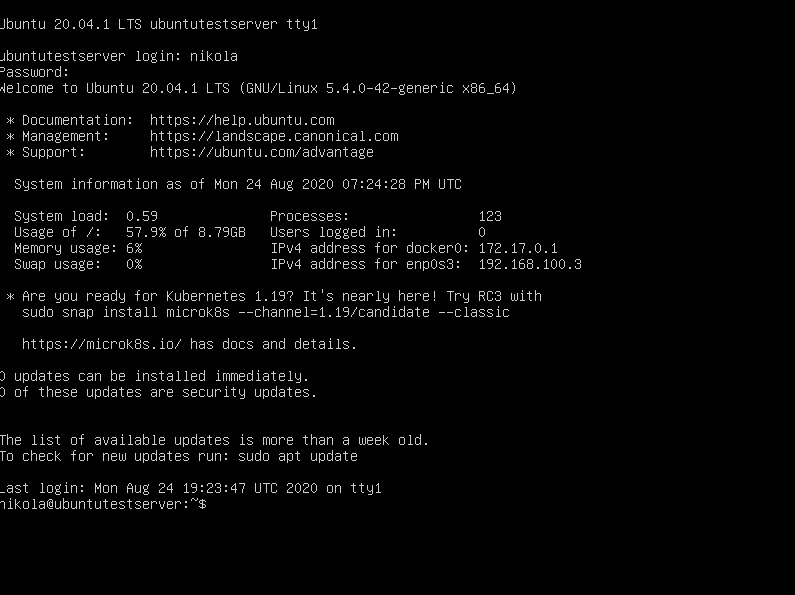
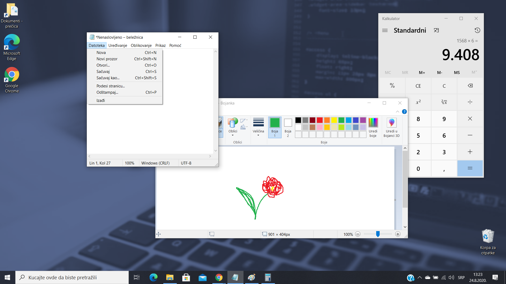
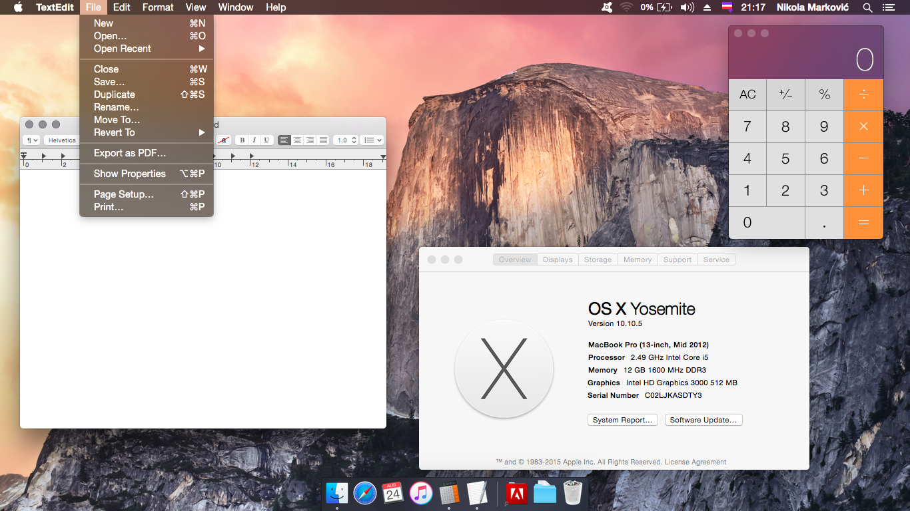
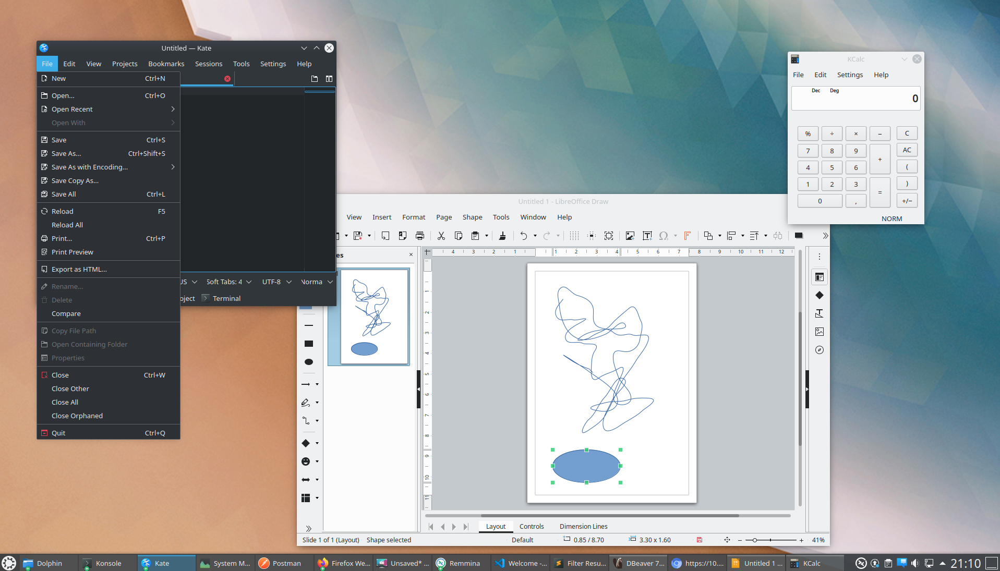
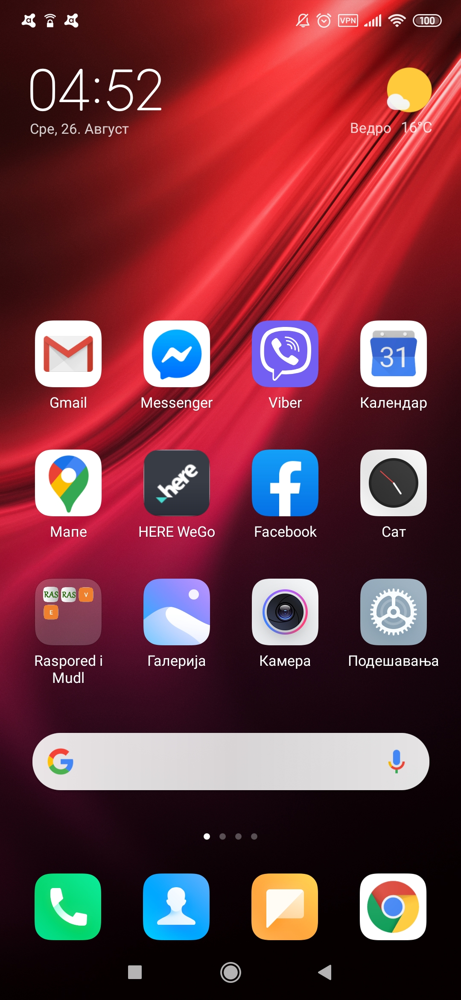

Графички кориснички интерфејс - основни елементи
================================================

|

Начин на који програми комуницирају са корисником представља кориснички интерфејс. Постоје два основна типа корисничког интерфејса: 

- текстуални и 

- графички. 

Код текстуалних корисничких интерфејса (ретко се данас могу срести, углавном их користе ИТ-стручњаци) корисник мора да комуницира са рачунаром тако што му задаје наредбе куцајући текст у командну линију (Command Prompt). Најкоришћенији оперативни систем текстуалног типа био је MS-DOS. Овај оперативни систем се више не користи масовно, међутим у широј употреби су неки други текстуални оперативни системи, а један од њих је и Убунту Сервер:

   
    Текстуални оперативни систем Убунту сервер (Ubuntu Server)

Графички кориснички интерфејс (ГКИ, енгл. GUI – Graphical User Interface) користи визуелне елементе приказане на екрану као што су прозори, менији, тастери, иконе и сл. 

Основна идеја ове визуализације је да екран рачунара представља радни сто. Отуд се та цела радна површина код ОС Виндоуз и зове „радни сто”, тј „десктоп” (енгл. Desktop).

У даљем тексту упознаћеш се са основним појмовима и концептима у раду са ГКИ на примеру неколико различитих оперативних система: Windows (Виндоуз), Linux (Линукс), macOS (мек-о-ес), Android (Андроид), iOS (ај-о-ес). Прва три можеш срести на рачунарима и таблетима, а следећа два на мобилним телефонима и таблетима.

Укључивањем рачунара започиње процес његовог припремања за рад. Овај процес називамо и *подизање система* (енгл. booting). Процесор најпре проналази инструкције у фирмверу у РОМ меморији (сети се лекције „Како раде рачунари”). Пратећи те инструкције, процесор проверава шта је од неопходних уређаја прикључено, а затим прелази на учитавање оперативног система.

Можда се сећаш са часова из основне школе да се у процесу подизања система најпре покреће BIOS (енгл. Basic Input Output System). Последњих година произвођачи прелазе са BIOS на UEFI (енгл. Unified Extensible Firmware Interface), који у суштини ради исто што и BIOS, али на модернији начин: брже, безбедније, подржавајући много веће дискове и нудећи графички интерфејс.

Иницијални програм (BIOS или UEFI) успоставља основну функционалност и комуникацију са монитором, тастатуром, мишем, хард диском и осталим уређајима у систему. Тек након тога се са системског диска (диска на којем се налази оперативни систем) учитавају програми оперативног система. Када се учита оперативни систем, он преузима контролу и даље понашање зависи од особина оперативног система. у случају графичког оперативног система корисник се по потреби пријављује систему (улогује), а затим се приказује радна површина (десктоп), на којој се налазе сличице (иконе, енгл. icons), а уз ивице екрана, зависно од оперативног система, његове верзије и подешавања, налазе се линија послова (таскбар), линија менија и сл. Операције се задају коришћењем миша, чији се показивач најчешће види у облику стрелице на екрану, која прати покрете миша по подлози. Операције могу да се задају и путем екрана осетљивог на додир, гласом, или употребом тастатуре.

Кад је реч о таблетима, а поготово мобилним телефонима, углавном су увек укључени, релативно ретко их искључујемо и „чекамо” да се „подигне систем”. На радној површини се налазе иконе, а команде се задају најчешће путем екрана осетљивог на додир.

.. ytpopup:: KQ8tYL31eHc
    :width: 735
    :height: 415
    :align: center 

ГКИ различитих оперативних система и уређаја
--------------------------------------------

Сви поменути оперативни системи имају заједничке основне елементе и са њима се ради на сличан начин. Ево како изгледа радна површина у разним оперативним системима:

    ГКИ ОС Виндоуз 10 (Windows 10)

|

    ГКИ О-ес-икс (OS X) за Мек (Mac) рачунаре

|

    ГКИ Кубунту (Kubuntu), ОС који у основи има Линукс-језгро

|

    ГКИ ОС Андроид (Android) инсталиран на мобилном телефону
