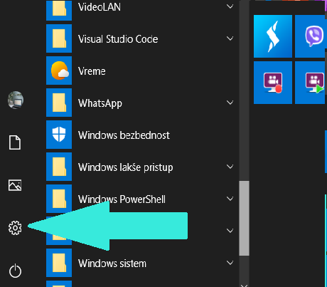

Графички кориснички интерфејс - основна подешавања система
==========================================================

Примећујеш да сваки уређај који користиш (рачунар, таблет, мобилни телефон), „зна” колико је сати, који је датум… Сигурно знаш и да је могуће куцати ћирилицом, латиницом или писмом неког другог језика. Уколико се на рачунар прикључе слушалице, штампачи, додатни монитори, могуће је да ће рачунар „сам” (заправо захваљујући инсталираним програмима) да „препозна” уређај и успостави комуникацију са њим, а можда је потребно да нешто „ручно” подесимо. Сваки уређај има „место” на којем се раде сва та подешавања, а пронаћи ћеш га под називом „поставке”, „подешавања”, „Settings” и слично.  Обично је представљено сличицом зупчаника.

    Дугме за отварање прозора Поставке (Settings)

.. figure:: ../../_images/10_postavke.png
    :width: 780px   
    :align: center
    :class: screenshot-shadow
    
    Поставке (Settings)

У овом видеу можеш да видиш како да подесиш позадинску слику:

.. ytpopup:: S2Vj9_j8PqU
    :width: 735
    :height: 415
    :align: center 

У следећем видеу можеш да видиш како да подесиш миша:

.. ytpopup:: zw2ZJGQmEHI
    :width: 735
    :height: 415
    :align: center 

Коначно, у трећем видеу можеш да видиш како да подесиш језике које намераваш да користиш:

.. ytpopup:: 9jLy9okd1O4
    :width: 735
    :height: 415
    :align: center 

Инсталирање и уклањање програма
-------------------------------

Као што знаш, за функционисање данашњих рачунара неопходан је оперативни систем. Оперативни систем је обично већ инсталиран на рачунару када га купујете (проверите са којим оперативним системом долази конкретан рачунар). Програми оперативног система чине „основна знања” (под наводницима, јер рачунар нема свест и не може да „зна”), која омогућују да хардвер функционише - да прихвата команде са тастатуре и миша, да прикаже слику на екрану, да учита програме са хард диска у унутрашњу меморију и извршава их итд. Међутим, само са оперативним системом не можемо ништа корисно да урадимо, осим што видимо да „рачунар ради”. А шта ради? - Па чека да му инсталирамо и да покренемо неки програм којим ћемо заиста урадити нешто - читати или обрадити текст, цртати, рачунати, слушати или компоновати музику, играти се, пројектовати зграду…

Програме купујемо или преузимамо бесплатно, већ према лиценци под којом је објављен (подсети се приче о лиценцама програма из претходног поглавља). Некада су програми углавном куповани на компакт-диску, сада је то редак случај. Данас куповина програма  изгледа тако да се преко интернета програм плати електронским путем и преузме на рачунар или се преузме слободно па се приликом плаћања добије активациони код који омогућује несметано легално коришћење програма.

Програми који се инсталирају накнадно су или системски програми (драјвери периферних уређаја, преводиоци, програми за архивирање и сл.) или кориснички програми, намењени за рад на неком конкретном послу.

Једном инсталирани програм може се по потреби ажурирати, или деинсталирати.

Када инсталирамо неки нови програм, добро је да подесимо да се он аутоматски покреће када покушамо да отворимо неку датотеку (фајл, енгл. file) коју намеравамо да обрађујемо баш тим програмом.

Типови датотека 
---------------

Сад се сигурно питаш, како се уопште може означити којим се програмом отвара нека датотека? Поменули смо то још у првој лекцији, али није наодмет још једном, на прецизнији начин: датотека је скуп података снимљених под заједничким именом на спољашњој меморији. Пун назив датотеке се састоји из два дела: имена и типа. Име је произвољан низ слова, цифара и неких специјалних знакова: минус (-), доња црта (_), размак ( ) и тачка (.), с тим што не може почети размаком. Тип, или екстензија је низ од најчешће три (постоје и екстензије од мање или више од 3 слова). Име и тип су раздвојени тачком. На основу типа можемо да закључимо да ли је у датотеци текст, слика, звучни запис, програмски код… Али много важније од тога шта ми можемо да закључимо на основу типа је информација оперативном систему којим програмом може да отвори конкретну датотеку.

Ево неких типова које ћемо користити:  

- текст  .txt  .doc  .docx  .odt  .pdf

- слика  .jpg  .bmp  .png  .svg  .ai  .pdf

- видео  .mpeg  .mov  .mp4

- програм .exe

У подешавањима оперативног система већ је дефинисано који типови датотека се отаврају којим програмом, али ми то можемо да променимо. Ево како:

.. questionnote::
    Отвори подешавања на свом рачунару и испробај различите могућности. У зависности од тога шта је већ подешено, промени подешавања, а након вежбе врати на подешавања која су теби најудобнија. Уколико вежбу радиш на школском рачунару, наставник ће ти рећи која подешавања да оставиш по завршетку вежбе. Ево неких подешавања која можеш да испробаш:
    
    - Промениш слику на позадини (десктоп-слику)
    - Подесиш да начин приказивања времена и датума буде приказан у складу са српским правописом
    - Промениш боје оквира прозора
    - Подесиш да имаш тачно два језика тастатуре: српска латиница (подразумевана) и српска ћирилица
    - Подесиш да подразумевани веб прегледач буде Google Chrome односно Microsoft Edge 
