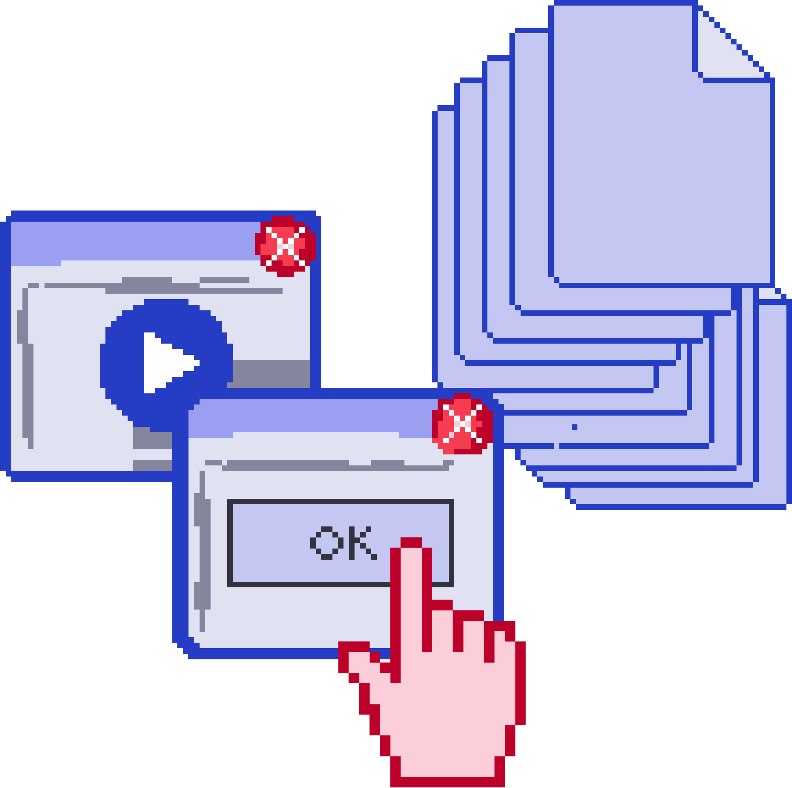

Садржај лекције 3.1
===================

На овом часу подсетићеш се шта је то графичко-кориснички интерфејс (ГКИ) и како се у њему ради.

Садржај:

- Елементи ГКИ, основне операције

- ГКИ различитих уређаја

- Системска подешавања

- Инсталирање и уклањање програма

- Типови датотека

Када успешно савладаш ову лекцију бићеш у стању да разликујеш основне елементе графичког корисничког интерфејса и да прилагодиш радно окружење кроз основна подешавања.

