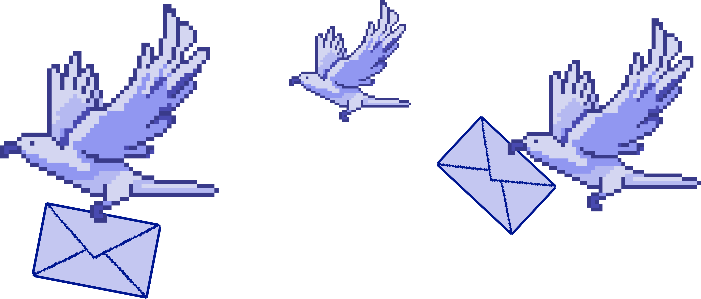

Садржај лекције 3.3
===================

На овом часу подсетићеш се и научити нешто ново у вези са чувањем и слањем датотека, као и заштитом рачунара и информација. 

Садржај:

- Рад са програмима за архивирање.

- Слање и чување датотека.

- Средства и методе заштите рачунара и информација

Када успешно савладаш ову лекцију бићеш у стању да сачуваш, модификујеш и организујеш податке, као и да разликујеш најчешће коришћене типове датотека

