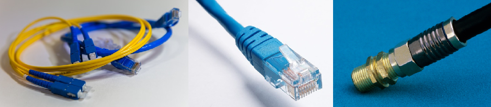
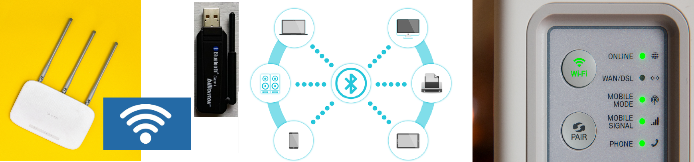
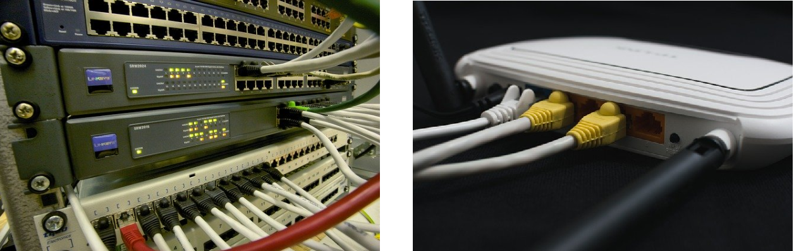

Рачунарске мреже и интернет
===========================

У претходној лекцији разматрали смо различите области људске делатности и њихову повезаност са развојем информационо-комуникационих технологија. 
Било да посматрамо трансформацију начина рачунања, записа и обраде текста, слика, звука, складиштење информација или њихову дистрибуцију, као и комуникацију између људи, у свакој од тих „паралелних” грана стижемо до исте тачке у којој се све ове функције обављају користећи једну врсту уређаја - рачунар. У овој лекцији, бавићемо се начинима повезивања рачунара и других уређаја у мреже.

Рачунарске мреже
----------------

Два или више рачунара повезаних тако да могу да размењују податке чине мрежу. Да би се остварила рачунарска комуникација потребни су: 

- комуникациони медијуми,
- комуникациони уређаји и
- комуникациони протоколи и софтвер који имплементира те протоколе.

Пренос информација врши се путем **комуникационих медијума** - а они могу да буду кабловски („жични”, енгл. wire)  и бежични (енгл. wireless). Кабловски медијуми се данас углавном реализују  као **оптички каблови**, који се сада постављају и до крајњих корисника. У постојећим (затеченим) мрежама се користе и разне врсте бакарних проводника, као што су обична бакарна парица (као код фиксних телефона), каблови са више бакарних парица (*UTP*, *STP*, *SSTP*, *FTP*, *SFTP*) или коаксијални каблови.

    лево: конектори на оптичким кабловима;
    у средини: конектор RJ-45 на UTP Етернет каблу;
    десно: конектор BNC на коаксијалном (антенском) каблу

.. questionnote::

    Знате ли разлику између ових разичитих врста каблова? Од ког материјала je први, a од ког други и трећи? Каква је природа сигнала кроз *UTP* и коаксијалне, а каква кроз оптичке каблове? 
    
    Ако се не сећате ових појмова из основне школе, покушајте да пронађете одговор на интернету.

Бежичне мреже данас се најчешће реализују путем вај-фај (енгл. WiFi) технологије, блутут (енгл. Bluetooth) технологије или као мреже за пренос података у системима мобилне телефоније.

    Различите бежичне технологије

**Комуникациони уређаји** су рутер (енгл. router), свич (енгл. switch), приступна тачка (енгл. access point) и други. Уређаји који немају уграђену подршку за одређену технологију, могу да користе одговарајући адаптер (нпр. за старије десктоп рачунаре вај-фај адаптер).

    Комуникациони уређаји

.. reveal:: mrežniuredjaji
   :showtitle: Више о рутерима и свичевима
   :hidetitle: Сакриј прозор
   
   .. infonote:: 
       За коришћење интернета није потребно да разумеш како раде ови уређаји, који управљају саобраћајем у мрежи. Ако желиш да знаш више, можеш да прочиташ на пример на овим линковима (на енглеском): `рутер <https://en.wikipedia.org/wiki/Router_(computing)>`_, `свич <https://en.wikipedia.org/wiki/Network_switch>`_.
    
|

Сигурно се од раније сећаш појмова *хардвер* и *софтвер*. Медијуми и уређаји чине хардвер неопходан за успостављање комуникације између рачунара. За рад рачунарске мреже су неопходни и комуникациони протоколи и комуникациони софтвер. Комуникациони протокол представља скуп правила за управљање преносом података. Скуп протокола који је данас је доминантан је TCP/IP (чита се ти-си-пи-ај-пи). Овај протокол прецизира кораке од којих се састоји пренос података и начин на који се ти кораци одвијају, и о њему ће бити више речи касније у овој лекцији.

Комуникациони софтвер чине различити мрежни оперативни системи, апликације, драјвери... Знаш ли шта означавају ове три групе софтвера? Ако се не сећаш, подсетићемо се у једној од лекција које следе.

Мреже су хијерархијски организоване - мање мреже се повезују у веће. Према величини, односно простору на коме се простиру, рачунарске мреже могу овако да се класификују:

- Лична мрежа (PAN - Personal Area Network) повезије уређаје једне особе или породице, обично се простире на неколико метара;
- Локална мрежа (LAN - Local Area Network) обично се простире на једну или неколико канцеларија, зграду, више суседних зграда, кампус и слично, може да се простире на неколико метара до неколико километара;
- Градска мрежа (MAN - Metroploitan Area Network) може да буде мрежа кабловског оператора која покрива један град, или мрежа која повезује неколико пословних објеката већег предузећа (нпр. банке, корпорације). Мери се километрима или десетинама километара;
- Регионална мрежа (WAN - Wide Area Network) спаја више локалних и градских мрежа, покрива округ или регион од више градова, а може да покрије и целу државу. Мери се десетинама или стотинама километара;
- Интернет је мрежа која повезује све претходне мреже у целину

.. figure:: ../../_images/2_mreza.png
    :width: 720px
    :align: center

    Шематски приказ глобалне мреже - интернета

Рачунаре унутар мреже називамо „чворовима” мреже. Мале мреже (PAN, LAN) се често организују тако да су рачунари у њој равноправни. Такве мреже се зову *пир-ту-пир мреже* (енгл.  **peer–to–peer** - једнак једнаком). Рачунари у пир-ту-пир мрежи по правилу директно комуницирају сваки са сваким, без потребе за рачунаром који посредује у комуникацији. Такође, у таквој мрежи сваки рачунар може да дели одређени простор (означене директоријуме) на свом диску са осталим рачунарима, тако да нема посебног рачунара за чување дељеног садржаја. Исти принцип може да се односи и на друге ресурсе, нпр. процесорско време.

У већим мрежама је непрактично или чак немогуће обезбедити да сваки рачунар директно комуницира са сваким. Такође, одржавање (нпр. бекап) и заштита расутих података постаје компликована у великим мрежама. Зато у већим мрежама постоје рачунари и други уређаји, чија је главна намена да обезбеђују ресурсе и услуге за друге рачунаре. Такви рачунари и уређаји се називају сервери, а рачунари који од њих траже услуге се називају клијенти. Овако организоване мреже се називају **клијент-сервер мреже**. Сервери могу да нуде различите ресурсе и услуге, па по својој улози (функцији), север може да буде:

- фајл сервер (обично у локалној мрежи), који чува одређене дељене фајлове и фолдере и омогућава им приступ
- комуникациони сервер, који одржава окружење потребно да један уређај пронађе други, и да комуницира са њим
- веб сервер, који на себи чува неке веб странице и на захтев их шаље клијенту
- сервер апликација (aplication server), који на себи чува веб апликације и омогућава клијентима да код себе извршавају те апликације иако немају инсталирану копију те апликације (довољно је да имају веб прегледач)
- мејл сервер, који омогућава размену електронске поште (слично као што поштанска служба омогућава размену писама и других пошиљки)
- сервер базе податка (database server), који одржава базу података, омогућава приступ бази и упите над њом са других рачунара
- сервер за штампу (print server), уређај који омогућава штампање на дељеном штампачу преко мреже

и разни други.

Да лакше запамтиш шта су сервери, а шта клијенти, сети се да реч сервис значи услуга, па према томе сервер значи пружалац услуга. Тако, на пример, у ресторану конобар сервира - пружа услуге, гостима - клијентима, поштујући одређена правила - протоколе!

**Настанак интернета, протоколи**

Интернет је настао крајем '60-тих и почетком '70-тих година XX века за потребе министарства одбране САД, са идејом да не буду све информације у само једном рачунском центру, већ да буду дистрибуиране у више повезаних центара, како би систем остао функционалан у случају престанка рада неког од центара. 
Та мрежа се звала АРПАНЕТ и састојала се од педесетак рачунара–чворова, преко којих су се повезивали локални рачунари и то на такав начин да је између свака два могуће наћи више различитих путева. Врло брзо, и у САД и у другим деловима света настају мреже налик АРПАНЕТ-у. Крајем '80 и почетком '90 почело је међусобно повезивање тих мрежа, које није више било само у војне сврхе. Неке мреже су биле владине, неке универзитетске, неке чисто комерцијалне. Ово је коначно довело до настанка интернета у данашњем облику - глобалне мреже доступне дословно свима. Интернет се састоји од веома различитих рачунарских система. Разлика се огледа у њиховој величини, оперативним системима које користе, улози коју имају у функционисању интернета итд. 

Да би сви ти различити рачунари могли да комуницирају, уведени су протоколи. Као што смо поменули, најпознатији комуникациони протокол је TCP/IP, Transmission Control Protocol / Internet Protocol. Укратко, најважнији кораци (фазе) у преносу података су:

- разбијање на пакете скупа података који треба послати,
- слање пакета кроз мрежу, могуће различитим путевима
- провера исправности сваког пакета на страни примаоца
- потврда пријема пакета, или захтев за поновним слањем (ако су детектоване грешке у преносу)
- спајање пакета у целину каква је била пре слања. 

Адресирање на интернету
-----------------------

Да бисте некога позвали телефоном, потребан вам је број његовог телефона, позивни број за његов град, државу. Да бисте некоме послали писмо морате да знате његово име, улицу и број куће, град, државу. Једном речју: адресу. И да бисте приступили неком рачунару путем интернета, такође вам треба његова адреса. 

**Како изгледа адреса рачунара** када на интернету не постоје улице и градови?

Можемо да кажемо да постоји нешто слично, а то су **интернет домени**. Домени имају своје ознаке, тј. називе, које сте вероватно виђали, на пример *.com*, *.org*, *.net*, *.us*, *.de*, *.fr*, *.ru*, *.rs*, *.срб* итд. У свакодневном говору, када кажемо интернет домен често мислимо на назив домена, па ћемо и ми понекад говорити о доменима мислећи на њихове називе. Сваки од набројаних домена је **домен највишег нивоа** (енгл. *top level domain*, скраћено **TLD**). У оквиру сваког од ових домена постоје поддомени, на пример .ac.rs, .edu.rs, .org.rs, .co.rs, .gov.rs и други. Ово су домени другог нивоа (*SLD*). Оваква подела домена на поддомене се наставља до нивоа где неки домен представља интернет адресу конкретног рачунара. Тако, интернет домене можемо интуитивно да схватимо као **хијерархијски организоване групе интернет адреса**.

.. reveal:: otkud_domeni
    :showtitle: Ако те интересује ко одређује интернет домене и чији је интернет
    :hidetitle: Сакриј прозор

    |

    Можда се питаш **како настају интернет домени** и како не долази до конфликта (преклапања, двоструких имена)?

    Организација за управљање доменима на међународном нивоу је непрофитна организација `ICANN <https://www.icann.org/>`_ (Internet Corporation for Assigned Names and Numbers). Она делегира одговарајућим националним организацијама управљање над националним доменима, као што су *.de* за Немачку, *.fr* за Француску, *.ru* за Русију итд. Србија има два национална домена, **.rs** и **.срб** и ICANN је управу над њима поверила фондацији `РНИДС <https://xn--d1aholi.xn--90a3ac/>`_ (Регистар национланог интернет домена Србије). РНИДС је неке поддомене ова два домена делегирао даље. На пример, домени .ac.rs и .ак.срб су делегирани организацији АМРЕС (Академска мрежа Србије), а домени .gov.rs и .упр.срб су делегирани Канцеларији за информационе технологије и електронску управу (КИТеУ) републике Србије. Ове организације даље управљају својим поддоменима и омогућавају корисницима који на то имају право, да добију своје интернет адресе у оквиру тих поддомена. Свако у Србији, ко жели да има своју интернет адресу, може да се обрати организацији РНИДС и да код ње (или неког њеног овлашћеног регистра) региструје изабрану адресу, ако она није већ регистрована. 

    .. infonote:: Занимљивост:

        За било коју интерент адресу регистровану код РНИДС, на адреси `https://www.rnids.rs/домени/подаци-о-регистрованом-домену <https://www.rnids.rs/%D0%B4%D0%BE%D0%BC%D0%B5%D0%BD%D0%B8/%D0%BF%D0%BE%D0%B4%D0%B0%D1%86%D0%B8-%D0%BE-%D1%80%D0%B5%D0%B3%D0%B8%D1%81%D1%82%D1%80%D0%BE%D0%B2%D0%B0%D0%BD%D0%BE%D0%BC-%D0%B4%D0%BE%D0%BC%D0%B5%D0%BD%D1%83>`_ можете да сазнате ко је ту адресу регистровао. 

    Ако желиш да боље разумеш чиме се још бави РНИДС (осим што води евиденцију наша два национална интернет домена), можеш да погледаш `ову њихову публикацију <https://www.rnids.rs/publikacije/Pravni_vodic_kroz_internet_domene.pdf>`_.

    Важно је да знаш: **интернет је јавно добро**, нико није власник интернета, нико не поседује интернет нити може да га контролише (укључује и искључује) са једног, централног места. Постоје организације које су задужене за уређивање појединих области функционисања интернета - на пример протокола, стандарда адресирања и комуникације, домена и разрешавања доменских адреса, за питање лиценци и ауторских права, безбедности и слично, али њихова улога је регулаторна. Те организације нису власници интернета нити његових делова, оне се само баве стварањем услова који омогућавају да интернет постоји и несметано ради.

    Ако те интересује више о управљању интернетом добро место за почетак тог истраживања је на овом линку `Управљање Интернетом | РНИДС <https://www.rnids.rs/%D0%BE-%D0%BD%D0%B0%D0%BC%D0%B0/%D1%83%D0%BF%D1%80%D0%B0%D0%B2%D1%99%D0%B0%D1%9A%D0%B5-%D0%B8%D0%BD%D1%82%D0%B5%D1%80%D0%BD%D0%B5%D1%82%D0%BE%D0%BC>`_.
        
**Домени највишег нивоа**

Научили смо да се назив домена састоји од неколико група слова раздвојених тачком, као и да последња група слова означава домен највишег нивоа. Неки од домена највишег нивоа су национални (ознаке држава), али неки и нису. Домени највишег нивоа који нису ознаке држава су међународни, такозвани генерички домени попут .com, .org, .info, .net и слично. У почетку развоја интернета, овакви домени без ознаке државе су се односили само на америчке сајтове, али данас то више није тако. Поддомени унутар тaквих домена сада могу да се региструју у било којој држави.

.. reveal:: spisaktld
   :showtitle: Ако те интересује списак свих TLD...  
   :hidetitle: Сакриј прозор
   
   .. infonote:: 
    
        ...можеш да га видиш овде: `Списак свих TLD <https://en.wikipedia.org/wiki/List_of_Internet_top-level_domains#ICANN-era_generic_top-level_domains>`_.

**Домени другог нивоа**

Група слова у низу која претходи домену највишег нивоа често указује на врсту организације. На пример, у називу домена `www.mg.edu.rs <https://www.mg.edu.rs/>`_ слова **edu** означавају да се ради о образовној институцији (Математичка гимназија), док слова **gov** у називу домена `mpn.gov.rs <http://www.mpn.gov.rs/>`_ означавају да се ради о владиној институцији (Министарство просвете, науке и технолошког развоја). Овакво означавање, међутим, није обавезно, као што показује пример домена `narodnopozoriste.rs <https://www.narodnopozoriste.rs/>`_.

.. questionnote::

    Погледајте називе домена које су регистровале неке институције (гимназијe, факултети, министарства итд.)

    | `mup.gov.rs <https://www.mup.gov.rs>`_
    | `education.gouv.fr <https://www.education.gouv.fr>`_
    | `bmbf.de <https://www.bmbf.de>`_
    | `commerce.gov <https://www.commerce.gov>`_
    | `etf.bg.ac.rs <https://www.etf.bg.ac.rs>`_
    | `cam.ac.uk <https://www.cam.ac.uk>`_
    | `vigimnazija.edu.rs <https://vigimnazija.edu.rs>`_
    | `talenti.edu.rs <https://www.talenti.edu.rs>`_

    Можете ли на основу неког од ових назива домена да откријете у којој држави је регистрован домен, или које врсте је институција која га је регистровала?

**Како се адресирају рачунари на интернету?**

Сваки рачунар који је директно доступан на интернету има своје јединствено име, које се састоји од локалног имена рачунара у својој мрежи (*hostname*) и назива домена. Ово је тзв. пуно квалификовано име домена (fully qualified domain name). На пример, рачунар чије локално име је *myhost* у родитељском домену *example.com* има пуно квалификовано име домена *myhost.example.com*. Пуно квалификовано име домена је довољно да адресирамо било који рачунар, који може да се адрсира на интернету.

**Како се адресирају садржаји на интернету?**

Садржаји се на интернету адресирају УРЛ адресама (енгл. **URL, Uniform Resource Locator**). Овакве адресе се састоје од назива протокола, адресе локације на интернету (тј. назива интернет домена) и адресе конкретног садржаја на тој локацији.  На пример,  у адреси `<https://petlja.org/biblioteka/r/kursevi/prirucnik-python-gim>`_, ``https://`` је ознака протокола, део ``petlja.org`` је назив домена, а део ``biblioteka/r/kursevi/prirucnik-python-gim`` је путања до приручника за учење Пајтона који се налази на сајту Петље. 

**Како се адресирају корисници на интернету?**

Сваки корисник на интернету може да има своју (једну или више њих) имејл адресу - адресу електронске поште. Њом се директно адресира корисник који својој пошти приступа путем одговарајућих сервиса. Адреса је облика **neko@negde.nesto** при чему „neko” представља идентификацију конкретног корисника на одређеном сервису електронске поште (мејл-сервису) коју је корисник сам изабрао, а „negde.nesto”  је ознака самог сервиса, заправо назив домена који обезбеђује тај сервис.

**IP адресе**

Стварне адресе рачунара, рутера и других уређаја на интернету, које се користе у комуникационим протоколима су такозване IP (ај-пи) адресе (енгл. **Internet Protocol Address**). Зато сваки уређај на интернету мора да има своју јединствену IP адресу. Постоје два стандарда по којима се записују IP адресе. По старијем стандарду *IPv4* (који је у време настанка био намењен знатно ужем кругу корисника), адреса се састоји од четири броја из интервала 0-255 (на пример 77.46.149.195). Ово даје теоријску могућност да се формира највише :math:`256^4 \approx 4 \cdot 10^9` различитих IP адреса. Након комерцијализације интернета 1990-тих година, постало је јасно да, иако огроман, овај број неће бити довољан за све уређаје који се појављују на интернету (данас више није довољан). Зато је још 1995. године предложен други, новији стандард, IPv6. По овом стандарду се адреса састоји од 8 четвороцифрених хексадекадних бројева, тј 8 бројева из интервала 0-FFFF. То даје :math:`16^{32} = 2^{128} \approx 3.4 \cdot 10^{38}` могућих адреса, што је практично неисцрпан број. Прелазак на стандард IPv6 је још увек у току.

Ми ипак можемо да приступамо рачунарима на интернету користећи називе домена (тачније, пуна квалификована имена рачунара), што се лакше памти од IP адреса. Ту удобност нам омогућава систем доменских имена (engl. Domain Name System, DNS). Овај систем можемо да схватимо као адресар свих уређаја на интернету. Систем је децентрализован, па се његови делови налазе на разним рачунарима које зовемо DNS сервери. Они садрже табеле регистрованих назива домена и разне податке о њима, па и њихове IP адресе. Захваљујући томе, DNS сервери могу на основу назива домена да пронађу и јаве IP адресу. 

Проналажење IP адресе за дати назив домена се назива `разрешавање имена домена`. Разрешавање имена се дешава од домена највишег нивоа, ка нижим нивоима. На пример, за разрешавање имена домена `matf.bg.ac.rs <http://www.matf.bg.ac.rs/>`_, упит се упућује регистру .rs домена, који га прослеђује регистру .ac домена (академске институције), затим .bg (београдски универзитет), и на крају на конкретан факултет, на чијем рачунару се налазе инфорамције о IP адресама свих рачунара тог поддомена, који су доступни на интернету.

.. questionnote:: 

    И поред тога што нико није власник интернета, ми ипак за прикључење на интернет некоме плаћамо ту услугу. Да ли знате коме и зашто?

**Добављачи интернет услуга, интернет сервис-провајдери (ИСП)**, обезбеђују нам приступ интернету и додељују адресу под којом се наш уређај појављује на мрежи. 

Већ смо рекли да се интернет састоји од међусобно повезаних уређаја и мрежа. Такође, споменули смо и појам IP адресе. IP адреса може бити јавна или приватна. Јавне IP адресе су јединствене адресе „видљиве” на интернету, док су приватне IP адресе такође јединствене, али видљиве само у оквиру локалне мреже. Данас, повезати се на интернет, значи добити једну приватну IP адресу у локалној мрежи провајдера интернет услуга. Та адреса додељује се рутеру корисника, на који се са друге стране повезују сви његови уређаји. Уређаји корисника чине личну или локалну рачунарску мрежу корисника. Изузетак је када корисник додатно плати најам јавне IP адресе чиме његов рутер постаје директно „видљив” на интернету. Потребу за јавним IP адресама обично имају предузећа или појединци који се баве пословањем на интернету, ако желе да, на пример, подигну веб сервер да би други рачунари могли да га „пронађу” и приступе му. Рутер и протоколи унутар личне или локалне мреже задужени су да захтев са уређаја корисника проследе на интернет, а приспеле информације са интернета проследе управо уређају корисника који је те информације „затражио”.

.. figure:: ../../_images/2_Internet_map.jpg
    :width: 650px   
    :align: center 

    Визуализација количине путева на интернету

    Аутор: The Opte Project - Originally from the English Wikipedia; description page is/was here., CC BY 2.5, https://commons.wikimedia.org/w/index.php?curid=1538544

Повезивање са интернетом
------------------------

Уколико код куће имаш уведен интернет, онда сасвим сигурно имаш и личну или локалну мрежу (PAN, LAN). Сви рачунари (стони, таблети, мобилни телефони) у том случају комуницирају са мрежним уређајем, који обезбеђује везу свих рачунара из локалне мреже са интернетом. Чак и у малој мрежи (кућној, школској или у неком предузећу) могуће је да постоји више мрежних уређаја као што су рутер и свич. Они имају различиту улогу у локалној мрежи. Обично веза са интернетом долази до рутера, а онда рутер обезбеђује повезаност и комуникацију унутар мање мреже. Поменимо и то да су се крајем прошлог века рачунари повезивали на интернет помоћу модема за фиксну телефонију, а између себе у малим мрежама помоћу хаба.

Крајњи корисници се повезују са интернетом преко комуникационих медијума и уређаја за повезивање. Технологије за повезивање са интернетом су разноврсне и стално се унапређују. Од жичних технологија за повезивање са интернетом, данас се користе:

- оптички кабл, као тренутно најквалитетнији начин повезивања. Пожељно је да се оптика доведе што ближе крајњем кориснику, а најбоље до куће/стана (*FTTH, Fiber To The Home*).
- мрежа фиксне телефоније, тј. бакарна парица и (најчешће) ADSL уређај
- коаксијални (антенски) кабл и одговарајући кабловски модем. Кабловски ТВ оператери нуде ову могућност као опцију уз кабловску телевизију, мада коаксијалне каблове све више замењују оптичким.

Од технолохија бежичног приступа, користе се:

- приступне технологије у системима мобилне телефоније (нпр. мобилни интернет)
- вај-фај (енгл. WiFi, Wireless Fidelity) - за мреже малог домета (PAN, LAN)
- вај-макс (WiMAX, Worldwide Interoperability for Microwave Access), за повезивање разуђених корисника, домета 5 km до чак 50 km, зависно од конфигурације терена.
- лај-фај (LiFi, Light Fidelity), нова технологија којом се сигнал емитује помоћу LED диоде у видљивом делу спектра 

и други.

.. questionnote::

    Ако имаш код куће или у школи „уведен” интернет, да ли знаш како је та веза реализована? Распитај се о томе како твоје домаћинство добавља интернет-услуге, а наставника како је школа повезана. 

**Да ли знаш који све уређаји могу да се повежу на интернет?**
То могу да буду рачунари, рутери, мобилни телефони и таблети, али и многе друге *ствари*. На интернет се повезују возила, системи веб-надзора, одашиљачи на медицинским уређајима које на себи или у себи носе здравствено угрожене особе (нпр. после операције срца, да прате и јављају њихово здравствено стање), чак и одашиљачи на животињама са великих фарми. Сви ти, и други уређаји чине тзв. **„интернет ствари”** (енгл. **IoT**, internet of things), који највише доприноси свакодневном вртоглавом расту броја уређаја прикључених на интернет. Интернет ствари омогућава нпр. да корисник са мобилног телефона, преко интернета, укључи грејање или неки кућни апарат пре него што стигне кући (и електричне утичнице могу да имају IP адресе), или да се камере за видео-надзор повежу са центром за надзор иако уз саму камеру не постоји рачунар - камера може да има своју IP адресу!

.. questionnote::

    Размисли које су позитивне а које негативне стране „интернета ствари”. Знаш ли за неки пример IoT у свом окружењу?

.. reveal:: vikidugme
   :showtitle: Ако желиш да знаш више
   :hidetitle: Сакриј прозор
   
   .. infonote:: 
    
        Свеобухватан текст о свим поменутим појмовима можеш пронаћи овде
        `Интернет — Википедија <https://sr.wikipedia.org/wiki/%D0%98%D0%BD%D1%82%D0%B5%D1%80%D0%BD%D0%B5%D1%82>`_.

.. comment
    На крају, ево како сам РНИДС `дефинише <https://www.rnids.rs/%D0%B4%D0%BE%D0%BC%D0%B5%D0%BD%D0%B8/%D1%88%D1%82%D0%B0-%D1%98%D0%B5-%D0%B8%D0%BD%D1%82%D0%B5%D1%80%D0%BD%D0%B5%D1%82-%D0%B4%D0%BE%D0%BC%D0%B5%D0%BD>`_ два важна појма о којима смо овде говорили:

    - Интернет домен (Internet domain) је скуп података који описује јединствену административно-техничку целину на Интернету, према правилима DNS система. Ови подаци могу да буду адресе рачунара, ресурса или сервиса на домену (www, mail, ftp…), називи и адресе DNS сервера, сигурносни подаци за DNSSEC и др. Глобалну видљивост интернет домена омогућава DNS сервис.
    - Назив интернет домена (енгл. Internet domain name) је текстуална ознака коју корисник региструје за своје потребе, чиме ствара административно-техничку могућност за видљивост интернет домена под тим називом. Назив интернет домена је саставни део веб адресе и адресе е-поште и на тај начин одређује идентитет на Интернету. 

