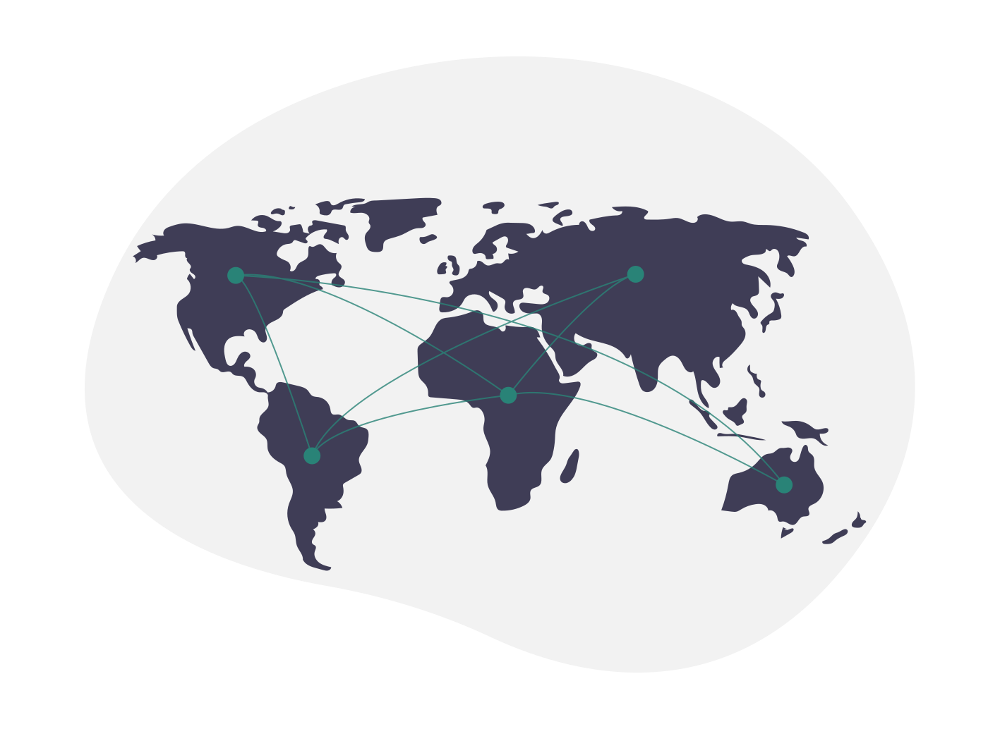

Садржај лекције 1.2
===================

|

На овом часу научићеш шта су то рачунарске мреже, и подсетићеш се основних појмова везаних за интернет.  

|

Садржај:

- Рачунарске мреже

- Настанак интернета

- Приступ интернету

|

Када успешно савладаш ову лекцију бићеш у стању да објасниш шта су то рачунарске мреже и интернет, као и како се приступа интернету.

|

|