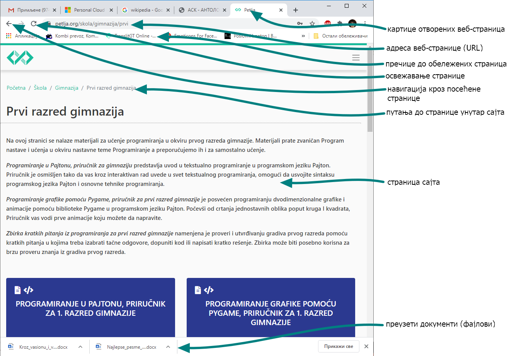
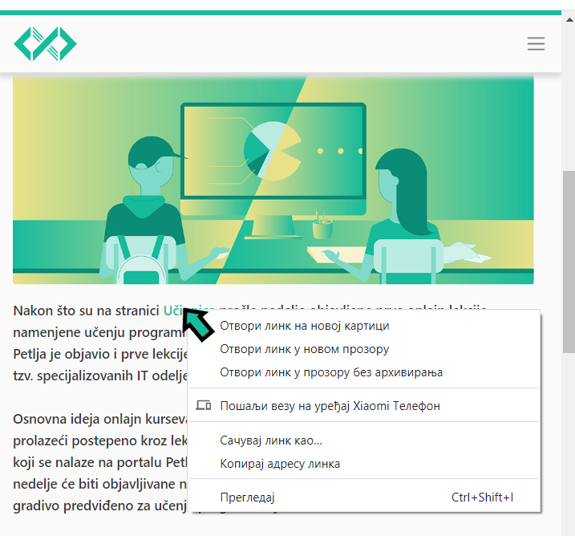
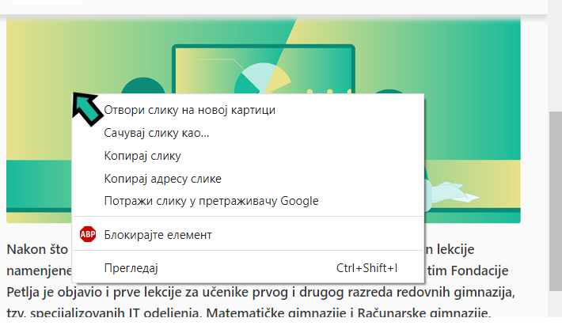
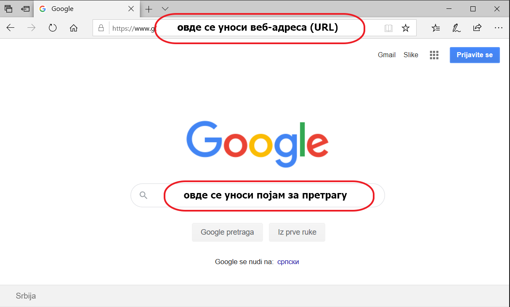
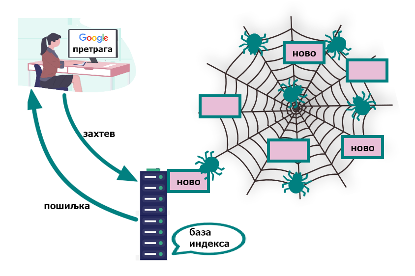

Интернет сервиси
================

.. infonote::
   Увек када је уређај повезан на интернет, каже се и да је онлајн (енгл. online) а када је веза прекинута, каже се да је уређај офлајн (енгл. offline). Обратите пажњу, у српском језику ове речи, иако енглеског порекла, пишу се онако како их изговарамо. Неправилно је написати онлине исто колико би било неправилно и да напишемо, на пример, телевисион... 

Као што се из претходне лекције може закључити, интернет представља инфраструктуру. Као што у граду имамо инфраструктуру - улице, бандере са кабловима, цеви испод улица, па на њима функционишу различити сервиси: градски саобраћај, комуналне услуге, водовод, снабдевање струјом, тако и на интернету постоје различите услуге - сервиси. У овом моменту поменућемо само два: веб (WWW) и електронску пошту.

**Веб, енгл. WWW - World Wide Web**, што би се могло превести као „широм света разапета мрежа” - данас најраспрострањенији сервис, који преставља мрежу садржаја (заправо веб-страница)  на интернету, међусобно повезаних везама - линковима.

**Електронска пошта, имејл (енгл. email)** је сервис путем којег корисници шаљу „писма”, односно пошиљке које се састоје од текста и мултимедијалних прилога. Адресирају се адресама корисника, које смо већ описали када смо говорили о врстама адресирања на интернету. 

Примери адреса: mika.petljanovic@gmail.com, mika.petljanovic@outlook.com, су адресе једне особе на два различита мејл-сервиса, mika.petljanovic@sbb.rs би била адреса код једног интернет-сервис провајдера, а mika.petljanovic@vigimnazija.edu.rs би била адреса на домену школе. Ово су четири потпуно различите адресе. У сваком од ових случајева, пошиљка стиже на сервер конкретног мејл-сервиса, а корисник уносећи своје корисничко име и лозинку може да приступи пошти у свом „поштанском сандучету” (енгл. inbox). Такав приступ се још зове „вебмејл”, јер се електронској пошти приступа путем веба (о којем говоримо у следећем пасусу). Постоји могућност да се на рачунар инсталира програм који се синхронизује када је рачунар повезан на интернет  тако да је могуће касније прегледање поште и када је веза прекинута. Ово је погодно ако немамо сталан приступ интернету.

Дакле, за сваку имејл комуникацију кључна су 4 рачунара: рачунар-клијент на којем пошиљаоц саставља мејл, рачунар-сервер на којем се налази мејл сервис који он користи, ту се налази „одлазно сандуче” одакле мејл путује интернетом до мејл-сервера примаоца и тамо у „долазном сандучету” чека да га примаоц преузме на свој рачунар-клијент.

И овде једна језичка напомена: у српском језику, без обзира да ли је текст писан ћирилицом или латиницом, пише се имејл а не емаил. Знак „@” који улази у састав сваке имејл адресе раздваја корисничко име од домена и чита се „ет”, од енглеске речи „at” што значи „при”, „на”. Зове се још и „мајмунче” или „манки” (од енглеског назива тог симбола monkey).

.. reveal:: hipertekst
   :showtitle: Шта је хипертекстуални документ?
   :hidetitle: Сакриј прозор
   
   .. infonote::  Можда овај израз видиш први пут, али сасвим сигурно да хипертекстуалне документе користиш, чак и проучавајући ове лекције. То је текст у којем се налазе хиперлинкови, линкови или хипервезе, баш `овако <https://sr.wikipedia.org/sr-ec/%D0%A5%D0%B8%D0%BF%D0%B5%D1%80%D0%B2%D0%B5%D0%B7%D0%B0>`_.  -то су речи (обично обојене плаво и подвучене, али могу да изгледају и другачије) и текстови који, када се на њих кликне мишем, воде на неку другу веб страницу или други део исте странице.

Хајде сада да детаљније упознамо два већ поменута сервиса која сигурно користиш, али вероватно не знаш све могућности, а можда нешто од тога и не користиш на сасвим исправан начин.

|

Прегледање веба
---------------

Веб је сервис путем којег ти управо сада проучаваш овај курс. За приступ веб садржајима и њихово прегледање потребно је да покренеш програм „веб прегледач” (веб браузер, енгл. web browser). Најчешће коришћени веб-прегледачи су: 
Гугл хром (Google Chrome), Мајкрософт еџ (Microsoft Edge), Мозила фајерфокс (Mozzila Firefox),  Опера (Opera) и Сафари (Safari).
Веб садржаји су адресирани помоћу УРЛ адресе (већ смо описали шта је то, подсети се ако се не сећаш лекције са претходног часа). Садржај веб странице може да буде текст, хиперлинк, слика, видео, звук.

Слика: Прегледање веб странице

На страницама постоје хиперлинкови, као што смо већ напоменули, то су места која воде до других веб-страница.

Кликом на хиперлинк (често се каже и скраћено, линк) отвара се страница ка којој он води. У зависности од тога како је креирана изворна страница, она друга ће се отворити уместо ње у истој картици истог прозора или у другој картици или прозору.  Десним кликом на линк отвара се мени који нам нуди додатне могућности:

- отворити линк у новој картици,

- отворити линк у другом прозору,

- отворити линк у прозору без архивирања (за безбедно коришћење на јавним или туђим рачунарима),

- у случају да је исти корисник пријављен на још неком уређају, појавиће се и опција за слање линка на други уређај

- чување странице на свом рачунару,

- копирање адресе ка којој води линк,

- преглед изворног HTML кода.

Слика: Мени који се добија десним кликом на хиперлинк

Кликом на хиперлинк (често се каже и скраћено, линк) отвара се страница ка којој он води. У зависности од тога како је креирана изворна страница, она друга ће се отворити уместо ње у истој картици истог прозора или у другој картици или прозору.  Десним кликом на линк отвара се мени који нам нуди додатне могућности:

- отворити слику у новој картици,

- чување слике на рачунару,

- копирање слике у „клипборд” (да би се „налепила” унутар неког документа),

- копирање адресе слике,

- претраживање веба према слици,

- блокирање (уколико је инсталиран блокер непожељних садржаја),

- преглед изворног HTML кода.

Слика: Мени који се добија десним кликом на слику

|

Претраживање веба
-----------------

Врло често људи не знају **разлику између прегледача и претраживача**. Обрати пажњу на то! Да поновимо још једном, прегледач је програм на твом рачунару помоћу којег прегледаш веб-садржаје на одређеној адреси. Претраживач је програм на неком серверу који ти помаже да пронађеш веб-странице чије адресе не знаш.
Када отвориш, на пример Гугл-претраживач у неком прегледачу то изгледа овако:

Слика: поља за адресу и за претрагу

Ако знаш тачну адресу сајта уносиш је у поље на врху прозора. Ако тражиш сајтове везане за одређени појам, онда то уносиш у поље за претрагу које се налази на средини прозора.

.. questionnote::
   Није свеједно да ли појам или адресу унесеш у једно или друго поље. Испробај са неколико појмова или адреса веб-сајтова па покушај да откријеш разлику.

Погледај видео у којем је детаљно објашњен поступак претраживања интернета:

.. ytpopup:: Wry89XdTjuI
    :width: 735
    :height: 415
    :align: center     

|

Напредна претрага
-----------------

Ако обичном претрагом не успеваш да пронађеш тражене информације, већ добијаш мношто резултата који приказују сајтове о појмовима истог назива али другачијег значења или добијаш нерелевантне сајтове, употреби напредну претрагу:  

.. ytpopup:: GuNYY5r8nJc
    :width: 735
    :height: 415
    :align: center

|

Преузимање садржаја са веба
---------------------------
Претрага и прегледање веба врло често се завршава тако што пронађени садржај желимо да сачувамо да би нам био „при руци” кад нам затреба. Можеш само да ископираш део текста или слику у постојећи документ на твом рачунару или да преузмеш целу веб страницу. Осим тога, на вебу често постоје датотеке (фајлови) који су постављени да би се преузели комплетно. Кликом на линк за преузимање (енгл. download) документ ће бити преузет. Обрати пажњу при преузимању да ли је у питању безбедан извор, преузимање са непоузданих сајтова неретко се заврши тиме што се преузме неки малициозни софтвер који вам може направити штету (о малициозном софтверу и заштити биће речи касније).

Погледај најпре видео о томе како да пронађеш документ који желиш да преузмеш. У видеу се говори о тражењу и прузимању документа „пе-де-еф” (.PDF). Најчешће се текстови за преузимање постављају баш у овом формату. 

.. ytpopup:: 3SN9lXx8qqI
    :width: 735
    :height: 415
    :align: center

Сада погледај виео у којем је објашњено како се преузимају слике са веба:

.. ytpopup:: PlmHt8fBL-g
    :width: 735
    :height: 415
    :align: center

Некада се преузимање докумената врши тако што само кликнеш на линк или на сличицу која је означена као место за преузимање (понаекад на њој пише „Преузми” или „Download”)  или је само нацртана стрелица вертикално на доле што представља преузимање са веба на локални рачунар. И при оваквом преузимању важи све оно што је речено у претходним видео-прилозима о релевантности извора и давања сагласности уколико се прозор са таквим дијалогом отвори пре преузимања. Опрезност је неопходна јер се управо на овај начин, са непроверених сајтова може преузети софтвер који може да нам нанесе штету - да се на наш рачунар пренесе злонамеран софтвер о чему ће бити више речи касније.
За вежбу, уради следећи задатак.

.. questionnote::
   Преузми са ових страница „Петничке онлајн ресурсе” и дело „Доротеј”

   http://petnica.rs/petnicki-online-resursi/

   http://www.antologijasrpskeknjizevnosti.rs/ASK_SR_AzbucnikDela.aspx

Уместо преузимања, можеш само да обележиш линк (уз ризик да власник тог садржаја евентуално промени садржај странице). То може да се уради на два начина: 

- обележавањем у прегледачу кликом на звездицу поред адресе сајта

- помоћу посебних сајтова који служе за памћење линкова, па чак и формирање белешки - као кад читаш папирну књигу па убациш папирић између два листа и напишеш белешку на њему. Такве сајтове ћеш лако пронаћи ако у претрагу укуцаш „маркери”, „букмаркери”, „анотације” (углавном на енглеском: marker, bookmarker, anotation) и наравно формулишеш претрагу тако да избегнеш сајтове који продају папирне стикере или украсне букмаркере, таман да провежбаш претрагу!

.. image:: ../../_images/3_zvezdica.png
   :width: 300px   
   :align: center

|

Претрага по сликама
-------------------

Осим појма који укуцамо у поље за претрагу, можемо да вршимо претрагу и за задату слику. Видели сте неки леп пејзаж а не знате где се налази, прочитали сте неку вест са сликом која вам делује невероватно па желите да проверите да ли се та слика појављивала и у другом контексту или имате неки трећи разлог због којег желите да пронађете на интернету информације о нечему што имате на слици, изаберите претрагу по слици и поставите слику са свог рачунара или путем линка ако је слика већ на интернету. 
Испробајте ову могућност да видите какве све резултате можете да добијете!

.. ytpopup:: 7BTcv0SHZz4
    :width: 735
    :height: 415
    :align: center

|

Како раде претраживачи?
-----------------------

Кад укуцаш у претраживач неки појам, он не претражује у том моменту све странице на вебу да би проверио где се тај појам појављује. Таква претрага би трајала недељама. Претраживачи на својим серверима имају програме који се називају „пауци” (енгл. spider, crawler) који стално претражују веб. Када наиђу на неки нов сајт, формирају „индекс” - који садржи кључне речи о том сајту (нешто налик картици одређене књиге у библиотечком каталогу, какви се још могу пронаћи у по некој старој библиотеци), а ако су сајт већ раније посетили онда ажурирају његов индекс уколико је било промена од претходне посете. Сви индекси се чувају у бази. Кад корисник укуца неки појам за претрагу, претраживач из те базе приказује индексе по релевантности. Који је сајт релевантнији за који појам биће одређено у зависности од алгоритма конкретног претраживача.

Када претражујеш интернет, колико понуђених линкова погледаш док не нађеш жељени садржај или одустанеш од прегледања и „профиниш” претрагу и поново гледаш најбоље позициониране сајтове? Вероватно погледаш највише првих десетак или петнаест понуђених линкова. Не само ти, већина људи ради претраге на сличан начин. Управо зато се креатори веб-садржаја често довијају на разне начине како да учине да њихов сајт буде „на врху” претраге, а програмери претраживача често модификују те алгоритме како би претрага била објективна. Овде није лоше да упознаш још два важна појма:

- **„Сео” оптимизацијa**  (енгл. **SEO**, Search engine optimization) се односи на активности којима се унапређује веб-дизајн и код веб-сајта, али и на изградњу добре „репутације” сајта постављањем квалитетних и оригиналних садржаја.

- **Ранг веб страница, page rank**  је релевантност веб странице, односно вредност додељена веб страници као мера њене популарности или важности, која се користи за одређивање редоследа којим ће бити приказана резултатима претраживача. У овом рангирању битну улогу игра податак колико веб страница има линкове који воде ка тој веб-страници.

Код претраге довољно је да укуцамо једну или пар кључних речи, а можемо да користимо и алате за напредну претрагу којом можемо да искључимо појављивање неких речи, да вршимо претрагу према правима коришћења (лиценци, биће о томе касније речи), језику и слично. При претрагама бољи резултати се добијају ако се укуца пар кључних речи него ако се формулише читава реченица са превише детаља.

.. questionnote::
   Задатак 1

   Желитш да сазнаш нешто о животињи „јагуар”. Међутим, при претрази се појављују и сајтови на разним језицима (јер се јагуар исто пише у многим јазицима) а појављују се и сајтови о аутомобилима марке „Јагуар”. Како ћеш подесити претрагу?

   Задатак 2

   Потребне су ти информације и формуле за геометријско тело „елипсоид” које ти је познато из географије. Међутим кад укуцаш тај појам, већина резултата се односи на чињеницу да наша планета има облик елипсоида, а тебе занима „математичка страна приче”. При томе, владаш добро и енглеским и још једним страним језиком. Како ћеш подесити претрагу?

|
 
Услуге, платформе и сервиси на вебу
-----------------------------------

Већ смо навели да је „веб” интернет сервис. Када кажемо „веб” обично најпре помислимо на веб-сајтове. Међутим, осим посете сајтовима, читања текстова и гледања слика, како је у својим почецима изгледао веб, данас овај сервис пружа много разноврсније услуге. Нека веб-места чак зовем „платформа” јер обједињује различите врсте услуга или је пак у питању систем који пружа много више од „обичног” веб-сајта. Поменућемо само неке за које верујемо да су ти познати: 

- Гугл-мапа  `maps.google.com <http://maps.google.com/>`_ -  мапа терена и путева на целој планети (мада није у свим земљама исти „ниво детаља” који се може видети, провери!)

- Јутјуб  `youtube.com <https://www.youtube.com/>`_ - платформа за отпремање и прегледање видео материјала. 

- Електронска трговина, онлајн продавнице - мноштво сајтова на којима је могуће купити и електронски платити робу.

- Електронско банкарство - данас свака банка има могућност да клијенти онлајн виде стање на рачуну и врше плаћање путем интернета.

- Друштвене мреже: `facebook.com <https://www.facebook.com/>`_,  `instagram.com <https://www.instagram.com/>`_, `twitter.com <https://twitter.com/>`_ и многе друге - сервиси путем којих људи остварују контакте и размењују слике, поруке… Сервиси за својеврсно „дружење” преко интернета.

- Платформе за учење на даљину путем интернета (енгл. e-learning) - овај net.kabinet, сајтови засновани на различитом софтверу и сервисима Google Classroom, Moodle…

- Онлајн енциклопедије и библиотеке.

И многи други, подсећања ради погледај у првој лекцији списак области развоја информационог друштва у Србији - то је управо списак веб-сервиса који се развијају код нас.

Задатак:

.. parsonsprob:: inter3

   Поређај у правилном редоследу 
   -----
   "паук" посећује сајт
   формира се индекс сајта
   захтев за претрагу
   индекс се шаље до клијента