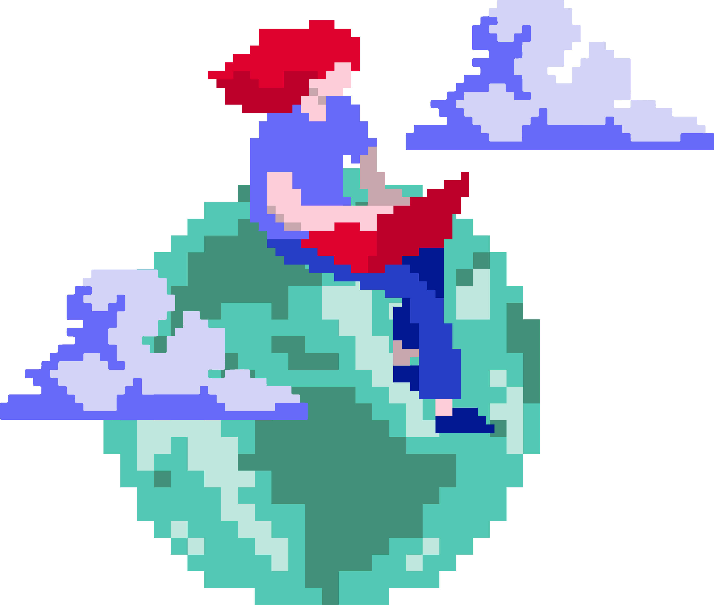
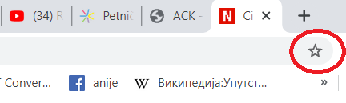

Интернет сервиси
================

.. infonote::
   Када је уређај повезан на интернет, каже се и да је онлајн (енгл. online) а када је веза прекинута, каже се да је уређај офлајн (енгл. offline). Обратите пажњу: у српском језику ове речи, иако енглеског порекла, пишу се онако како их изговарамо. Неправилно је написати онлине исто колико би било неправилно и да напишемо, на пример, телевисион... 

Као што из претходне лекције може да се закључи, интернет представља инфраструктуру. И у граду имамо инфраструктуру - улице и разне врсте цеви и проводника испод њих, на којима функционишу различити сервиси - градски саобраћај, комуналне услуге, водовод, канализација, грејање, снабдевање струјом. Слично томе, на интернету као инфраструктури постоје различите услуге - сервиси. Овде ћемо да поменемо само два: веб (WWW) и електронску пошту.

**Веб, енгл. WWW - World Wide Web**, што би се могло превести као „широм света разапета мрежа”, данас је најраспрострањенији интернет сервис. Он преставља мрежу садржаја (заправо веб-страница)  на интернету, међусобно повезаних везама - линковима.

**Електронска пошта, имејл (енгл. email)** је сервис путем којег корисници шаљу „писма”, односно пошиљке које се састоје од текста и мултимедијалних прилога. Адресирају се адресама корисника, које смо већ описали када смо говорили о врстама адресирања на интернету. 

Примери адреса: mika.petljanovic@gmail.com, mika.petljanovic@outlook.com, су адресе једне особе на два различита мејл-сервиса, mika.petljanovic@sbb.rs би била адреса код једног интернет-сервис провајдера, а mika.petljanovic@vigimnazija.edu.rs би била адреса на домену школе. Ово су четири потпуно различите адресе. У сваком од ових случајева, пошиљка стиже на сервер конкретног мејл-сервиса, а корисник може да посети веб страницу тог сервиса, унесе своје корисничко име и лозинку и затим приступи пошти у свом „поштанском сандучету” (енгл. inbox). Такав приступ се још зове „вебмејл”, јер се електронској пошти приступа путем веба (о којем говоримо у следећем пасусу). Постоји могућност да се на рачунар инсталира програм који се синхронизује када је рачунар повезан на интернет, тако да је могуће касније прегледање поште и писање одговора и када је веза прекинута. Ово је погодно ако немамо сталан приступ интернету. Приметимо да овај пример показује да мејл-сервис може да се оствари без ослањања на веб, тј. да је реч о посебној, у суштини независној врсти интернет сервиса.

У слању сваке имејл поруке учествује већи број рачунара, међу којима неки имају истакнуте улоге. Комуникација започиње на рачунару-клијенту, на коме пошиљалац саставља имејл поруку. Та порука затим путује до рачунара-сервера, на којем се налази мејл сервис пошиљаоца са његовим „одлазним сандучетом”. Порука одатле путује даље до мејл сервера примаоца и његовог „долазног сандучета” (што, бар теоријски, може да буде и исти рачунар). Када прималац посети веб страницу свог мејл сервиса, порука ће бити послата са његовог мејл сервера (из његовог долазног сандучета) на рачунар-клијент примаоца.

И овде једна правописна напомена: у српском језику, без обзира на то да ли је текст писан ћирилицом или латиницом, пише се имејл а не емаил. Знак „@” који улази у састав сваке имејл адресе раздваја корисничко име од домена и чита се „ет”, од енглеске речи „at” што значи „при”, „на”. Зове се још и „мајмунско а”, „мајмунче” или „манки” (од енглеског назива тог симбола monkey).

.. figure:: ../../_images/3_Sending-Email.png
   :width: 500px   
   :align: center

.. learnmorenote:: Шта је хипертекстуални документ?
   
   Можда овај израз видиш први пут, али сасвим сигурно да хипертекстуалне документе користиш, чак и проучавајући ове лекције. То је текст у којем се налазе хиперлинкови, линкови или хипервезе, баш `овако <https://sr.wikipedia.org/sr-ec/%D0%A5%D0%B8%D0%BF%D0%B5%D1%80%D0%B2%D0%B5%D0%B7%D0%B0>`_ - то су речи или краћи текстови(обично приказане плавом бојом и подвучене, али могу да изгледају и другачије) који, када се на њих кликне мишем, воде на неку другу веб страницу или други део исте странице.

Хајде сада да детаљније упознамо два већ поменута сервиса која сигурно користиш, али вероватно не знаш све могућности, а можда нешто од тога и не користиш на сасвим исправан начин.

Прегледање веба
---------------

Веб је интернет сервис путем којег ти управо сада читаш овај текст. За приступ веб садржајима и њихово прегледање потребно је 
да покренеш програм који се зове веб прегледач (веб браузер, енгл. web browser). Најчешће коришћени веб-прегледачи су: 

- Гугл Хром (Google Chrome), 
- Мајкрософт Еџ (Microsoft Edge), 
- Мозила Фајерфокс (Mozzila Firefox), 
- Опера (Opera) и 
- Сафари (Safari).

Веб садржаји су адресирани помоћу URL адресе (већ смо описали шта је то, подсети се ако се не сећаш лекције са претходног часа). Веб страница може да садржи текст, хиперлинкове, слике, видео, звук.

.. figure:: ../../_images/3_veb_stranica.png
    :width: 900px   
    :align: center

    Прегледање веб странице

На страницама постоје хиперлинкови, као што смо већ напоменули, то су места која воде до других веб-страница. Кликом на хиперлинк (често се каже и скраћено, линк) отвара се страница ка којој он води. У зависности од тога како је креирана изворна страница, она друга ће се отворити уместо ње у истој картици истог прозора или у другој картици или прозору.  Десним кликом на линк отвара се мени који нам нуди додатне могућности:

- отварање линка у новој картици,
- отварање линка у другом прозору,
- отварање линка у прозору без архивирања (познат и као приватан прозор, служи пре свега за безбедно коришћење на јавним или туђим рачунарима),
- у случају да је исти корисник пријављен на још неком уређају, појавиће се и опција за слање линка на други уређај
- чување странице на свом рачунару,
- копирање адресе ка којој води линк,
- преглед изворног HTML кода.

.. figure:: ../../_images/3_desni_klik.png
    :width: 500px   
    :align: center
    :class: screenshot-shadow

    Мени који се добија десним кликом на хиперлинк

Клик на слику у веб прегледачу може да изазове различита понашања, у зависности од тога како је направљена веб страница. Најчешће понашање је да се слика отвори у истој картици истог прозора или у другој картици или прозору. Десним кликом на слику се отвара мени, који нам нуди додатне могућности:

- отварање слике у новој картици,
- чување слике на рачунару,
- копирање слике у „клипборд” (да бисмо је касније „налепили” на неко друго место),
- копирање адресе слике,
- претраживање веба према слици,
- блокирање (уколико је инсталиран блокер непожељних садржаја),
- преглед у изворном HTML коду.

.. figure:: ../../_images/3_desni_klik_na_sliku.png
    :width: 780px   
    :align: center
    :class: screenshot-shadow

    Мени који се добија десним кликом на слику

Претраживање веба
-----------------

Људи често мешају **веб прегледач и веб претраживач**, па на ове називе треба обратити пажњу. Веб прегледач је, као што смо већ рекли, програм на твом рачунару помоћу којег прегледаш веб-садржај на изабраној адреси. Веб претраживач је програм на неком серверу који ти помаже да пронађеш веб-странице чије адресе не знаш. Када отвориш, на пример, Гугл-претраживач у било ком прегледачу то изгледа отприлике овако:

.. figure:: ../../_images/3_adresa_pretraga.png
    :width: 780px   
    :align: center
    :class: screenshot-shadow

    поља за адресу и за претрагу

Ако знаш тачну адресу сајта, унеси је у поље на врху прозора. Ако тражиш сајтове везане за одређени појам, текст за претрагу (упит) унеси у поље за претрагу које се налази на средини прозора.

.. questionnote::

   Није свеједно да ли појам или адресу унесеш у једно или друго поље (мада то зависи од прегледача и претраживача које користиш, као и од додатака инсталираних уз прегледач). 
   
   Испробај унос разних појмова и URL адреса у једно и друго поље, по могућности на разним претраживачима и у разним прегледачима, па покушај да откријеш разлику.

Погледај видео у којем је детаљно објашњен поступак претраживања интернета:

.. ytpopup:: Wry89XdTjuI
    :width: 735
    :height: 415
    :align: center     

|

Напредна претрага
-----------------

Ако обичном претрагом не успеваш да пронађеш тражене информације, већ добијаш резултате који воде ка нерелевантним сајтовима, или ка сајтовима о појмовима истог назива али другачијег значења, употреби напредну претрагу:

.. ytpopup:: GuNYY5r8nJc
    :width: 735
    :height: 415
    :align: center

Преузимање садржаја са веба
---------------------------
Претрага и прегледање веба врло често се завршава тако што пронађени садржај желимо да сачувамо да би нам био „при руци” кад нам затреба. Можеш само да ископираш део текста или слику у постојећи документ на твом рачунару или да преузмеш целу веб страницу. Осим тога, на вебу често постоје датотеке (фајлови) који су постављени да би се преузели комплетно. Кликом на линк за преузимање (енгл. download) документ ће бити преузет. Обрати пажњу при преузимању да ли је у питању безбедан извор, преузимање са непоузданих сајтова неретко се заврши тиме што се преузме неки злонамеран софтвер који може да вам направи штету (о злонамерном софтверу и заштити биће речи касније).

Погледај најпре видео о томе како да пронађеш документ који желиш да преузмеш. У видеу се говори о тражењу и прузимању документа „пе-де-еф” (.PDF). Најчешће се текстови за преузимање постављају баш у овом формату. 

.. ytpopup:: 3SN9lXx8qqI
    :width: 735
    :height: 415
    :align: center

Сада погледај видео у којем је објашњено како се преузимају слике са веба:

.. ytpopup:: PlmHt8fBL-g
    :width: 735
    :height: 415
    :align: center

Некада се преузимање докумената врши тако што само кликнеш на одговарајуће дугме или сличицу. На дугмету или сличици може и да пише „Преузми” или „Download”, или је само нацртана стрелица на доле, што представља симбол за преузимање са веба на локални рачунар. И при оваквом преузимању важи све оно што је речено у претходним видео-прилозима о релевантности извора и давања сагласности уколико се прозор са таквим дијалогом отвори пре преузимања. Опрезност је неопходна јер се управо на овај начин, са непроверених сајтова може преузети софтвер који може да нам нанесе штету - да се на наш рачунар пренесе злонамеран софтвер о чему ће бити више речи касније.
За вежбу, уради следећи задатак.

.. questionnote::

   Преузми са ових страница „Петничке онлајн ресурсе” и дело „Доротеј”

   http://petnica.rs/petnicki-online-resursi/

   http://www.antologijasrpskeknjizevnosti.rs/ASK_SR_AzbucnikDela.aspx

Уместо преузимања, можеш само да обележиш линк (уз ризик да власник тог садржаја евентуално промени садржај странице). То може да се уради на два начина: 

- обележавањем у прегледачу кликом на звездицу поред адресе сајта

- помоћу посебних сајтова који служе за памћење линкова, па чак и формирање белешки - као кад читаш папирну књигу па убациш папирић између два листа и напишеш белешку на њему. Такве сајтове ћеш лако пронаћи ако у претрагу укуцаш „маркери”, „букмаркери”, „анотације” (углавном на енглеском: marker, bookmarker, anotation) и наравно формулишеш претрагу тако да избегнеш сајтове који продају папирне стикере или украсне букмаркере, таман да провежбаш претрагу!

Претрага по сликама
-------------------

Осим појма који укуцамо у поље за претрагу, можемо да вршимо претрагу и за задату слику. Ако сте, на пример, видели неки леп пејзаж а не знате где се налази, или сте прочитали неку вест са сликом која вам делује невероватно па желите да проверите да ли се та слика појављивала и у другом контексту, или имате неки трећи разлог због којег желите да пронађете на интернету информације о нечему што имате на слици, изаберите претрагу по слици и поставите слику са свог рачунара или путем линка ако је слика већ на интернету. 

Испробајте ову могућност да видите какве све резултате можете да добијете!

.. ytpopup:: 7BTcv0SHZz4
    :width: 735
    :height: 415
    :align: center

|

Како раде претраживачи?
-----------------------

Кад укуцаш у претраживач неки појам, он не претражује у том моменту све странице на вебу да би проверио где се тај појам појављује. Таква претрага би трајала недељама. Претраживачи на својим серверима имају програме који се називају „пауци” или "пузачи" (енгл. spider, crawler) који стално претражују веб. Када наиђу на неки нов сајт, они формирају „индекс”, који садржи кључне речи о том сајту (нешто налик картици одређене књиге у библиотечком каталогу, какви се још могу пронаћи у по некој старој библиотеци). Када наиђу на сајт који су већ раније посетили, ови програми онда ажурирају индекс сајта уколико је било значајних промена од претходне посете. Сви индекси се чувају у бази података. Кад корисник унесе неки појам за претрагу, претраживач из те базе приказује линкове поређане по процењеној релевантности. Из овога је јасно да претраживач мора да буде у стању да брзо одлучи које су најрелевантније веб стране за дати појам и којим редом треба да прикаже одговарајуће линкове. За то се користе посебни алгоритми, који укључују тзв. вештачку интелигенцију. Програмери претраживача често допуњавају знање на које се ослањају "паметни" алгоритми за класификацију резултата претраге, како би класификација била објективна, а резултати претраге актуелни и релевантни.

Када претражујеш интернет, колико понуђених линкова погледаш док не нађеш жељени садржај или одустанеш од прегледања и „профиниш” претрагу и поново гледаш најбоље позициониране сајтове? Вероватно погледаш највише првих десетак или петнаест понуђених линкова. Не само ти, већина људи ради претраге на сличан начин. Управо зато се креатори веб-садржаја често довијају на разне начине како да учине да њихов сајт буде „на врху” претраге. Овде није лоше да упознаш још два важна појма:

- **„Сео” оптимизацијa**  (енгл. **SEO**, Search engine optimization) се односи на активности којима се унапређује веб-дизајн и кôд веб-сајта, али и изграђује добра „репутација” сајта постављањем квалитетних и оригиналних садржаја.

- **Ранг веб страница, page rank**  је релевантност веб странице, односно вредност додељена веб страници као мера њене популарности или важности, која се користи за одређивање редоследа којим ће бити приказана у резултатима претраживача. У овом рангирању битну улогу игра укупан број страница (широм веба) које садрже линк ка тој страници.

Код претраге довољно је да укуцамо једну или пар кључних речи, а можемо да користимо и алате за напредну претрагу којом можемо да искључимо појављивање неких речи, да вршимо претрагу према правима коришћења (лиценци, биће о томе касније речи), језику и слично. При претрагама бољи резултати се добијају ако се укуца пар кључних речи него ако се формулише читава реченица са превише детаља.

.. questionnote::

   Задатак 1

   Желитш да сазнаш нешто о животињи „јагуар”. Међутим, при претрази се појављују и сајтови на разним језицима (јер се јагуар исто пише у многим језицима) а појављују се и сајтови о аутомобилима марке „Јагуар”. Како ћеш подесити претрагу?

   Задатак 2

   Потребне су ти информације и формуле за геометријско тело „елипсоид”, које ти је можда познато из географије. Међутим, кад укуцаш тај појам, већина резултата се односи на чињеницу да наша планета има облик елипсоида, а тебе занима „математичка страна приче”. При томе, владаш добро и енглеским и још једним страним језиком. Како ћеш подесити претрагу?

 
Услуге, платформе и сервиси на вебу
-----------------------------------

Већ смо навели да је „веб” интернет сервис. Када кажемо „веб”, обично најпре помислимо на посете веб-сајтовима, читања текстове и гледање слика. То и јесте све што је веб нудио у својим почецима, али данас овај сервис пружа много разноврсније услуге. Нека веб-места чак зовемо „платформа” јер обједињује различите врсте услуга или је пак у питању систем који пружа много више од „обичног” веб-сајта. Поменућемо само неке за које верујемо да су ти познати: 

- Гугл-мапа  `maps.google.com <http://maps.google.com/>`_ -  мапа терена и путева на целој планети (мада није у свим земљама исти „ниво детаља” који се може видети, провери!)
- Јутјуб  `youtube.com <https://www.youtube.com/>`_ - платформа за отпремање и прегледање видео материјала. 
- Електронска трговина, онлајн продавнице - мноштво сајтова на којима је могуће купити и електронски платити робу.
- Електронско банкарство - данас свака банка има могућност да клијенти онлајн виде стање на рачуну и врше плаћање путем интернета.
- Друштвене мреже: `facebook.com <https://www.facebook.com/>`_,  `instagram.com <https://www.instagram.com/>`_, `twitter.com <https://twitter.com/>`_ и многе друге - сервиси путем којих људи остварују контакте и размењују слике, поруке… Сервиси за својеврсно „дружење” преко интернета.
- Платформе за учење на даљину путем интернета (енгл. e-learning) - овај net.kabinet, сајтови засновани на различитом софтверу и сервисима Google Classroom, Moodle…
- Онлајн енциклопедије и библиотеке

и многи други. Подсећања ради погледај у првој лекцији списак области развоја информационог друштва у Србији - то је управо списак веб-сервиса који се развијају код нас.

.. parsonsprob:: inter3

   Поређај у правилном редоследу 
   -----
   "паук" посећује сајт
   формира се индекс сајта
   захтев за претрагу
   у бази индекса се проналазе они релевантни
   резулатат се шаље клијенту
