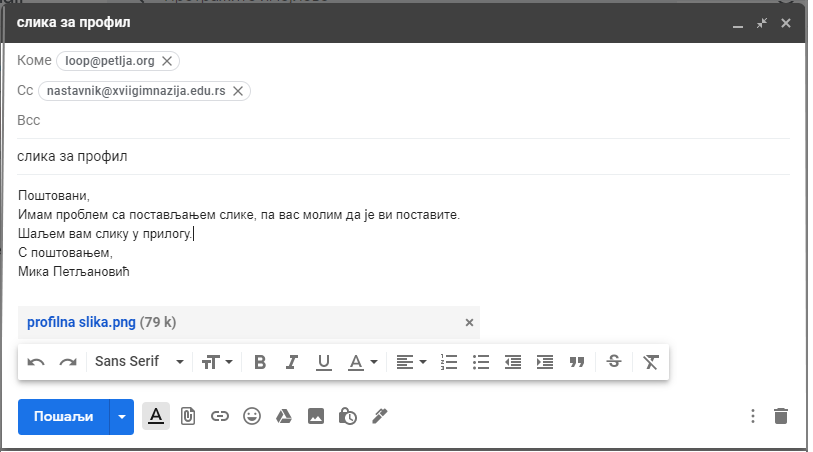

Начини и правила комуникације и понашања на интернету
=====================================================

Електронска пошта - „имејл”
----------------------------

Довољно је да знаш нечију имејл адресу, да имаш свој налог и већ можеш да пошаљеш имејл. Међутим, важно је да знаш нека основна правила комуникације, јер од тога зависи да ли ће те особа којој се обраћаш правилно разумети, али и какав ће утисак стећи о теби - да ли си васпитан и образован, од чега некад може да зависи и исход преписке, а и слика коју неко има о теби.

Вероватно нешто до овога знаш и из основне школе, али није наодмет да се подсетиш. Ово су основна правила којих би се требало придржавати:

**У поље „Коме”** (енгл. To) пише се адреса примаоца, онога коме се обраћаш у писму. Ако се истовремено обраћаш неколицини особа које се међусобно познају, можеш да ставиш све адресе у ово поље. Није пристојно ставити велики број (нпр. неколико десетина) адреса у то поље, а никако не би требало ставити адресе људи који се међусобно не познају и немаш од њих дозволу да било коме прослеђујеш њихову адресу.

**Поље „Cc”** (енгл. Carbon Copy) предвиђено је да у њега ставиш адресе оних који треба да буду упознати са преписком, али се не обраћаш њима нити од њих очекујеш одговор.

**Поље „Bcc”** (енгл. Blind Carbon Copy) треба да употребиш када више прималаца треба да добије имејл, али тако да они не виде адресе других, углавном због заштите личних података. Имај на уму да на овај начин не можеш да започнеш групну дискусију, јер примаоци почетне поруке у овом случају не могу да одговоре тако да сви остали виде њихов одговор. 

Приликом слања поруке, мора да се употреби бар једно од поља *To*, *Cc* и *Bcc* (у противном порука нема коме да буде послата), а могу да се употребе и два или сва три поља.

Уколико наведеш велики број прималаца имејла, постоји ризик да тај имејл заврши у нежељеној пошти (енгл. Spam) и да га примаоци и не примете.

**Поље „Наслов”** (енгл. Subject) служи да у њега напишеш пар речи које говоре о теми мејла како би прималац, у случају да прима много поште, на основу тога проценио колико је хитно да отвори приспели мејл, али и да касније лако може да пронађе преписку захваљујући добро одабраном наслову. Дакле, у твом је интересу да наслов буде смислен уместо уопштених „помоћ”, „молба”, „хитно” и слично… И никако у наслов не треба да куцаш читаве поруке. Не заборави, то је само **наслов**.

Када одговараш на мејл, ако одговараш само пошиљаоцу мејла уради то користећи опцију **„Одговори”** (енгл. Reply). Али, ако је више прималаца укључено у преписку и твој одговор се тиче свих, онда треба све укључити и у одговор, што се постиже опцијом **„Одговори свима”** (енгл. Reply to all). Не заборави да одговор на твоју поруку (а тиме ни даљу преписку) неће видети примаоци које наведеш у пољу „Bcc”, чак и ако је онај ко је одговорио, користио опцију "Одговори свима" ("Reply to all").

Писмо треба започети и завршити пригодним обраћањем и поздравом, поштовати општи и дигитални правопис. Наравно, текст може да се пише ћирилицом или латиницом, али не енглеским алфабетом, тј. не користити слова „c”, „s”, „dj” и „z” уместо „č”, „ć”, „š”, „đ” и „ž”. Осим општег правописа, постоје нека правила која су карактеристична за текстове у електронском облику. Честа је, на пример, неправилна употреба размака (спејс, енгл. space). Размак се иза знака интерпункције пише увек, а испред знака једино у случају да је то отворена заграда или отворени наводник. Према томе, размак се на пише пре зареза, тачке, тачка-зареза и слично.

У електронској комуникацији писање великим словима се сматра ВИКАЊЕМ, а то није баш лепо.

Уз електронску пошту може се послати и **прилог** (енгл. **attachment**). То може да буде било каква датотека (слика, текстуални документ, видео), осим што код скоро свих сервиса електронске поште постоје и два ограничења. Једно ограничење се односи на величину прилога, тако да не можете послати произвољно велику датотеку (ова ограничења су различита код различитих имејл сервиса), а друго ограничење се односи на немогућност слања извршивиих датотека (то су датотеке типа .exe, о томе ће бити више речи у следећој теми), како би се спречило ширење злонамерног софтвера. Ако је потребно да пошаљете веома велику датотеку или неки програм, то можете да урадите путем неког другог сервиса.  
 
.. questionnote::

    Пронађи на интернету неколико текстова о дигиталном правопису и портажи правила која нисмо овде навели.

Имај увек на уму да слање електронске поште није сасвим безбедно, па ако се не користе нарочити поступци заштите приватности (нпр. криптовање), у имејл немој да стављаш поверљиве информације.

При прослеђивању поруке трећим лицима требало би да имаш дозволу пошиљаоца, као и да не мењаш садржај оригиналне поруке.

Из текста није увек лако (а некад није ни могуће) да се препозна тон поруке, који се у гласу или говору тела много лакше препознаје. На пример, савет, предлог, молба и наређење у тексту могу да изгледају потпуно исто. Исто тако, на основу самог текста често не може да се разликује да ли је неко озбиљан или се шали. Зато су у писаној преписци постали популарни емотикони, који могу на очигледнији начин да пренесу тон поруке, односно емоцију. Њихова употреба је прихватљива и понекад врло корисна, али у употреби емотикона не треба претеривати.

.. questionnote::

    На почетку године наставник је сигурно дао своју службену имејл адресу. Пошаљи један имејл свом наставнику којим га обавештаваш да си стигао до ове лекције и овог задатка.
 
Јавне дискусије на форумима и друштвеним мрежама
------------------------------------------------

Када учествујеш у дискусијама на друштвеним мрежама и форумима, настој да комуникација буде пристојна, као када разговараш уживо. Дискутуј аргументовано и без вређања других учесника. У дискусији се држи теме. Администратор форума или странице има пуно право да непримерене дискусије прекине закључавањем дискусије или блокирањем учесника. Креирање лажних профила и коментарисање у име неког другог (измишљеног или стварног) није баш прихватљиво понашање на интернету и то не би требало да се ради. Управо због тога што се то дешава, у комуникацији са људима које не познајемо „уживо” неопходна је велика опрезност, да не бисмо довели себе и друге у опасност. 
 
 .. image:: ../../_images/3_media-998990_640.jpg
   :width: 780px   
   :align: center

.. questionnote::

    Правила понашања на интернету називају се „нетикеција” (нетикет, нетикета, енгл. *netiquette*, од *net* и *etiquette*). Потражи на интернету текстове о томе и упореди их са овим што смо навели у лекцији. Покушај да пронађеш још нека правила која нисмо навели. Запиши сва та правила и покушај да их разврсташ према области примене. Иначе, ова правила јесу неформална, али су ипак правила, општеприхваћена на интернету, и сматрају се делом лепог васпитања, бонтона. 
