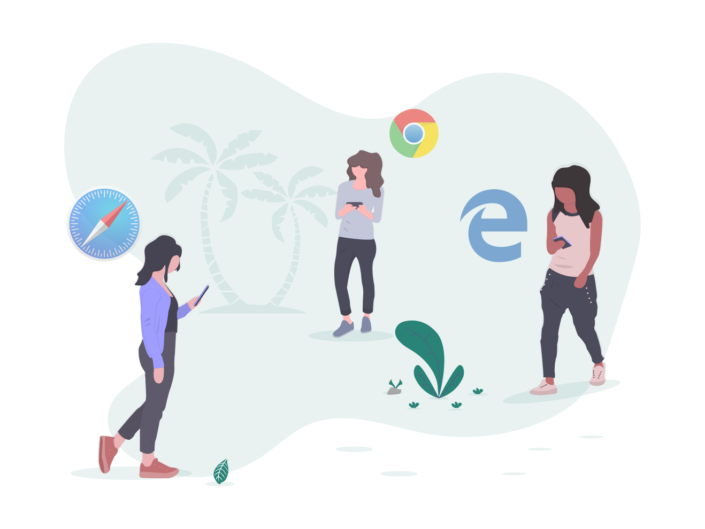

Садржај лекције 1.3
===================

|

На овом часу научићеш како се користе  два интернет сервиса, како се прегледа и претражује веб и која су правила комуникације и лепог понашања на интернету

|

Садржај:

- Интернет сервиси

- Прегледање веба

- Претраживање веба

- Веб сервиси

- Преузимање садржаја са веба

- Начини и правила комуникације и лепог понашања на интернету

|

Када успешно савладаш ову лекцију бићеш у стању да самостално претражујеш и проналазиш информације у дигиталном окружењу и преузимаш их на свој уређај, класификујеш информације са интернета и да комуницираш путем интернета.

|

|
