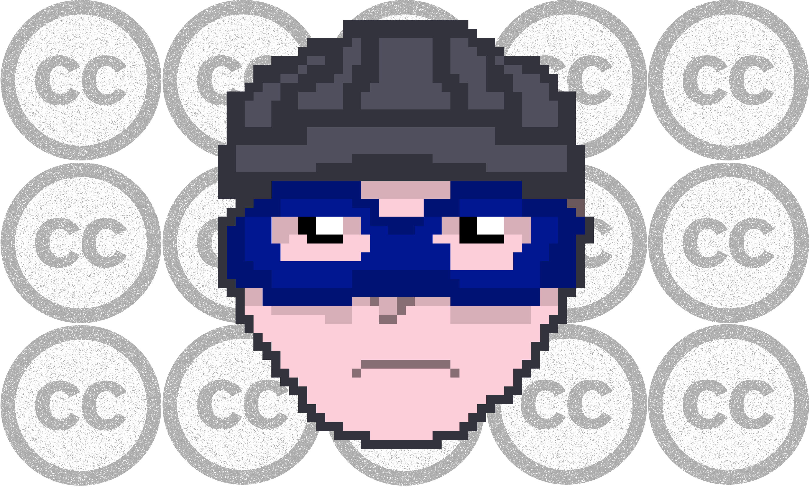
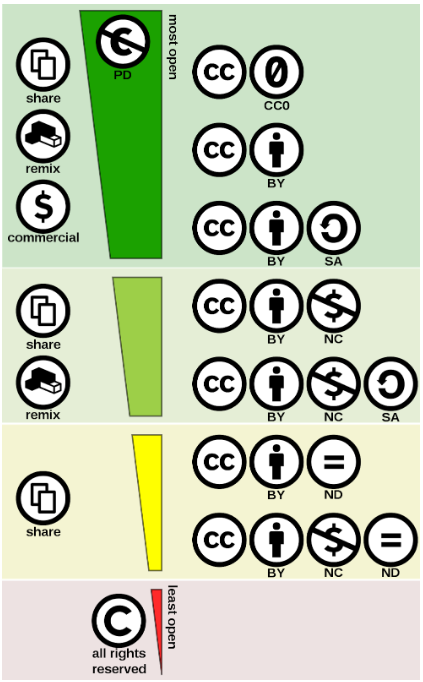
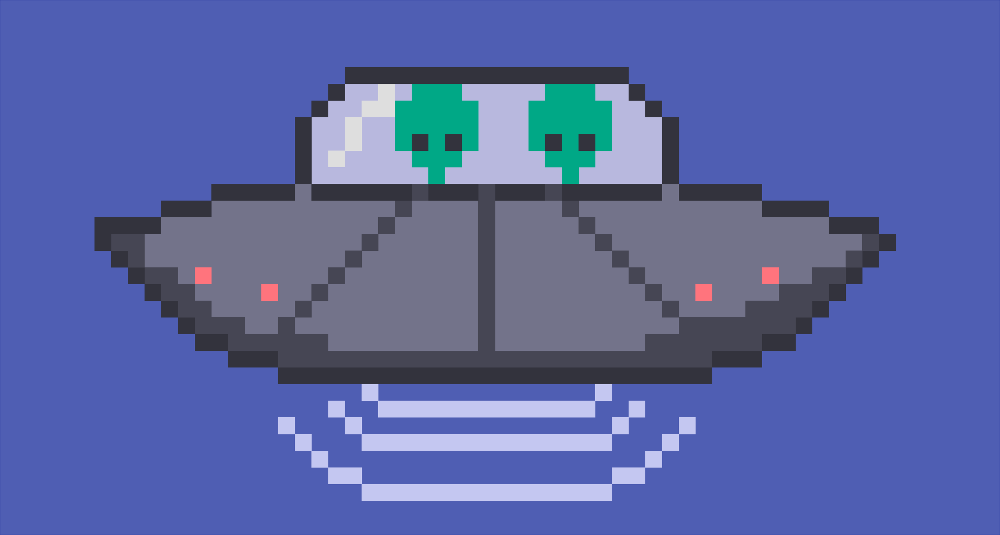

Ауторска права и веродостојност информација
===========================================

|

Ауторска права на интернету
---------------------------

На вебу врло лако можемо да дођемо до најразличитијих садржаја - текстова, слика, звучних записа, видео-материјала. Међутим, то што бесплатно дођемо до неких садржаја, не значи да можемо да их прерађујемо и даље делимо по сопственом избору. Аутор неког дела има право да одреди услове под којима се оно може користити даље. Некада је довољно само навести извор, али некада аутор не дозвољава коришћење његовог дела ни под тим условом. Питање ауторских права није само морално, већ и јасно дефинисано правно питање, чије непоштовање за собом повлачи и последице. Уколико је аутор навео услове за коришћење свог дела, има право да тужи онога ко те услове није поштовао.

При пријављивању на неки сервис, у поступку отварања налога, корисник има прилику да прочита услове коришћења и сагласи се са њима, да би уопште могао да користи тај сервис. Ови услови између осталог регулишу и ауторска права над материјалима који се налазе на том сервису.

|

.. reveal:: zabrana
   :showtitle: Овим забрањујем да се користе моји подаци...
   :hidetitle: Сакриј прозор
   
   .. infonote:: Интересантна је појава да се повремено појави на пример на Фејсбуку, објава да „Овим забрањујем да  Фејсбук користи моје фотографије…” **Овакве објаве немају никакво ни техничко ни правно дејство и само „загушују” комуникацију на мрежи, и не треба их копирати.**  Сва права у том смислу одређена су условима коришћења одређеног сервиса, са чиме се сагласимо прихватањем услова при отварању налога.

|

За заштиту својих права, аутори могу сами да напишу услове коришћења, али је практичније да искористе неки већ постојећи систем лиценцирања. Тренутно најраспрострањенији систем је „Заједничко креативно добро” (енгл. Creatiвe Commons) интернационални пројекат који се реализује и у Србији. Ово су такозване „слободне лиценце”, а аутори врло шесто штите своја дела „затвореним лиценцама” које штите њихова ауторска права (копирајт, енгл. copyright, ©).

.. ytpopup:: vNJ44J4G7PQ
    :width: 735
    :height: 415
    :align: center     

|

.. reveal:: cc
   :showtitle: Ко стоји иза Creative Commons лиценци?
   :hidetitle: Сакриј прозор
   
   .. infonote:: Посети сајт који је приказан у претходном видео-прилогу. Више о организацији можеш да прочиташ овде `O CC licencama <https://creativecommons.org.rs/?page_id=54>`_. 

|

Да резимирамо причу о лиценцама након гледања видео-прилога и посете сајту:

Свака лиценца се састоји из три „слоја”:

- Машински читљив слој намењен је интернет претраживачимакако би могли да пронађу садржаје према захтеваној лиценци.

- Лако размуљив слој је она „маркица” коју видиш на сајту а састоји се из симбола који указују на основне карактеристике лиценце.

- Уговор о лиценци који чини сам документ који дефинише права аутора и рпава корисника.

На сајту `creativecommons.org.rs <http://creativecommons.org.rs/>`_ налази се детаљан опис свих лиценци као и интерактивна форма која олакшава ауторима креирање одговарајуће лиценце.

Ове лиценце односе се на ауторска права везана за материјале који се налазе на интернету. О лиценцама софтвера биће речи касније.

Слика: скала лиценци према степену отворености

|

Веродостојност информација на интернету 
----------------------------------------

**Извори од поверења**

Кад је реч о веродостојности информација изузетно је важно да знамо која организација или појединац су одговорни за сајт или део сајта који смо посетили и са којег користимо информације. Ту нам је пре свега од значаја да знамо да „протумачимо” УРЛ-адресу, односно домен на којем је извор у чију веродостојност желимо да се уверимо. Да ли на сајту постоји информација о ауторском тиму, да ли постоји информација о лиценци под којом су објављени садржаји. 

Ако, рецимо, желимо да пронађемо упутство за коришћење неког уређаја, кућног апарата, логично је да информацију најпре потражимо на званичном сајту произвођача па тек онда у описима на сајту продавнице, а ако смо  као резултат претраге нашли на неком сајту „сумњивог” домена, можда је боље да документе са таквих сајтова не преузимамо. Може се десити да заразимо рачунар неким малициозним софтвером (софтвером који може да нам уништи податке или открије лозинке неовлашћеним лицима или направи неку другу штету) или пак да добијемо информације које смо тражили о уређају које нису валидне.
Неретко сајтови који нуде бесплатну музику, филмове, књиге, софтвер (који се иначе плаћају) уз датотеке које преузмете прикаче и малициозни софтвер који може да угрози вашу приватност или да вам направи штету међу вашим подацима и програмима.

|

.. reveal:: sumnjivi
   :showtitle: Шта би могли да буду „сумњиви” домени?
   :hidetitle: Сакриј прозор
   
   .. infonote:: Ако домен нема назив који на неки начин одговара називу фабрике, трговачког ланца, организације, чији сајт тражиш, или је ознака домена таква да не указује на врсту институције за коју се представља, на пример, на сајту пише да је у питању универзитет, а у домену је ознака попут .info,  .biz или нешто слично уместо .ac и домен земље у којој је универзитет онда би требало да побољшаш претрагу и упоредиш резултате.

У потрази за информацијама, добро је проверити на више сајтова, из више извора веродостојност информације.

Осим извора иза којих стоји одређена нека научна или образовна институција, удружење или фондација од поверења, редакција неког познатог научног часописа, неретко се наше претраге заврше на Википедији. Да ли знате ко је аутор текстова на Википедији и ко за њих гарантује? Можемо ли им веровати?

|

.. reveal:: wiki
   :showtitle: О Википедији
   :hidetitle: Сакриј прозор
   
   .. infonote:: `Википедија  <https://sr.wikipedia.org/sr-ec/%D0%92%D0%B8%D0%BA%D0%B8%D0%BF%D0%B5%D0%B4%D0%B8%D1%98%D0%B0>`_

Иако на Википедији може апсолутно свако да буде аутор, исто тако, свако ко утврди грешку може да је исправи. Генерално, кључни механизам за проверу релевантности је провера извора информација па се ткао и на Википедији инсистира на томе да се на дну чланка експлицитно и јасно наведу извори информација. Реценезију и уређење текста раде уредници, тако да и тај процес утиче на поузданост објављених садржаја. Статистике кажу да, чак и ако неко случајно или злонамерно унесе нетачну или увредљиву информацију, у врло кратком року, од неколико минута или сати ће неко од уредника који прате измене приметити и интервенисати. Свакако ни Википедији као ни једном другом извору не можемо апсолутно веровати, али ипак добијамо добру основу за претрагу и „унакрсну проверу” чињеница које смо пронашли на Википедији. Наравно, и након свих ових провера, не можемо да будемо 100% сигурни у информацију јер су можда и аутор и рецензент у заблуди или пак постоји више супротсављених гледишта у вези са појмом који се објашњава.

Примећујеш да на Википедији за скоро сваки појам постоје верзије на различитим језицима. Чак и ти можеш да постанеш аутор на Википедији уколико постоје теме о којима желиш и можеш да пишеш или да будеш волонтер - уредник. На тај начин можеш да даш допринос повећању количине корисних садржаја на српском језику на интернету. Наравно, под условом да овај посао прихватиш озбиљно и одговорно и допринесеш поузданости Википедије.

|

**Дезинформације, лажне вести**

Неретко на вебу можемо пронаћи вести које нам делују невероватно, а ипак аутори прилажу слике и разне „доказе” којима нас уверавају у истинитост својих тврдњи. Оваква појава назива се „масовна обмана” или „хоакс”. Поруке са лажним информацијама корисника могу да доведу у заблуду и наведу да, на пример ода неке поверљиве податке или да створи панику и подстакне га да предузме неке друге радње из страха од тобожње опасности. Разлози за наставак оваквих „вести” су разни: манипулација, пропаганда, „теорије завере”, а све то зарад остварења неких политичких, верских, комерцијалних циљева, а понекад су то само неслане шале.
У ову групу спадају и ланчани мејлови, мејлови којима се саопштавају „велике тајне” а у ствари квазинаучне „теорије”, мејлови у којима нам неко тражи личне податке да би нам оставио тобожње велико наследство или лозинке да би „спречио крађу наших података” а управо нас навео да их сами одамо. 

.. infonote::
    Изузетно је важно да не прихватамо одмах, без провере вести које смо пронашли на интернету - треба увек потражити још извора, проверити ко стоји иза одређеног сајта, односно са које адресе је послат „сумњиви” имејл, да ли је то нека организација од ауторитета, али наравно пре свега да мислимо својом главом, критички и утемељено на научним чињеницама.

На интернету постоје сајтови који се баве анализом у потрази за истином. Наравно, ако ћемо да будемо доследни до краја у свом критичком мишљењу, можда ни тамо није баш све 100% тачно, али свакако такви текстови садрже мноштво линкова и аргумената који ће нам помоћи да њиховим трагом прикупимо довољно чињеница да можемо да формирамо став.

- Ово је пример једног таквог домаћег сајта: `fakenews.rs <https://fakenews.rs/>`_.

Ово су два инострана сајта са примерима вести које су  „кружиле” и код нас по друштвеним мрежама:

- О тобожњим капсулама вируса које су бацане из авиона `syyhoaxanalyzer.com <https://www.syyhoaxanalyzer.com/?p=1629&fbclid=IwAR0kb6x0iHRFYl2_gIH6rq-VvUe3X0b9EShCCdzUosp1LB_LE_2ElIuY-sM>`_.

- О такозваним „кемтрељсима” - једној од омиљених тема „теоретичара завере” (поред тврдње да је Земља равна плоча, да од 5Г мреже „падају птице са неба” и да су у вакцинама чипови који нам читају мисли…) `hoax-net.be <https://hoax-net.be/non-lus-army-na-pas-largue-des-capsules-de-covid-19-sur-litalie-la-france-et-le-groenland/>`_.

|

.. reveal:: tz
   :showtitle: Шта је „теорија завере”
   :hidetitle: Сакриј прозор
   
   .. infonote:: Ова појава била је присутна у народу и пре појаве интернета, али су убрзане комуникације, имејл и друштвене мреже допринели њиховом ширењу, јер свако ко пожели може да објави вест или „вест” и да допре до широке публике. У питању су објашњења неких догађаја укључивањем „завера”, политичких или финансијских циљева, при чему објашњења и „докази” нису засновани на научним методама и реалним чињеницама, а лакоћа хиперпродукције лажних „доказа” и „сведока” ствара уктисак да је „теорија доказана”. 

                 Управо неограничена доступност чињеницама омогућује нам да сваку такву тврдњу проверимо на релевантним изворима, што није увек једноставно.    

                 Ако те интересује да сазнаш више о овом социолошком феномену који је узео маха на интернету, више можеш да прочиташ овде  `О теоријама завере <https://sr.wikipedia.org/sr-el/Teorija_zavere>`_.

|

Ако ти је ово занимљива тема, погледај `Водич за борбу против лажних вести <https://issuu.com/novinarska-skola/docs/fake_news_vodic>`_.

|

.. questionnote:: Веродостојност информација

    1. Процените истинитост вести на овом сајту https://zapatopi.net/treeoctopus/

    Образложите свој став - зашто тако мислите?

    
    2. Кад смо већ код октопода, погледај овај видео  https://vimeo.com/270865285  

    Ако га поделиш на друштвеним мрежама, шта мислиш који проценат твојих пријатеља ће поверовати да је истинит?

|

.. questionnote:: Вредновање извора

    Изненада те је у току ноћи заболео зуб. Твој стоматолог не ради ноћу. Потражићеш помоћ на интернету. Којим сајтовима ћеш највише веровати и зашто?
    
    http://www.novosti.rs/vesti/lifestyle.304.html:425213-Malim-trikovima-ublazite-zubobolju
   
    https://stil.kurir.rs/lepi-zdravi/medicina/51082/najbolji-lek-protiv-zubobolje-bol-nestaje-u-momentu-recept
    
    http://ordinacijadentan.rs/lek-za-zubobolju-sta-raditi-kada-boli-zub-najbolji-saveti-strucnjaka/
    
    https://www.zenskimagazin.rs/dijetafitnes/zdravlje/resite-se-zubobolje-za-minut-sa-ovim-prirodnim-lekovima
   
    https://www.stomatolog-novi-sad.rs/zablude-vs-istine-u-stomatologiji-no9-stavljanje-aspirina-u-podrucje-obolelog-zuba-smanjuje-bol
    
    http://www.zenasamja.me/zdravlje/3010/boli-vas-zub-evo-par-trikova-kako-da-ublazite-bol