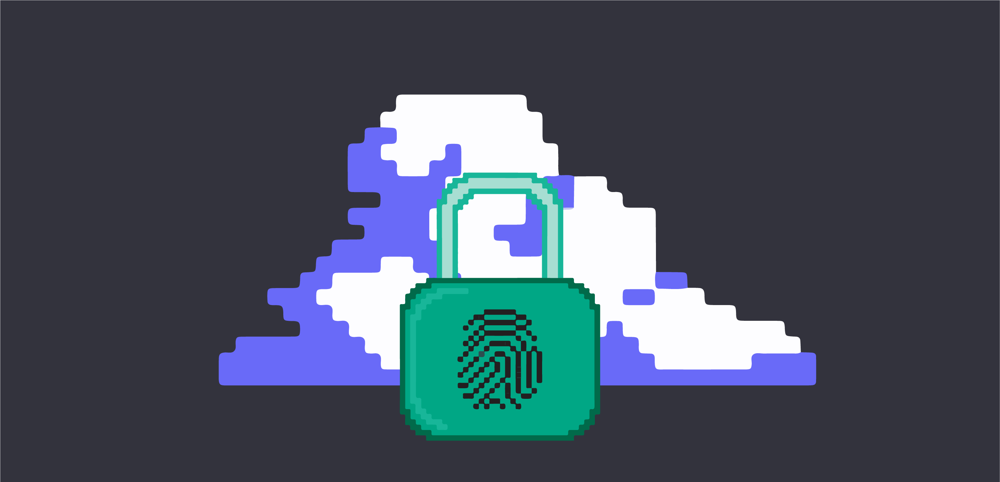
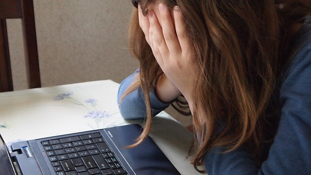

Заштита и безбедност на мрежи
=============================

Заштита личних података и приватност
------------------------------------

Лични подаци (каже се још и „подаци о личности”) су сви они подаци на основу којих се може идентификовати нека особа и угрозити њена приватност. То су осим имена и презимена и његови подаци о датуму рођења, здравственом стању, банковним рачунима, адреса, зарада, вероисповест, национална припадност, лични ставови, намере и друга обележја његовог физичког, генетског, менталног, економског, културног и друштвеног идентитета. Да би неко прикупљао и обрађивао овакве податке, мора за то да има сагласност лица на које се подаци односе, или родитеља/старатеља ако је реч о малолетном лицу. Такве информације не би требало слати у мејловима са великим бројем прималаца (који се при томе не познају или нису сагласни да се њихови подаци деле на тај начин) и не би их требало постављати јавно, на пример на друштвеним мрежама.

Закон о заштити података о личности у Србији је пропис који држава доноси да би уредила односе између грађана на које се подаци односе и приватних и јавних организација које те податке прикупљају и обрађују. Овим законом су уређена права за заштиту лица у вези са складиштењем, обрадом и преносом података. Осим наведених права, овај закон уређује и обавезе оних који су надлежни за чување, обраду и пренос података.

Неретко ћеш на неким сајтовима пронаћи информацију о томе да се обрада и чување података врши у складу са Општом уредбом о заштити података (енгл. General Data Protection Regulation, GDPR). То је уредба Европске уније којом се регулише заштита лица у односу на обраду података о личности и слободном кретању таквих података. Када на неком сајту или мејл сервису отвараш налог, обавезно ће ти, у складу са прописима бити предочено ко и како прикупља, обрађује и чува твоје податке.

У подешавањима својих налога на мејл-сервисима и друштвеним мрежама, обавезно провери и подеси правила безбедности и приватности како твоји подаци не би били злоупотребљени. И поред тога, настој да не остављаш непотребно своје личне податке на било ком сервису.

.. questionnote::
    Проверите на свом Гугл или Мајкрософт налогу, као и на налозима на друштвеним мрежама подешавања приватности и онемогућите јавни увид у личне податке који нису неопходни за ваше присуство на одређеном сервису или друштвеној мрежи.

    Ако нисте сигурни да све добро разумете на енглеском језику, подесите језичке поставке свог налога на српски језик.

Безбедност на интернету
------------------------

**Будите свесни да постоје опасности и научите како да заштитите себе и друге!**

Дигитално насиље и насиље на интернету су узнемиравање, понижавање, претње и злостављање коришћењем интернета и телефона. Кад су деца у питању, најчешће се класификује на вршњачко насиље и насиље одраслих особа према деци.

Треба да знаш да је упорно звање телефоном, злостављање слањем велике количине СМС порука и мејлова, упорно контактирање и малтретирање  против нечије воље, кривично дело и да имаш право на заштиту од тога. 

Уколико некога познајеш само преко интернета, немој да пристајеш на састанке уживо на које не можеш да дођеш у пратњи одрасле особе. Никако не пристај на слање слика за које не желиш да буду јавно доступне, јер никад не знаш кад их тај неко може злоупотребити, без обзира на то да ли ту особу уопште не познајеш „уживо” или је то неко кога знаш и волиш, јер гаранције да их тај неко неће некада злоупотребити не постоје! Уколико неко од тебе захтева да користиш „шифровани језик”, да лажеш и прикриваш тај контакт, то је већ готово сигуран знак да си у опасности!

Особа која је жртва дигиталног насиља, покушавајући да се „извуче” обично се „запетљава” још више наивно верујући да ће насиље престати након „само још овога” и такви случајеви нажалост најчешће се завршавају трагично - деца бивају жртве физичког насиља или самоубиства као „бега” из наизглед безизлазне ситуације. Мораш да разумеш да су твој живот и твоја безбедност важнији од страха да ћеш добити од родитеља прекор због лакомисленог упуштања у комуникацију са непознатом особом и да је мање зло некоме открити проблем у настајању него дозволити да он дође до тачке са које нема повратка.
 

**У случају да препознаш дигитално насиље, немој да покушаваш да проблем решиш самостално.** То је практично немогуће. Обрати се за помоћ родитељима или директно националном контакт центру за безбедност деце на интернету на број телефона 19833 или преко сајта `pametnoibezbedno.gov.rs <https://pametnoibezbedno.gov.rs/>`_.

.. questionnote::
   
    Која су твоја права на интернету, као и какве могућности имаш да та права оствариш детаљно проучи на овом сајту `Твоја права - безбедност на интернету <http://tvojaprava.cpd.org.rs/sigurnostnainternetu.html>`_. Затим, да би ти било лакше да препознаш ситуације у којима можеш да постанеш жртва, проучи пажљиво следећу презентацију: `Паметно и безбедно - презентација <https://pametnoibezbedno.gov.rs/files/Prezentacija-za-decu.pdf>`_
    Након проучавања садржаја на ова два веб-места,  састави есеј на тему „Опасности са интернета и моје право на заштиту”
 

.. questionnote:: Дигитално насиље

    1. Твој најбољи друг/другарица ти се поверава да је упознао/упознала девојку/младића путем интернета, да су се јако заволели и да су се договорили да се упознају и лично. Какав ћеш савет дати?
 
    2.  Твој најбољи друг/другарица ти се поверава да га/је неко вербално злоставља на друштвеним мрежама и шаље приватне поруке непријатне садржине. Какав ћеш савет дати?

**За крај, да сумирамо,**
при коришћењу интернета, изузетно је важно да водимо рачуна о:

- безбедности људи и података
- ауторским правима
- поштовању правила лепог понашања и дигиталног правописа
- кредибилитету извора информација.

