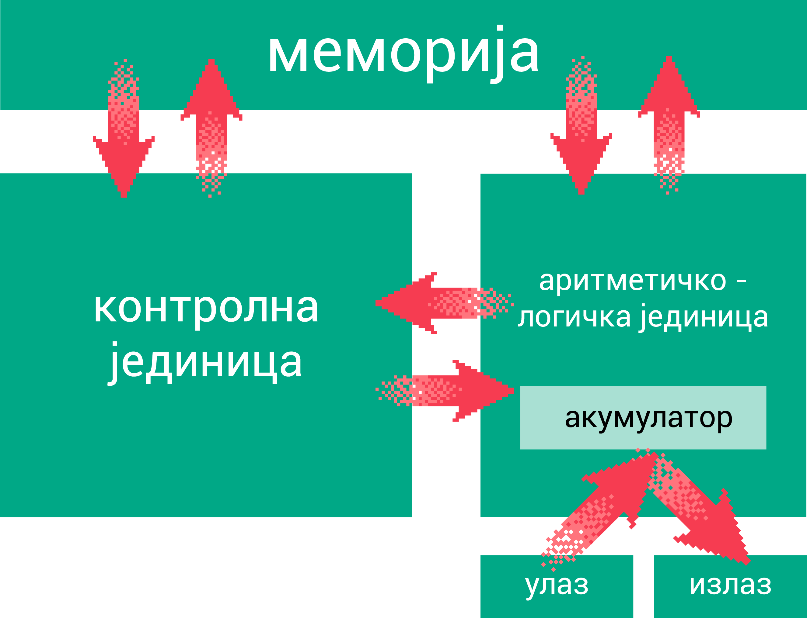

Генерације електронских рачунара
================================

Код електормеханичких рачунара постојала је велика разлика између брзине рада и поузданости механичких и електронских компоненти. Стога се настојало да се механички склопови замене електронским.

Првим електронским рачунаром сматра се рачунар Енијак (енгл. ENIAC, Electronic Numerical Integrator And Computer) конструисан четрдесетих година прошлог века - крајем Другог светског рата. Био је тежак 27 тона (отприлике као данас један огроман камион - шлепер) и велики као пар школских учионица, само електронских вакуумских цеви је имао око 18000 и стотину хиљада других компоненти. Трошио је много струје, заузимао огроман простор, био подложан кваровима, и мада неупоредиво мањих могућности него било који данашњи мобилни телефон, у време када је настао, представљао је огроман технолошки напредак.

.. learnmorenote:: Ко жели да сазна нешто више о Енијаку

    `ENIAC — Википедија <https://sr.wikipedia.org/wiki/ENIAC>`_

Нешто мало након Енијака, настао је Едвак (енгл. EDVAC, Electronic Discrete Variable Automatic Computer) - био је први рачунар који је радио потпуно у бинарном систему, а подаци и програм који је одређивао шта рачунар треба да уради били су ускладиштени у меморију рачунара. Члан конструкторског тима био је и Џон фон Нојман, творац концепта по којем раде сви рачунари од тада па и данашњи рачунари.

   Фон Нојманова архитектура

Наиме, сви рачунари до тада су се „физички програмирали” - то значи да су инжењери буквално лемили жице и конструисали склоп који треба да извршава одређени програм. За неки следећи програм требало га је „редизајнирати”. **Фон Нојманов принцип** има одвојену меморију у којој се складишти програм, тако да један рачунар може да извршава различите програме, само их треба учитати у меморију рачунара.

.. learnmorenote:: Да се подсетимо - знаш ли шта су електронске вакуумске цеви? А транзистори?
   
    У овој лекцији  често се спомињу технолошки изуми: електронска вакуумска цев, полупроводници, транзистори, интегрална кола… О томе је у основној школи било речи на часовима технике и технологије.
      
    Електронска вакуумска цев имала је велику примену у разним областима електронике све до открића полупроводника и појаве транзистора. У рачунарству, имала је улогу „прекидача” који затвара или отвара струјно коло. Касније су их заменили транзистори који су имали исту улогу. Ти „прекидачи” су важни јер представљају базичне елементе у рачунару, који се користе за изградњу сложенијих елемената, који могу да памте и обрађују податке.

**I генерација** - развијена за време Другог светског рата, у војне сврхе. Израђивани су у технологији **електронских вакуумских цеви**. Хиљаде електронских цеви заузимало је огроман простор, трошило је много енергије и производило пуно топлоте. За меморисање програма и података користили су бушене траке и бушене картице, програмирали се на машинском језику - језику блиском машини али тешко разумљивом за човека. Први рачунари ове генерације: већ поменути Енијак (ENIAC), Јунивак (UNIVAC). Ти рачунари су били веома скупи и могле су да их приуште само огромне организације - војска, влада, универзитети, а њима су руковали само обучени стручњаци. Примена је била искључиво у научне, техничке, војне и пословне сврхе.

Ова генерација била је актуелна  1940-тих и 1950-тих година.

.. figure:: ../../_images/5_ENIAC.png
    :width: 720px   
    :align: center

    Електронске вакуумске цеви и рачунар ENIAC

**II генерација** -  користила је транзисторе (то је прва појава полупроводничке технологије која се користи и данас), па су рачунари постали јефтинији, физички мањи и трошили мање струје, али још увек су заузимали много већи простор него данашњи рачунари и производили велику количину топлоте. Појавили су се магнетни меморијски медијуми, програми су били меморисани унутар рачунара, започело је умрежавање рачунара, користе се симболички језици и развијају се језици вишег нивоа. И На рачунарима II генерације, због велике сложености, могли су да раде само високо обучени стручњаци који су одлично познавали конструкцију и начин функционисања рачунара.  Од ове генерације почиње серијска производња и комерцијална продаја рачунара. По први пут могао је да се купи рачунар за неку фабрику, предузеће, „фирму”.

Ова генерација била је актуелна 1950-тих и 1960-тих година.

.. figure:: ../../_images/5_tranzistor_IBM.png
    :width: 720px   
    :align: center

    Транзистори и рачунар IBM7090

**III генерација** - израђена у технологији интегрисаних кола. То је период тзв. „мејнфрејм” рачунара. Овај израз означава рачунаре који су се смештали у велике металне рамове, (отуда назив) и затварали у кућишта налик орманима, а намена им је била углавном за коришћење од стране великих државних институција и индустрије. Мада и даље велики у данашњим релацијама, ови рачунари су били далеко мањи, јефтинији и енергетски мање захтевни од претходне генерације. Увођењем „дељења времена”, рачунари могу да опслужују више корисника одједном, који комуницирају са рачунаром путем терминала - то су уређаји који обједињују тастатуру и монитор, за куцање и приказ текста.  Почев од ове генерације радом рачунара управља оперативни систем, комуникација са рачунаром постаје „ближа човеку” па се шири круг корисника. Појављују се и мини-рачунари. То су били први „лични рачунари”, тј. рачунари намењени да само једна особа ради на њима. Прве три генерације рачунара карактеришу велике димензије, били су веома тешки (чак и у трећој генерацији по неколико тона), па нису били преносиви. 

Ова генерација била је актуелна '60-'70 година XX века.

.. figure:: ../../_images/5_kolo_PDP.png
    :width: 720px   
    :align: center

    Интегрално коло и  рачунар PDP 11 

**IV генерација** - технологија високо интегрисаних кола - хиљаде кола раније генерације интегрисано је у чип. Са овом генерацијом рачунари су значајно појефтинили и постали бржи и поузданији у раду. Повећава се капацитет меморије, а комуникација се све више обавља путем „графичког корисничког интерфејса” - дакле не превасходно текстуалним командама као у претходној генерацији већ онако како смо сви данас навикли - употребом миша и других сличних уређаја. Карактерише је и настанак кућних, лако преносивих, персоналних рачунара (мада се и даље развијају и користе мејнфрејм рачунари у рачунским и серверским центрима), таблета, паметних телефона, експанзија интернета...  Ова генерација развијена је 1980-тих година и актуелна је и даље.

    Интегрално коло веома великог степена интеграције (VLSI), лаптоп и суперкомпјутер 
    
    `Appaloosa / CC BY-SA <https://creativecommons.org/licenses/by-sa/3.0>`_,     

    `Sir Stig / CC BY-SA <https://creativecommons.org/licenses/by-sa/3.0>`_, 
    
    `Argonne National Laboratory&#039;s Flickr page / CC BY-SA <https://creativecommons.org/licenses/by-sa/2.0>`_.

.. learnmorenote:: Ко хоће да научи више

    Интересантну изложбу и виртуелну туру кроз историју развоја рачунарства поставио је `Музеј града Новог Сада <http://nsit.museumns.rs/>`_. 

    Свеобухватан материјал о историји рачунарства али и о томе како раде рачунари можеш да прочиташ на сајту `Енциклопедије Британка <https://www.britannica.com/technology/computer>`_. 

**Савремено рачунарство** - на четвртој генерацији ћемо се задржати још мало. Са овом генерацијом рачунари су ушли у све фабрике, научне и државне институције, у домаћинства, џепове... Трећа генерација је настала када су склопове транзистора заменили чипови. Степен интеграције се временом повећавао и чинио да рачунари постају све мањи а све моћнији.
'70-те године прошлог века обележио је настанак и развој микропроцесора - чипова који су садржали у себи целокупну централну процесорску јединицу (што до тада није био случај). Први такав процесор звао се Intel 4004, а убрзо за њим и Intel 8008, који је био основа првог рачунара који се могао купити у деловима и саставити у кућним условима - MITS Altair 8800.
Убрзо се на тржишту појавио и први склопљени рачунар Apple тако да више није било неопходно да корисник сам склапа рачунар. То је био први корак ка све масовнијој употреби рачунара изван институција (банки, лабораторија, фабрика). Крај '70-тих и почетак '80-тих обележила је експанзија микрорачунара: Commodore 64, ZX Spectrum, Amiga, Atari, Amstrad... 
За ове рачунаре као монитори су се користили телевизори, а као јединице спољашње меморије обични касетофони (уређаји у којима су се користиле касете са магнетном траком, а основна намена им је била снимање и репродукција музике). И у Србији се могао набавити миркорачунар у деловима који се звао "Галаксија". Ови рачунари су се користили углавном за играње, учење програмирања и неку једноставнију обраду података. 

    IBM PC, Commodore 64, ZX Spectrum 
    
    `Ruben de Rijcke  / CC BY <https://creativecommons.org/licenses/by/4.0/>`_,
    
    `Bill Bertram  / CC BY-SA <https://creativecommons.org/licenses/by-sa/2.5>`_.

У области софтвера овај период карактерише и развој програмских језика и оперативних система који су омогућили ширем слоју корисника коришћење рачунара (што је до тада била веома ускостручна и специјализована област). Наравно, паралелно са микрорачунарима и даље су наставили свој развој мејнфрејм и суперкомпјутери за научне, пословне и војне сврхе.
Почетком '80-тих година настају персонални рачунари, онакви какве данас користимо. То је био следећи велики "скок" - компанија IBM (ај-би-ем) - сећаш се, споменули смо је у претходној лекцији, произвела је први IBM PC (лични рачунар, енгл. personal computer). У његовој основи био је микропроцесоr Intel 8088. Врло брзо, појавили су се IBM-компатибилни рачунари (копије, клонови) различитих произовђача који су били јефтинији, али су користили исти софтвер.
IBM PC рачунари користили су оперативни систем MS DOS, а касније Windows компаније Мајкрософт. Паралелно са развојем ове линије рачунара развијала се и линија Apple рачунара, са оперативним системом Mac OS компаније Macintosh.

Савремено рачунарство карактерише и умрежавање рачунара, настанак интернета и великих компанија чије је пословање засновано управо на коришћењу интернета. '90-тих година настале су компаније Yahoo (Јаху), Google (Гугл) и Amazon (Амазон) које су и данас водеће у области коришћења интернета, рачунарства у облаку, електронској трговини, развоју вештачке интелигенције итд. У неким класификацијама се појава вештачке интелигенције сматра почетком **пете генерације** рачунарства.

Почетак 21. века обележила је и појава мобилног рачунарства - лапотпоп, нетбук рачунара, тaблета и мобилних телефона којима главна функционалност није више класично телефонирање већ управо употреба интернета и дигиталне камере. Оперативни системи ових мобилних уређаја су углавном Windows, MacOS и Android.  

.. questionnote::
    Направи „временску осу” на којој ћеш представити све кључне моменте у развоју технологија за прикупљање, складиштење, обраду и пренос информација, али и технолошких иновација које су изазивале индустријске револуције. Можеш да урадиш на папиру или у неком веб-алату. Укуцај у претрагу „Timelne tool” или „Timeline maker” и одабери алат који ти делује најудобније за рад.
