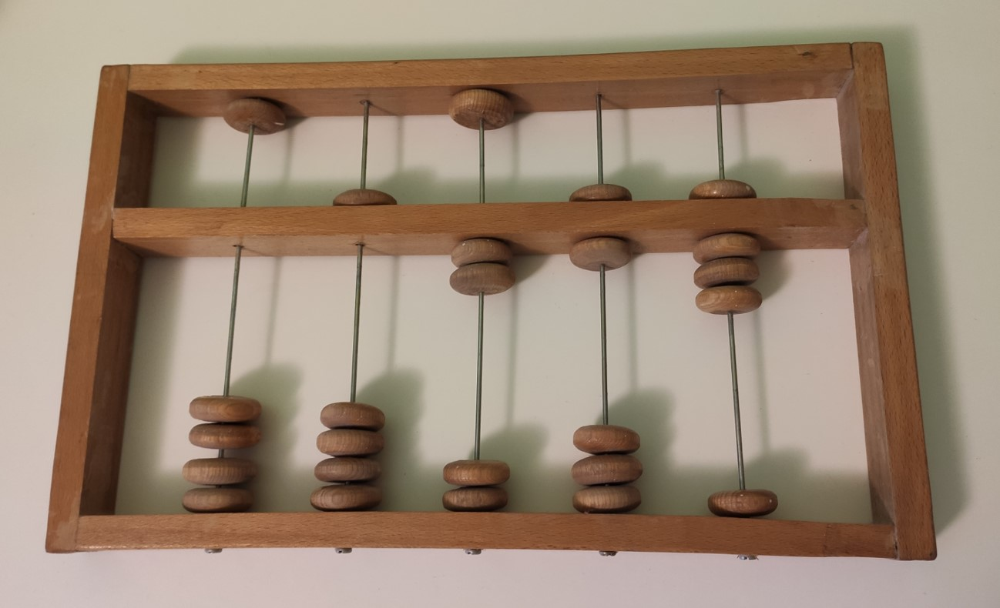
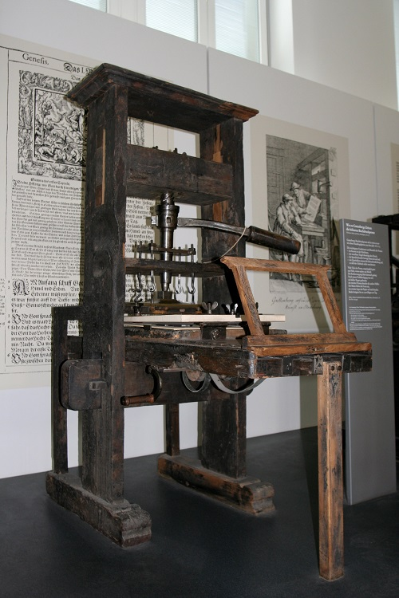
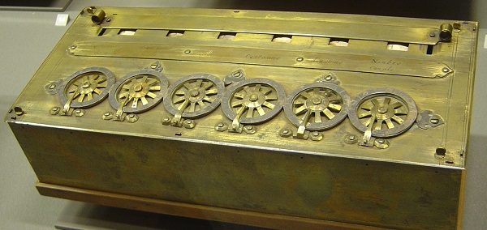

Историјски развој информационо-комуникационих технологија
=========================================================

Од давнина је човек имао потребу за складиштењем, преносом и обрадом информација које је прикупио на разне начине. Те информације су увек биле у складу са његовим активностима и потребама -  да забележи на зиду пећине улов, да бележи податке о времену и тако планира своје активности у складу са годишњим добом које наилази, да забележи колико је некоме позајмио жита, да забележи неки историјски догађај… У неким од тих ситуација, важно је било само бележење податка, чињеница, а некада су те „белешке” уметничка дела која каснијим генерацијама сведоче о животу људи у прошлим временима.   Најпре су то били пећински цртежи, па записи на комадима дрвета, глиненим плочицама, папирусу, касније књиге, фотографије, филм и видео, а сада рачунари... За рачунање коришћене су различите врсте рачунаљки, абакуса, механичких калкулатора и на крају рачунари... За размену података, за чување или слање информација најпре су се користили већ поменути записи на различитим материјалима, а онда су те записе преносили коњаници који разносе пошту, голубови писмоноше, курири, пошта, телеграф, телефон, радио, телевизија и коначно, опет рачунари повезани на различите начине.

Хајде да видимо како су се сви ти, тако различити послови на крају сусрели у рачунарима данашњице.

.. infonote::
    Развој технологија за прикупљање, складиштење, обраду и размену информација дакле, сеже далеко у праисторију. Ипак, неки проналасци су имали кључну улогу и велики утицај на развој комуникације, па самим тим и на људско друштво у целини, што је опет доводило до нових проналазака. Овај процес и данас траје, тако да се историјат развоја технологија за прикупљање, обраду, складиштење и размену података може посматрати паралелно са развојем људског друштва.

Људски изуми углавном су настали да би човек нешто брже и квалитетније урадио или да би користећи машину олакшао себи рад и омасовио производњу. Те машине су биле намењене и за физички рад (полуга, точак, парна машина, фабричке машине…) али и машине за интелектуални рад, за обављање математичких операција, обраду и размену текста, слика, звука. Хајде да направимо један брзи преглед кроз историју људског друштва и његових изума.

.. learnmorenote:: Где можеш све то да видиш уживо?

   Када дођеш у Београд, или ако већ живиш у њему, обавезно посети `Музеј науке и технике на Дорћолу <https://www.muzejnt.rs/>`_! И пре тога, прегледај сајт музеја, видећеш мноштво занимљивих експоната, како из области којом се бавимо тако и из других научних и техничких области.

Векови кључних проналазака за развој ИКТ-а
------------------------------------------

Историјат ИКТ-а дели се у неколико периода: предмеханички, механички, електромеханички и период електронских рачунара.

**Предмеханички период**

Почеци бележења података, њихове обраде, чувања и преношења информација другим људима кроз простор и време свакако се везују за коришћење каменчића, изрезбарених костију, комада дрвета или камена, везивање чворова на канапу, рачунаљке…
Једна од првих „рачунских машина” је рачунаљка, често помињани Абакус, који сe користиo у Месопотамији, Персији, старом Египту, Грчкој, Риму, Кини, па и касније у Јапану, Кореји, Русији, Америци… Најстарији познати абакуси датирају из времена чак десетак векова п.н.е. а користили су се доскора, када су их заменили јефтини а једноставни електронски калкулатори.

   Слика: Абакус

.. suggestionnote:: Ако желиш да знаш више о абакусу…
   
   `Абакус (рачунање) — Википедија <https://sr.wikipedia.org/sr-ec/%D0%90%D0%B1%D0%B0%D0%BA%D1%83%D1%81_(%D1%80%D0%B0%D1%87%D1%83%D0%BD%D0%B0%D1%9A%D0%B5)>`_
   
   Занимљива видео-упутства и на српском и на другим језицима можеш наћи на Јутјубу. Само укуцај „Рачунање абакусом” или „How to calculate on Abacus” и видећеш!

Осим рачунања, технологије записивања података такође су имале свој „развојни пут”. Већ поменути пећински цртежи јесу најстарији записи, нешто касније записи на каменим и глиненим плочицама, кожи, затим проналазак папира и прве књиге писане руком.

Сећаш се сигурно, са часова историје, како се звао центар за превођење и преписивање књига, код нас, на територији данашње Србије?

.. learnmorenote:: Подсети ме
   
   `Ресавска школа — Википедија <https://sr.wikipedia.org/sr-ec/%D0%A0%D0%B5%D1%81%D0%B0%D0%B2%D1%81%D0%BA%D0%B0_%D1%88%D0%BA%D0%BE%D0%BB%D0%B0>`_

Паралелно са развојем технологије текао је и развој писма, као и развој начина записивања бројева и математичких израза, односно израчунавања. У време палеолита људи су записивали бројеве као низове „рецки”, да представе оно што су бројали „на прсте” - на пример број уловљених животиња. Како се количина онога што су бројали повећавала, стварали су се системи за лакше записивање - најстарији записи су тако имали груписано по 4 „рецке” прецртане петом, ради лакшег записа већих бројева. С временом, све старе цивилизације развиле су неки свој систем записивања бројева - вама је сигурно познат начин записа „римских” бројева, развијених у доба Античког Рима. Сви древни бројевни системи су се заснивали на увођењу нових симбола за све веће и веће вредности што је прилично закомпликовало систем. Временом, у неколико различитих древних цивилизација родила се идеја о позиционом запису, где се користио један скуп цифара које су репрезентовале различите вредности, у зависности од позиције на којој су записани. Један од таквих система, потекао из Индије, преко арапског полуострва, кроз разна дела хиндуских и арапских математичара почео је да стиже и у Европу, у IX веку. То је управо био систем који и данас користимо - десет цифара, укључујући и „концепт нуле”. Наиме, бројевни системи до тада углавном нису имали запис за нулу, осим у ретким случајевима.

.. suggestionnote:: Ако желиш да знаш више о нули

   Ако те интересује прича о броју „нула” прочитај овај текст `Када и где је настао број нула? <https://www.nationalgeographic.rs/vesti/8390-kada-i-kako-je-nastao-broj-nula.html>`_ 

Интересантно је да знаш, најзначајнији арапски математичар тога доба, написао је и књигу у којој описује принципе извођења основних аритметичких операција (до тада се у литератури нису описивали методи већ само конкретан рачун). Из тих описа потиче израз „Ал - гебр” од чега данашњи назив једне значајне гране математике - алгебре, а из имена овог математичара, Ал Хорезмија изведен је и појам „алгоритам” који ти је сигурно познат из основне школе. Алгоритмима ћемо се бавити касније, у другом полугођу.

.. suggestionnote:: Ако желиш да знаш више о Ал Хорезмију  
   
   Ако те интересује историја математике или биографије историјских личности, прочитај на сајту Центра за промоцију науке текст  `Ал Хорезми <http://elementarium.cpn.rs/teme/al-horezmi/>`_ 

Што се развоја писма тиче, о томе је сигурно било говора на часовима српског језика и историје. Покушај да направиш паралелу у кључним историјским тренуцима развоја писма и развоја начина записивања бројева. Искористи интернет као извор информација.

Кад је реч о преносу информација, појава писма и промене у начину бележења информација тако да се могу пренети даље или оставити за касније генерације, се такође временом мењала. Замисли једног палеолитског човека - информације које је он записивао на зиду пећине, могао је да види само онај ко у ту пећину уђе. Временом, развило се писмо, али су се развиле и технологије записа, као и саобраћај и успостављање поштанских система. 

Размисли, од праисторије па до XV века (крај предмеханичког периода) која су се саобраћајна средства користила и колико далеко и брзо су путовале информације? Упореди то са данашњим даљинама и брзинама кад је реч о преносу информација.

Следећи важан корак је била конструкција првих механичких калкулатора - машина које су олакшавале и убрзавале процес израчунавања и обраде велике количине нумеричких података.

**Механички период**

Кључни проналазак који је допринео наглом ширењу знања и његовом чувању за касније генерације била је **Гутенбергова штампарска преса, конструисана у XV веку**. То је омогућило да књиге постану јефтиније и да се израђују брже и са мање грешака него када су преписиване руком. Ово је, наравно, проузроковало да све више људи стекне образовање, да се научна открића и технолошки изуми забележе и тако прошире даље од места где су настала, али и да се сачувају за касније генерације. То је дакле историјски моменат када се људско знање лакше бележи, чува и дистрибуира.

   Штампарска преса

.. learnmorenote:: Нешто више о Гутенберговој штампарској преси... 

   можеш да прочиташ овде `Штампарска машина — Википедија <https://sr.wikipedia.org/sr-ec/%D0%A8%D1%82%D0%B0%D0%BC%D0%BF%D0%B0%D1%80%D1%81%D0%BA%D0%B0_%D0%BC%D0%B0%D1%88%D0%B8%D0%BD%D0%B0>`_

За XV век везује се још један значајан догађај - **Леонардо Да Винчи** пројектовао је први механички калкулатор. Његова шира употреба није забележена, већ само нацрти за његову израду.

Више од двадесет пет векова након најстаријих познатих абакуса, појавила се прва механичка рачунска машина која је имала практичну употребу: **Паскалина (Аритметичка машина) - конструисао Блез Паскал у XVII веку**. Машина се састојала од механичких склопова са зупчаницима и могла је да извршава операције сабирања и одузимања.

   Паскалина

.. suggestionnote:: Aко те интересује нешто више о Паскалаини сазнај овде...

   `Паскалина — Википедија <https://sr.wikipedia.org/wiki/%D0%9F%D0%B0%D1%81%D0%BA%D0%B0%D0%BB%D0%B8%D0%BD%D0%B0>`_

Касније, **крајем XVII века Готфрид Вилхелм Лајбниц** унапредио је Паскалину да може и да извршава операције множења и дељења.

И Паскаловом и Лајбницовом рачунском машином управљао је директно човек - механички је уносио бројеве, жељене операције и покретањем зупчаника изводио рачунске операције на машини. 

Први уређај који је могао да се програмира уопште није била машина за рачунање. **Прва машина која се програмирала** био је -  ткачки разбој! 

.. learnmorenote:: Знаш ли шта је ткачки разбој?

   То је машина помоћу које се тка платно. У почетку једноставно, а касније са шарама, што је напоран, мукотрпан и неретко (осим кад је у питању уметничко ткање) веома монотон посао, подложан грешкама. Потражи на интернету нешто више о томе ако те је заинтересовало!

**На прелазу из XVIII у XIX век, Жозеф Мари Жакар** унапредио је ткачки разбој механизмом који је са бушених металних картица, системом игала „очитавао” упутства за рад разбоја и тако креирао шаре у ткању. Ово је унапредило технику ткања, али је и поставило темеље програмирању...

.. figure:: ../../_images/5_razboj_žakard.jpg
    :width: 400px   
    :align: center
    :class: screenshot-shadow

    Модел Жакаровог разбоја са бушеним картицама `Rama / CC BY-SA 2.0 FR <https://creativecommons.org/licenses/by-sa/2.0/fr/deed.en>`_.

**Жакарове бушене картице** за управљање ткачким разбојима касније су биле замењене папирним тракама и картицама и коришћене су у разним облицима све до средине XX века, чак и на електронским рачунарима, све док није преовладала технологија магнетних записа, али о томе кад дође време. У међувремену, ако те је ово заинтересовало, прочитај интересантну... 

.. suggestionnote:: ... причу о Жакару
  
  Наћи ћеш је овде `Жозеф Мари Жакар — Википедија <https://sr.wikipedia.org/sr-ec/%D0%96%D0%BE%D0%B7%D0%B5%D1%84_%D0%9C%D0%B0%D1%80%D0%B8_%D0%96%D0%B0%D0%BA%D0%B0%D1%80>`_
   
Из историје сте сви у школи пуно научили о **Првој индустријској револуцији**. Сигурно знаш о томе и из физике - највише ју је обележио изум парне машине. Међутим, нагли развој индустрије захтевао је и обраду све веће количине података и компликованија израчунавања.

Овај период, **XIX век, обележио је Чарлс Бебиџ** низом својих проналазака. **Диференцна машина** пројектована је да аутоматски обавља сложена израчунавања, а требало је да је покреће парна машина. На жалост, ова машина, тешка 15 тона (што је отприлике тежина три слона) није никад завршена. 

.. figure:: ../../_images/5_diferencna_mašina.png
    :width: 720px
    :align: center

    Реплика друге Бебиџове диференцне машине `Victorgrigas / CC BY-SA <https://creativecommons.org/licenses/by-sa/3.0>`_, `Carsten Ullrich / CC BY-SA <https://creativecommons.org/licenses/by-sa/2.5>`_

У међувремену, Бебиџ је конструисао и следећу машину. **Аналитичка машина** је била прва рачунска машина која је могла да се програмира. Програм се „уносио” већ поменутим, бушеним картицама.  

.. suggestionnote:: Више о Бебиџу и његовим машинама...

   
   можете да прочитате овде `Чарлс Бебиџ <https://sr.wikipedia.org/wiki/%D0%A7%D0%B0%D1%80%D0%BB%D1%81_%D0%91%D0%B5%D0%B1%D0%B8%D1%9F>`_

Првим програмером рачунских машина сматра се **Ада Бајрон, која је у XIX** веку била творац идеје како програмирати Бебиџову аналитичку машину. 

.. suggestionnote:: Ако желите да сазнате више o Ади ...
   
   можете да прочитате овде `Ејда Кинг Лавлејс — Википедија <https://sr.wikipedia.org/sr/%D0%95%D1%98%D0%B4%D0%B0_%D0%9A%D0%B8%D0%BD%D0%B3_%D0%9B%D0%B0%D0%B2%D0%BB%D0%B5%D1%98%D1%81>`_

Захваљујући већ поменутој парној машини, саобраћај се нагло развија, а самим тим и поштанске услуге, као и штампа и дистрибуција новина. 

И тако смо зашли дубоко у XIX век. Значајна открића на пољу електрицитета, заједно са почетком употребе нафте као погонског горива, обележили су **Другу индустријску револуцију**. Но нафта у овој причи остаје на споредном колосеку. Електрицитет је нашао велику примену у конструкцији рачунских машина. Стога, следећа етапа је:

**Електромеханички период**

Средину деветнаестог века обележио је један важан математички проналазак - **Џорџ Бул, творац је математичке логике**, која се по њему зове „Булова алгебра”, а представља математичке основе читавог данашњег рачунарства. Булова алгебра омогућила је конструкцију првих рачунара који раде у бинарном бројном систему. Овом теоријом и бинарним бројним системом ћемо се бавити за пар недеља. За сада смо је само сместили у историјски оквир.

Компоненте рачунских машина овог периода постају прекидачи и релеји, рачунари имају практичну примену. На пример **Херман Холерит**, статистичар, конструисао је машину која је користећи **електрицитет и бушене картице** знатно убрзала попис становништва у Америци **крајем XIX** века. Интересантно је да Холерит оснива фирму за израду рачунских машина која касније прераста у Ај-би-ем (енгл. IBM, International Business Machine) - запамтите ово име, срешћете га опет средином двадесетог века! 

.. figure:: ../../_images/5_bušena_kartica.jpg
    :width: 780px   
    :align: center
    :class: screenshot-shadow

    Бушена картица - меморијски медијум `Arnold Reinhold / CC BY-SA <https://creativecommons.org/licenses/by-sa/2.5>`_.

Крајем XIX и почетком XX века наука и индустрија се нагло развијају и овај период обележавају бројни проналасци који ће, сваки у своје време бити прекретница у развоју ИКТ:  електронске вакуумске цеви, прекидачи и релеји, као и бежични пренос сигнала. Фотографија и филм, а затим телеграф, радио и телефон, нешто касније и телевизија, изуми су који су утицали на брзину и квалитет ширења информација. Може се рећи да је ово  био „скок” у развоју ИКТ раван оном када је Гутенберг изумео штампарску пресу.

Конрад Цузе, 1930. направио је први програмабилни електронски рачунар, али је он уништен у рату и није наишао на примену.

Сада већ долазимо до четрдесетих година XX века и периода Другог светског рата. У то време, и Немци и савезничка војска покушавају да новооткривену, надолазећу технологију искористе за своју надмоћ у рату. У том периоду настаје неколико електронских, програмабилних рачунара. Њихова примена била је у прорачуну путања пројектила у артиљерији и разбијању непријатељских шифри.

Алан Тјуринг, енглески математичар, творац је формалне дефиниције појма алгоритма и теорије израчунљивости - кључних концепата рачунарства. Он је такође творац електромеханичке машине за „разбијање” немачких шифри у Другом светском рату. 

И ту долазимо до ере електронских рачунара, која се даље означава генерацијама електронских рачунара.

.. learnmorenote:: Још мало о Тјурингу

   Кад завршиш своје данашње школске обавезе, потражи на интернету или на кабловској телевизији филм „Игра кодова” (енгл. The Imitation Game) - филм о Алану Тјурингу и његовом тиму.  Осим што је филм занимљив, разумећеш боље Тјурингов допринос развоју рачунарства и концепт машине за разбијање шифри.

.. parsonsprob:: istorija

   Поређај у исправном историјском редоследу кључни проналасци 
   -----
   Абакус
   Позициони бр. систем
   Гутенбергова штампарска преса
   Паскалина (Аритметичка машина)
   Жакарове бушене картице
   Бебиџова  Диференцна машина
   Програми за Аналитичку машину
   Математичка логика
   Електронске вакуумске цеви, прекидачи и релеји