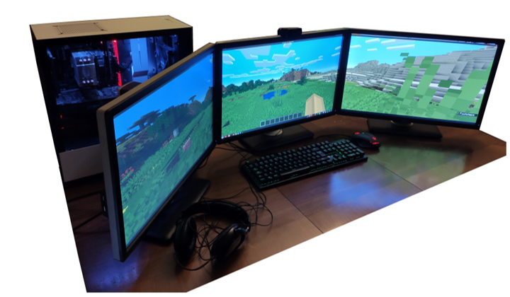
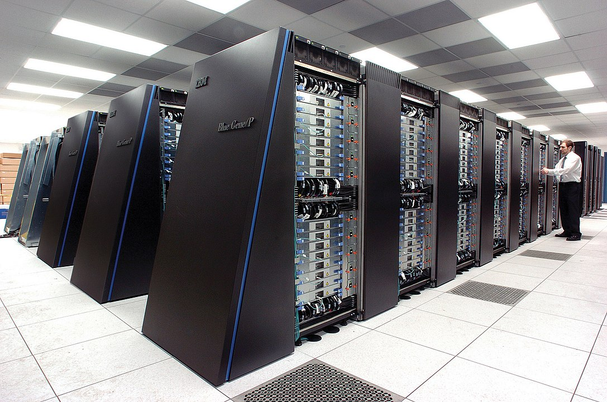

Како раде рачунари?
===================

Човек је одувек правио машине које му помажу да нешто уради, да реши неки проблем. У почетку су то биле машине које помажу у обављању мануелних послова. Врло брзо људи су почели да размишљају како да направе машине које би им помогле у рачунању или у неким сложенијим мисаоним радњама. У почетку, рачунари су могли само да обављају основне рачунске операције. Временом су се развили тако да могу да обрађују текст, слике, звук...

**Машине које се користе за обраду података извршавају четири основне радње:**

- **улаз информација** (тастатура, миш, микрофон, камера, екран осетљив на додир)
- **складиштење информација** (унете информације се складиште у меморију рачунара)
- **обрада информација** (ускладиштене информације се обрађују у процесору и резултати се враћају у меморију)
- **излаз информација** (екран, звучник, штампач - информације из меморије се приказују на излазу - слика, текст, звук, сигнал за управљање роботом)

Код рачунара повезаних на интернет, излаз из једног рачунара може да буде улаз у други рачунар

У рачунар улазе подаци кроз улазне јединице и смештају се у унутрашњу меморију. Процесор их узима, обрађује и враћа у унутрашњу меморију. Ова обрада се врши према инструкцијама које су записане у програму. На крају, кад се обрада података заврши, резултати рада се шаљу на излазне јединице. 

.. questionnote::
   Погледај поново шему Фон Нојмановог концепта рачунара. Да ли уочаваш везу између те шеме и управо побројаних основних радњи које извршава рачунар?

Компоненте рачунарског система
------------------------------

У основној школи је већ било речи о томе из чега се састоји рачунар и како функционише. Сада ћемо о томе мало детаљније.

.. infonote::
    Основни елементи рачунарског система су хардвер и софтвер.

    **Хардвер**  је физички део дигиталног уређаја. Хардвер је енглеска реч (енгл. Hardware) која у буквалном преводу значи гомила гвожђурије.

    **Софтвер** (енгл. Software) су програми дају упутства хардверу, омогућују да хардвер уопште може ишта да ради.  

На овом месту увешћемо још један важан појам: **фирмвер**. То је софтвер који је практично уграђен у хардвер. Он заправо омогућује иницијално функционисање хардвера. Неки уређаји имају само фирмвер - и не могу се додатно програмирати. 
Сигурно знаш да у савременим аутомобилима постоји рачунар, у телефонима, телевизорима, веш-машинама и разним другим уређајима којима се често додаје префикс „паметни” (енгл. smart, smartphone, smart TV…) Сваки такав уређај у себи има основни софтвер, направљен искључиво за њега и то је фирмвер. Враћаћемо се на овај појам још неколико пута у наредним лекцијама. Било би добро да га не заборавиш.

.. learnmorenote:: Додатна литература
   
   Уколико разумеш енглески језик, погледај шест кратких видео-клипова који на илустративан начин објашњавају појмове из ове лекције. Пронаћи ћеш их на овом линку `Introducing How Computers Work <https://www.khanacademy.org/computing/computer-science/computers-and-internet-code-org/how-computers--work/v/khan-academy-and-codeorg-introducing-how-computers-work>`_ Ако ти је лакше, можеш да укључиш и енглески титл - некад је лакше разумети страни језик ако то што чујеш истовремено и видиш написано. Кликни доле десно за сличицу зупчаника. Доступан и аутоматски превод на српски - није идеалан, али ће ти помоћи да разумеш садржај ових видео-клипова.

Дигитални уређаји
-----------------

**Рачунар је машина дизајнирана да следи упутства (инструкције, наредбе) и тако обавља разноврсне задатке.** Унутар рачунара се изводе математичке операције над бројевима. То су аритметичке операције (+,-,*,/), релације поређења (<,>,=), као и логичке операције (Λ, V, ¬).

Рачунар заправо обрађује бројеве. Зато се и зову „дигитални рачунари” - енгл. „digit” значи „цифра”. Наведене операције рачунар врши над бинарним бројевима - бројевима записаним као комбинација цифара 0 и 1. Како онда да при коришћењу рачунара уносимо или видимо текст, слике, видео, чујемо звук? Одговор ћеш добити кроз наредне лекције - разумећеш како се све те различите информације претварају у бројеве и тако даље обрађују, чувају, преносе.  

Рачунар не може да „разуме” податке које обрађује, размишља и доноси одлуке, он обрађује бројеве не додељујући им никакво значење.

**Рачунари могу да се програмирају - да једна машина ради различите послове у зависности од програма који јој је задат**. Рачунарски програм је низ наредби које рачунар извршава. Интерактивни веб сајтови, игрице на мобилним телефонима све су то рачунарски програми. 

Када кажемо „рачунар” углавном мислимо на стони рачунар (енгл. desktop), лаптоп, таблет или „паметни телефон”. 

    Персонални рачунар са три монитора

Међутим, за научну и пословну примену, као сервери на интернету, у војне сврхе и слично, користе се „суперкомпјутери” огромних брзина и димензија. 

    Суперкомпјутер. Аутор: Argonne National Laboratory&#039;s Flickr page - originally posted to Flickr as Blue Gene / PFrom Argonne National LaboratoryUploaded using F2ComButton, CC BY-SA 2.0, https://commons.wikimedia.org/w/index.php?curid=6412306

.. suggestionnote:: Топ 10 суперкомпјутера

   
   Ако желиш да сазнаш више о суперкомпјуерима ево једног занимљивог текста о 10 најмоћнијих суперкомпјутера на свету `Top 10 of the World’s Fastest Supercomputers [2020] <https://trendingcultures.com/top-10-worlds-fastest-supercomputers/>`_.
   
Са друге стране, у образовне сврхе праве се и џепни рачунари којима се може додати тастатура и монитор или пак могу да се  споје са персоналним рачунаром или телефоном да би се програмирали. 

.. figure:: ../../_images/6_džepni_računari.png
    :width: 780px   
    :align: center
    :class: screenshot-shadow

    Џепни рачунари Raspberry Pi (Распбери пај) и micro:bit (Микробит)

Поред тога, рачунари су сакривени и у многим другим уређајима. Сети се, кад смо говорили о интернету, споменули смо „интернет ствари” (енгл. internet of things, IoT). Како је могуће да се аутомобил, фрижидер, веш-машина, веб-камера или било који други уређај повеже са интернетом? Како је могуће да аутомеханичар повеже свој рачунар са аутомобилом и открије квар? То је могуће јер савремени уређаји садрже уграђен рачунар. Он не изгледа као рачунар који ти видиш сада на столу испред себе. То су електронски склопови који такође могу да се програмирају, али најчешће то уради произвођач уређаја или је могуће да сервисер „репрограмира” уређај. Такве уређаје који садрже рачунаре једним именом називамо **дигиталним уређајима**.

Рачунске машине које служе искључиво за рачунање и не могу се програмирати називају се **калкулатори** (често - популарно, али погрешно, називају се „дигитрони”, што је само назив словеначког произвођача калкулатора осамдесетих година прошлог века). Осим рачунара и калкулатора, као што смо већ поменули, постоје разноврсни програмабилни уређаји за специфичне намене, дакле имају уграђен рачунар, могу да се програмирају, али хардвер је дизајниран тако да се уређај не може користити као универзални рачунар. Размисли, имаш ли идеју који су то уређаји? 

.. learnmorenote::  Рачунар је...
   
   Рачунар није само тај уређај који стоји на школској клупи на којем сада проучаваш ову лекцију и користиш га тако што куцаш по тастатури и гледаш у монитор. Рачунар је и лаптоп, „паметни” телефон, таблет, па и неки мали уређаји који могу да се програмирају и управљају роботима или производним процесима, али о томе ће још бити речи у наредним лекцијама!

.. infonote::

   **Да резимирамо:**

   Рачунар је уређај који се може програмирати да извршава различите врсте задатака тако што сваки задатак своди на низ елементарних математичких операција.

.. questionnote::

    Реч "синоним" ти је вероватно позната са часова српског језика. Да ли се сећаш шта та реч значи? Размисли да ли су „рачунар” и „компјутер” синоними. Реч „рачунар” настала је од појма „рачунати”. А „компјутер”?  Поразговарај са другим ученицима и аргументуј свој став.
