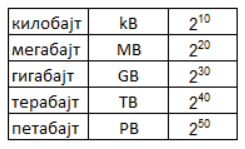

Представљање података у рачунару
================================

|

У својој унутрашњости, рачунари се састоје од електричних кола. Они обрађују електричне сигнале који заправо представљају нуле и јединице. Све унутар рачунара записано је помоћу нула и јединица, које се преносе као импулси кроз жице и електрична кола.
Кроз једну жицу може да има и нема сигнала, што практично значи да се може пренети информација „тачно” или „нетачно,  „да” или „не”,  „0” или „1” односно „укључено” или „искључено”. Наведене вредности могу се посматрати као бројеви бинарног бројног система.  То је бројни систем који има само две цифре, углавном их означавамо са „0” и „1”. 

 
**Једна нула или јединица је један бит информације. И само име је добио по томе: бит - BInary digiT, бинарна цифра (0 или 1)- то је основна јединица за мерење количине података.** 

.. questionnote::
   Колико различитих података може да се кодира са два бита?

.. reveal:: dvabita
   :showtitle: Размисли па погледај одговор
   :hidetitle: Сакриј прозор
   
   .. image:: ../../_images/6_dva_bita.png
      :width: 300px   
      :align: center

   Дакле, одговор је - четири различита податка, које можемо представити бројевима 0, 1, 2 и 3.

Слично као у претходном примеру, са три жице, количина података се повећава на 8: 000, 001, 010, 011, 100, 101, 110, 111. 

Ако гледамо на тај начин, са две „жице” можемо да пренесемо бројеве 0, 1, 2 и 3, а са три жице бројеве 0, 1, 2, 3, 4, 5, 6, 7. Тако са 8 жица можемо представити и пренети бројеве из интервала 0 до 255. са 16 жица бројеве од 0 до 65535 итд.

Ако је један бит основна, најмања, јединица за мерење „количине” података, које су веће јединице?

У декадном систему, сваки следећи „ред величине” добија се множењем са 10. На сваких 1000 обично додајемо префикс (или „ново” име), па тако имамо:

грам, килограм, тона

милиметар, метар, километар

У бинарном систему је то мало другачије.

**Најпре, низ од 8 битова називамо бајт. У једном бајту може да се запише 256 различитих бројева:**

.. image:: ../../_images/6_bajt.png
   :width: 450px   
   :align: center

**Бајт је најмања јединица количине података која може да се адресира у рачунару. Ознака је B.**

Овде „кило”, није :math:`10^3`  већ :math:`2^{10}` па је 1kB = 210B = 1024B  

Ево још неких редова величине:

Сваки следећи је 1024 пута већи од претходног.

Покушај да се сетиш у којим ситуацијама користиш ове мерне јединице?

.. reveal:: kilo
   :showtitle: Помоћ
   :hidetitle: Сакриј прозор
   
   .. infonote:: Када желиш да пошаљеш некоме слику, или да нешто снимиш на флеш-меморију, када се договараш са родитељима колики диск да се набави за рачунар или колико је „велики” филм који желиш да преузмеш на свој рачунар.
                 Погледај колики је капацитет хард-диска на рачунару за којим сада читаш ову лекцију. Погледај колика је фотографија снимљена телефоном или колико меморије заузима неки текст који имаш снимљен на рачунару. 

.. questionnote::
   састави задатак за Јединице за мерење количине информација

|

Физичко представљање података у рачунару
----------------------------------------

Рачунари заправо раде тако што електрични сигнали који представљају малопре поменуте нуле и јединице „путују“ кроз жице и електрична кола. 

Свака информација која улази или излази из рачунара, представљена је једним од два стања “0” или “1”, односно “има”/”нема” струје. Али како се врше рачунске операције над тим бројевима, односно сигналима?

Подсетимо се нечега што знаш из математике – у математичкој логици имали смо две основне вредности – „тачно“ и „нетачно“  :math:`(\top, \bot)`  и операције „не“, „и“ и „или“ :math:`(\neg, \wedge, \vee)`. Ако вредности :math:`(\top, \bot)` посматрамо као електричне сигнале, “има”/”нема” струје, над њима се могу вршити операције :math:`(\neg, \wedge, \vee)` пропуштајући те сигнале кроз електронска кола. Комбинацијом тих основних кола праве се сложенија која могу да извршавају аритметичке операције :math:`(+, -,\cdot, :)`.

Сети се када смо говорили о историјату рачунара и спомињали електронске цеви, а затим транзисторе – управо ова електронска кола која извршавају основне логичке операције су израђивана од цеви и транзистора. Временом су транзистори постајали све мањи, а њиховом комбинацијом настала су интегрисана кола, касније чипови. Што су ове компоненте постајале мање, као и растојања између њих које је сваки сигнал морао да прође, рачунари су постајали све бржи. 

|

Бројеви
-------

Проучавајући историјат развоја ИКТ-а дотакли смо се начина записивања бројева кроз векове.  За симболичко представљање бројева развијани су током историје различити бројевни системи.

Ми у математици и свакодневном животу користимо декадни (грчки δέκα (дека) – десет) бројевни систем. 

.. reveal:: 10_prstiju
   :showtitle: Знаш ли зашто баш декадни а не неки други?
   :hidetitle: Сакриј прозор
   
   .. infonote:: **овде кад се кликне на дугме слика две шаке са испружених 10 прстију**

Међутим, као што смо видели у претходном видеу, у рачунару је све представљено у бинарном облику.

.. reveal:: baš_binarni
   :showtitle: Знаш ли зашто баш бинарни а не неки други?
   :hidetitle: Сакриј прозор
   
   .. infonote:: **овде кад се кликне на дугме слика која илуструје има/нема струје и текст:**

   Зато што је много лакше реализовати физички електронске склопове који имају два стабилна стања него системе са, на пример, 10 различитих стања.
   Конкретно,  има/нема струје, укључена/није укључена сијалица, транзистор и вакуумска цев такође имају два стабилна стања .

Осим декадних и бинарних, у рачунарству се користе и октални (основа 8) и хексадекадни (основа 16), јер је запис великих бинарних бројева дугачак и непрегледан, а превођење из бинарног система у системе са основама 8 и 16 и обратно је релативно једноставно.
Кроз историју је било и система са основом 12, 20, па чак и 60.

Када смо пре неколико часова изучавали историјат развоја ИКТ-а, да људи нису одувек користили бројеве овакве какве ми данас користимо. Први начини записа бројева били су у такозваном непозиционом запису - кад су људи само записивали на пример „рецке” или, рецимо, римски бројеви. Тако у бројевима IX и XI цифре X и I у сваком случају имају вредности 10 и 1 а коначна вредност броја се добија у зависности од тога да ли је мањи број испред или иза већег броја.
Код позиционог записа, вредност сваке цифре зависи од њене позиције у броју. Тако у броју 91, цифра 9 има вредност 90, а у броју 19 има вредност 9.

Уопште, свака цифра у декадном броју има вредност неког степена броја 10.

.. math::  3628=3000+600+20+8=3\cdot10^3+6\cdot10^2+2\cdot10^1+8\cdot10^0

У бинарном бројном систему, свака цифра има вредност неког степена броја 2.

.. math::  10111001_{(2)}=1\cdot2^7+0\cdot2^6+1\cdot2^5+1\cdot2^4+1\cdot2^3+0\cdot2^2+0\cdot2^1+1\cdot2^0

|

Представљање текста у рачунару
------------------------------

Знамо да рачунари не раде само са бројевима - много чешће уносимо и читамо текст. Како се текст преводи (кодира) на језик рачунара и обратно?

Сваком слову алфабета може се доделити број, декадно или бинарно записан. Ако кодирамо свако слово низом бинарних цифара, можемо их “пропустити” кроз жице - и пренети текст у облику бинарних сигнала.

Најпознатији стандард за кодирање симбола је „Аски стандард”  (енгл. ASCII, American Standard Code for Information Interchange). Основни стандард користи један бајт, што је, као што смо видели довољно да се забележи 256 различитих вредности. 
Првих 128 кодова је стандардизовано:  прва 32 кода су „Управљачки” симболи и они се не штампају, након њих, до 126 су кодови симбола који имају своју графичку репрезентацију: специјални знаци, цифре и слова. Преосталих 128 су „проширење” неким додатним а често коришћеним знацима.

.. reveal:: aski_kodovi
   :showtitle: О ASCII кодовима, детаљније
   :hidetitle: Сакриј прозор
   
   .. infonote:: `ASCII — Википедија <https://sr.wikipedia.org/wiki/ASCII>`_, 
   
    `Ascii Table - ASCII character codes and html, octal, hex and decimal chart conversion <http://www.asciitable.com/>`_

Ако погледаш табелу ASCII кодова на претходним линковима видећеш да ту нема српских латиничних слова, нема ћирилице, а ни многих других симбола који припадају разним језицима. Како се ово решава?
Први рачунари су радили само са основним ASCII кодом (до 127), затим је проширен до 256. Кад су рачунари постали довољно брзи и ушли у масовну употребу, проблем кодирања различитих језика решен је системом „Уникод” код којег се сваки знак кодира са два бајта. На тај начин може да се кодира 216 = 65536 знакова што је сасвим довољно за кодирање свих постојећих писама.

.. questionnote::
    Искодирај бинарно, ASCII кодом своје име и презиме (за потребе израде овог задатка, занемари постојање дијакритичких знакова - čćšđž)

|

Представљање слике у рачунару
-----------------------------

**Представљање слике у меморији рачунара**

Слике се на екрану рачунара приказују као сићушне тачке осветљене различитим бојама. Свака боја се на екрану добија као комбинација три основне боје - црвене, плаве и - зелене! (Није баш као кад мешате темпере на ликовном, зато што је у питању светло а не бојица). Положај и боја пиксела се записују бинарно. 

У основној школи сте већ учили да, по томе како се креирају и како се памте у меморији рачунара,  слике могу бити **растерске** и **векторске**.

|

**Растерске** се памте у меморији баш тако како смо описали и приказ на екрану - као матрица разнобојних тачака. Те тачке се зову **пиксели**. Све фотографије, на пример су растерске. Карактеристика слике, број тачака по јединици дужине назива се **резолуција**.

**Векторске** слике се памте као „формуле за цртање”, односно геометријски облици одређене слике и сваки пут се „прорачунава” које тачкице на екрану треба осветлити којом бојом, односно, каже се да се векторски цртеж приказује у „екранској резолуцији” - то је резолуција физичких тачкица из које се састоји слика на екрану.

**Представљање слике на екрану**

И векторске и растерске слике морају да буду преведене у бинарне бројеве како би рачунар могао да их обрађује. Када их рачунар обради, на екрану корисник може да види дату слику која се састоји од пиксела. Сваки пиксел на слици представљен је бинарним бројевима. Ако кажемо да је 1 црна (или укључена), а 0 бела (или искључена), једноставна црно-бела слика може се креитати помоћу бинарне слике. Таква слика је представљена као мрежа пиксела, где се сваки ред пиксела преводи у бинарни број, у зависности од боје и положаја пиксела у мрежи. Погледај пример једне црно–беле слике, и њену бинарну репрезентацију. На доњој слици је приказан начин кодирања црно-беле слике.

.. image:: ../../_images/6_L2S7.png
   :width: 720px   
   :align: center

Количина меморије потребна за запис неке растерске слике зависи од броја пиксела из којих се слика састоји, као и од палете боја која се користи. Ако је слика црно-бела, за сваки пиксел је довољан по један бит за памћење боје, као на горњој слици. Већ ако желимо да убацимо и нијансе сиве или неке друге боје, биће потребно више меморије. Ако хоћемо да сваки пиксел може да буде обојен у једну од 256 боја из палете, требаће нам за сваки пиксел по цео бајт.

.. questionnote::
    Дешава се да покренемо неки програм за цртање и наиђемо на информацију да нам је на располагању „16 милиона боја”. Покушај да израчунаш колико је у том случају потребно бајтова за запис боје сваког пиксела.

.. reveal:: boje
   :showtitle: Одговор
   :hidetitle: Сакриј прозор
   
   .. infonote:: Потребно је три бајта - по један за 256 нијанси црвене, зелене и плаве, од којих се генерише свака боја.

|

Представљање звука у рачунару
-----------------------------

И на крају звук - за који из физике знамо да је талас који се опет може представити као низ бројева. Што је гушћа подела интервала то је верније представљен талас.

Звук са улазног уређаја - микрофона представља аналогни (непрекидни) сигнал и он се дигитализује, тј. кодира бинарним бројевима и тај дигитални запис се меморише. Обратно, при репродукцији звука дигитални сигнал се конвертује у аналогни који се шаље у звучник где на основу њега настаје звук.

|
