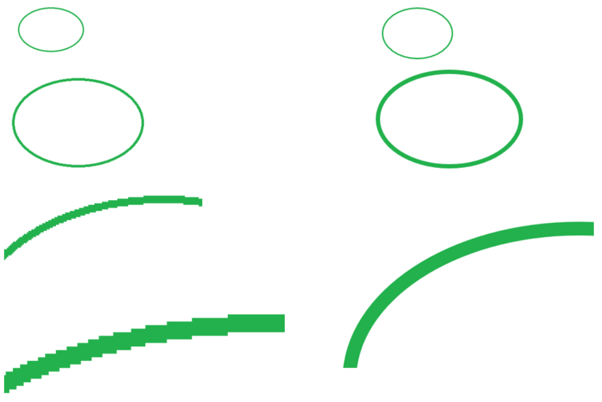
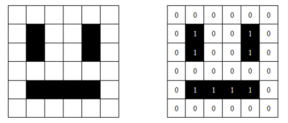
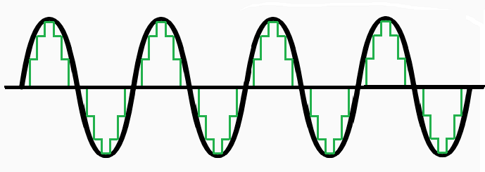

Представљање података у рачунару
================================

У својој унутрашњости, рачунари се састоје од електронских кола, кроз која теку дигитални електрични сигнали - импулси. Присуство импулса у одређеном тренутку можемо да означимо 
јединицом, а одсуство нулом. У рачунару постоји и мноштво минијатурних електронских склопова који у сваком тренутку могу да се нађу у једном од два стабилна стања (`бистабилно коло <https://sr.wikipedia.org/wiki/%D0%91%D0%B8%D1%81%D1%82%D0%B0%D0%B1%D0%B8%D0%BB%D0%BD%D0%BE_%D0%BA%D0%BE%D0%BB%D0%BE>`_, енгл. *flip-flop*). Уобичајено је да једно од та два стабилна стања означавамо нулом, а друго јединицом. Поменути склопови представљају основу рачунарске меморије, јер сваки од њих може да запамти вредност 0 или 1. На тај начин, све што се унутар рачунара налази или дешава можемо да представимо помоћу нула и јединица. Важи и обрнуто: 

- **сваки низ који се састоји од нула и јединица, може директно да се представи у рачунару стањем низа одговарајућих електронских склопова и**
- **низ нула и јединица може да се проследи из једног дела рачунара у други као низ импулса.**

Одавде следи веома важан закључак:

.. infonote::

    Да би рачунар могао да чува и преноси разноврсне податке, довољно је да за те податке представимо (кодирамо) помоћу низова нула и јединица, односно бинарних бројева. Подсетимо се, бинарни бројеви су бројеви записани у бинарном бројевном систему, тј. систему у коме се користе само две цифре - 0 и 1.

    Једна бинарна цифра је најмања количина информације којом оперишемо. Ту количину информације називамо **један бит**, скраћено од енглеског **BI**\nary digi\ **T**, бинарна цифра.

Користећи два бита, можемо да формирамо 4 различита записа: 00, 01, 10 и 11. То значи да са два бита можемо да кодирамо 4 различита податка. Кодови 00, 01, 10 и 11 могу да представљају бројеве 0, 1, 2 и 3, или слова A, B, C и D, или неке другачије податке.

.. questionnote::
   
   Колико различитих података може да се кодира са три бита?

.. reveal:: tri_bita
   :showtitle: Размисли, па упореди свој одговор  
   :hidetitle: Сакриј

   .. infonote:: Може да се кодира осам различитих податка, а податке (шта год да су они) можемо да кодирамо записима 000, 001, 010, 011, 100, 101, 110, 111. 

Продужавајући низ бинарних цифара (битова) које користимо, добијамо све већи број различитих низова, тј. све већи број кодова. Тако, на пример, низ од 8 битова даје :math:`2^8 = 256` различитих кодова, који могу да представљају нпр. бројеве из интервала од 0 до 255.

.. image:: ../../_images/6_bajt.png
    :width: 500px   
    :align: center

.. infonote::

    Низ од 8 бита називамо **један бајт**. Управо смо видели да је један бајт меморије довољан да се представи, тј. кодира било који од 256 различитих података. Другим речима, за памћење или пренос информације о било којем од могућих 256 података је реч у неком контексту, довољан је један бајт меморије. Ознака за бајт је B.

**Осим бита и бајта, које су остале јединице за мерење количине информација?**

При мерењу физичких величина у међународном систему *SI*, следећа већа јединица се најчешће добија множењем претходне са 1000. На пример, основна јединица за притисак је паскал (Pa), 1000 паскала је килопаскал (KPa), а 1000 килопаскала је мегапаскал (MPa). Слично томе, основна јединица за снагу је ват (W), а веће су редом киловат (1 KW = 1000 W), мегават (1 MW = 1000 KW), гигават (1 GW = 1000 MW), терават (1 TW = 1000 GW).

При изражавању количине информације (односно меморије довољне за памћење и саопштавање те информације), такође се користе префикси кило, мега, гига, тера итд, али правила су мало другачија.

Један килобајт није :math:`10^3 = 1000` бајтова, него :math:`2^{10}`, што записујемо :math:`1KB = 2^{10}B = 1024B`.

Ево још неких јединица за количину меморије:

.. table::
    :align: left

    ========= ========= ===========================
    јединица   ознака    величина
    ========= ========= ===========================
    килобајт   KB        :math:`1 KB = 2^{10} B`
    мегабајт   MB        :math:`1 MB = 2^{20} B`
    гигабајт   GB        :math:`1 GB = 2^{30} B`
    терабајт   TB        :math:`1 TB = 2^{40} B`
    петабајт   PB        :math:`1 PB = 2^{50} B`
    ексабајт   EB        :math:`1 EB = 2^{60} B`
    ========= ========= ===========================

Свака следећа јединица је 1024 пута већа од претходне.

.. questionnote::
   
   Покушај да се сетиш у којим све ситуацијама користиш ове мерне јединице?

.. reveal:: razmisli2
   :showtitle: Размисли, па упореди свој одговор
   :hidetitle: Сакриј прозор
   
   .. infonote:: 
   
        Неке од ситуација када су ти потребне јединице за количину меморије су:
        
        Када желиш да пошаљеш некоме слику, када нешто снимаш на флеш-меморију, када нешто инсталираш на телефон, када желиш да креираш и пошаљеш (или да преузмеш) видео, када купујеш неки уређај са меморијом (екстерни диск, телефон, рачунар).
        
.. questionnote::
   
   Упореди по величини неколико текстуалних датотека, слика, аудио и видео записа које имаш на рачунару или телефону. У којим јединицама се типично изражавају величине ових датотека? Одговори за сваки тип датотеке посебно.
   
   У којим јединицама се обично изражава: 
   
   - капацитет преносиве флеш меморије?   
   - простор који имамо на располагању у електронском поштанском сандучету?   
   - радна меморија (*RAM*) рачунара?   
   - капацитет хард диска у телефону? А у рачунару?

Физичко представљање података у рачунару
----------------------------------------

На почетку ове стране смо рекли да је за чување и пренос података у рачунару довољно да те податке умемо да представимо (кодирамо) помоћу низова нула и јединица, односно бинарних бројева. Размотримо шта то конкретно значи за разне врсте података.

Представљање логичких вредности
'''''''''''''''''''''''''''''''

Почнимо од логичких вредности, као најједноставније врсте података. Подсећамо те, у математичкој логици постоје две основне вредности – „тачно“ и „нетачно“  :math:`(\top, \bot)`.
Вредност :math:`\top` у рачунарству кодирамо као 1, а вредност :math:`\bot` као 0, тако да се вредност :math:`\top` у рачунару доводи до потребног места слањем импулса, док се вредност :math:`\bot` доводи као изостанак (неслање) импулса. 

Видимо да је за памћење једне логичке вредности довољан само један бит.

Представљање бројева
''''''''''''''''''''

Проучавајући историјат развоја ИКТ-а дотакли смо се начина записивања бројева кроз векове. За симболичко представљање бројева развијани су током историје различити бројевни системи.

Ми у математици и свакодневном животу користимо декадни (грчки δέκα/дека – десет) бројевни систем. 

.. questionnote:: Знаш ли зашто баш декадни а не неки други?
   
   .. image:: ../../_images/6_ruke.png
      :width: 300px
      :align: center

Међутим, као што смо видели, податке које користимо у рачунару кодирамо помоћу бинарних бројева.

.. learnmorenote:: Знаш ли зашто баш бинарни а не неки други?

    - За памћење података је много лакше направити електронске склопове који имају два стабилна стања (и памте једну од две могуће вредности) него системе са, на пример, 10 различитих стабилних стања

    - Много је лакше проследити бинарну цифру (слањем или неслањем имплулса) него декадну цифру

    - Много је лакше направити електронско коло, које обавља неку операцију над "бинарним записима" (серијама импулса), него над "декадним записима" (за које није јасно ни како би изгледали)
   
Осим декадних и бинарних записа, у рачунарству се користе и хексадекадни (основа 16), а раније су се користили и октални (основа 8) записи, јер је запис већих бинарних бројева веома дугачак и непрегледан, а превођење из бинарног система у системе са основама 8 и 16 и обратно је врло једноставно. Захваљујући томе, хексадекадни запис може да се схвати као помоћни запис, који је нека врста скраћеног писања бинарних записа (исто је важило својевремено и за октални запис).

Бинарни, октални, декадни и хексадекадни систем писања бројева су позициони системи. У позиционим системима, вредност сваке цифре зависи од њене позиције у броју. Тако у броју 91, цифра 9 има вредност 90, а у броју 19 има вредност 9. Уопште, вредност сваке цифре у декадном броју се добија када се цифра помножи одговарајућим степеном броја 10.

.. math::  3628=3000+600+20+8=3\cdot10^3+6\cdot10^2+2\cdot10^1+8\cdot10^0

Слично правило важи и у бинарном бројном систему, вредност цифре у бинарном броју се добија када се цифра помножи одговарајућим степеном броја 2.

.. math::  10111001_{(2)}=1\cdot2^7+0\cdot2^6+1\cdot2^5+1\cdot2^4+1\cdot2^3+0\cdot2^2+0\cdot2^1+1\cdot2^0

Представљање текста у рачунару
''''''''''''''''''''''''''''''

Знамо да рачунари од податка не користе само бројеве - много чешће уносимо и читамо текст. Како се текст преводи (кодира) на језик рачунара и обратно?

Сваком слову алфабета може да се додели број, декадно или бинарно записан. Ако кодирамо свако слово низом бинарних цифара, онда та слова "можемо да пропустимо кроз жице", тј. можемо да пренесемо текст у облику електричних импулса.

Први широко распрострањен стандард за кодирање текстуалних симбола је **ASCII** (чита се аски, енгл. *American Standard Code for Information Interchange*). Овај стандард користи за сваки симбол један бајт, што је довољно да се забележи 256 различитих вредности. Од тих 256, *ASCII* кôд користи првих 128. То значи да је овим стандардом прописано шта представља првих 128 вредности које могу да се запишу у једном бајту (8 бита, тј. 8 бинарних цифара). Од тога већина (кодови од 32 до 126) представља текстуалне симболе - мала и велика слова енглеске абецеде, цифре, знаке интерпункције и још неколико тзв. специјалних знакова (знаци попут ``+ - * / # $ % ^ & { } [ ]``).

Преосталих 128 кодова стандард не користи, што значи да је трећим странама (разним произвођачима хардвера и софтвера) остављено да те преостале кодове употребе како им одговара. У разним деловима света у оптицају су биле различите допуне, односно „проширења“ ASCII кода симболима који се користе у тим културно-језичким срединама.

.. suggestionnote:: О ASCII кодовима, детаљније:
   
   `ASCII — Википедија <https://sr.wikipedia.org/wiki/ASCII>`_, 

Овде можеш да нађеш `табелу ASCII симбола <http://www.asciitable.com/>`_  и њихових кодова у декадном, хексадекадном и окталном систему.

.. questionnote::

    Искодирај бинарно, *ASCII* кодом своје име и презиме (за потребе израде овог задатка, занемари постојање дијакритичких знакова - čćšđž)

Ако погледаш табелу *ASCII* кодова на претходном линку, видећеш да ту нема српских латиничних слова, нема ћирилице, а ни многих других симбола који припадају разним језицима. 

Овај проблем је решаван на различите начине, укључујући и поменута проширења *ASCII* кода са додатних - изабраних 128 симбола. Та проширења су такође стандардизована и добила су назив *кодне стране*, али на жалост, постојало је неколико стандарда. Ни у једном од тих стандарда, систем кодних страна није био довољно удобан, нарочито за оне који пишу на више језика, или на језику чији симболи не могу да стану у једну кодну страну (користе више од 128 симбола).

Удобно и вероватно трајно решење је донео стандард за мапирање текстуалних симбола, који се зове Јуникод (*Unicode*). Овај стандард сваком симболу придружује један природан број, који се назива кодна тачка (*code point*). Ту су укључени дословно сви симболи који се користе у свим писмима на свету (чак и писмо измишљеног клингонског језика), велики број емотикона и многи други симболи који не спадају у слова.

Необична и у први мах збуњујућа особина Јуникод стандарда је да он не прописује начин кодирања свих ових симбола, већ само сваком симболу придружује његов број - кодну тачку. Постоји неколико начина кодирања ових бројева - кодних тачака, од којих је далеко најраспрострањенији *UTF-8*. Добра особина овог кодирања је то што се сви симболи обухваћени ASCII стандардом потпуно исто кодирају и *UTF-8* кодом. Другим речима, *UTF-8* кодирање је још једно проширење ASCII стандарда, али такво да обухвата све Јуникод симболе. Да би ово могло да буде постигнуто, у *UTF-8* кодирању су употребљени кодови различите дужине. Конкретно, неки симболи (као што су слова енглеске абецеде) имају кôд дужине један бајт, неки два бајта (овде спадају сва ћирилична слова и слова српске латинице која не постоје у енглеском), неки три, а неки чак четири бајта.

Представљање слике у рачунару
'''''''''''''''''''''''''''''

**Представљање слике у меморији рачунара**

Слике се на екрану рачунара приказују као сићушне тачке осветљене различитим бојама. Свака боја се на екрану добија као комбинација три основне боје - црвене, плаве и - зелене (није баш као кад мешате темпере на ликовном, зато што се овде мешају светла а не пигменти).

У основној школи сте већ учили да, по томе како се креирају и како се памте у меморији рачунара,  слике могу бити **растерске** и **векторске**.

**Растерске** слике се памте у меморији као матрица тачака, које се зову **пиксели**, а боја сваке тачке се записује бинарно. Све фотографије, на пример, су растерске. Карактеристика слике, број тачака (пиксела) по јединици дужине назива се **резолуција**.

**Векторске** слике се памте као „формуле за цртање“, односно геометријски облици одређене слике и сваки пут се „прорачунава“ које тачкице на екрану треба осветлити којом бојом, односно, каже се да се векторски цртеж приказује у „екранској резолуцији“ - то је резолуција физичких тачкица из којих се састоји слика на екрану.

Слика: Пример увеличавања растерске (лево) и векторске (десно) слике

**Представљање слике на екрану**

И векторске и растерске слике морају да буду преведене у бинарне бројеве како би рачунар могао да их обрађује. Када их рачунар обради, на екрану корисник може да види дату слику која се састоји од пиксела. Сваки пиксел на слици представљен је бинарним бројевима. Ако кажемо да је 1 црна (или укључена), а 0 бела (или искључена), једноставна црно-бела слика може се креирати помоћу бинарне слике. Таква слика је представљена као мрежа пиксела, где се сваки ред пиксела преводи у бинарни број, у зависности од боје и положаја пиксела у мрежи. Погледај пример једне црно–беле слике, и њену бинарну репрезентацију (начин кодирања).

Количина меморије потребна за запис неке растерске слике зависи од броја пиксела из којих се слика састоји, као и од палете боја која се користи. Ако је слика црно-бела, за сваки пиксел је довољан по један бит за памћење боје, као на горњој слици. Уколико желимо да убацимо и нијансе сиве или неке друге боје, биће потребно више од једног бита са сваки пиксел, па и укупно више меморије. Ако хоћемо да сваки пиксел може да буде обојен у једну од 256 боја из палете, требаће нам за сваки пиксел по један бајт.

.. questionnote::

    Дешава се да покренемо неки програм за цртање и наиђемо на информацију да нам је на располагању „16 милиона боја“. Покушај да израчунаш колико је у том случају потребно бајтова за запис боје сваког пиксела.

.. reveal:: boje
   :showtitle: Одговор
   :hidetitle: Сакриј прозор
   
   .. infonote:: 
   
        Ради се о :math:`2^{24}` боја (што је приближно 16 милиона), па је потребно 24 бита, односно три бајта. 
        
        Поменутих :math:`2^{24}` боја се добија комбиновањем по 256 нијанси црвене, зелене и плаве, од којих се генерише свака боја, јер :math:`256 \cdot 256 \cdot 256 = 256^3 = {(2^8)}^3 = 2^{8 \cdot 3} = 2^{24}`. За записивање удела сваке од ове три боје у актуелној комбинацији потребан је по један бајт, што је укупно три бајта по пикселу.

|

Представљање звука у рачунару
'''''''''''''''''''''''''''''

Можда знаш из физике да се звук простире као талас, а талас такође може да се представи као низ бројева. Што је гушћа подела интервала, то је верније представљен талас.

Звук са улазног уређаја - микрофона представља аналогни (непрекидни) сигнал и он се дискретизује и дигитализује, тј. кодира се бинарним бројевима. Такав запис звука се чува у рачунару. Обратно, при репродукцији звука дискретан дигитални сигнал се конвертује у аналогни, који се шаље у звучник, где аналогни сигнал производи звук.

Обрада података у рачунару
--------------------------

Поред чувања и преноса, податке је у рачунару потребно и обрађивати. Међутим, свака обрада података, ма како била сложена, састоји се само од копирања података и основних логичких и аритметичких операција над њима, мада број тих операција може да буде веома велики.

На пример, над логичким вредностима :math:`\top` и :math:`\bot` потребно је обезбедити само основне логичке операције "не", "и" и "или" :math:`(\neg, \wedge, \vee)`. 

У електроници се једноставно конструише коло са два улаза и једним излазом, тако да ако у датом тренутку на бар један улаз стигне импулс, онда се и на излазу појављује импулс. Овакво коло може да се употреби за израчунавање логичке функције :math:`\vee`. Заиста, ако вредност :math:`\top` кодирамо као 1, а вредност :math:`\bot` као 0, онда се вредност :math:`\top` у рачунару доводи до потребног места слањем импулса, док се вредност :math:`\bot` доводи као изостанак импулса. Довођењем овако представљених логичких вредности :math:`p` и :math:`q` на улазе поменутог кола, на излазу добијамо њихову дисјункцију :math:`p \vee q` представљену на исти начин (постојање импулса се тумачи као вредност :math:`\top`, а непостојање као :math:`\bot`). Ова излазна вредност може да се пошаље даље где је потребно или да се сачува у бистабилном елементу, тј. меморији.

За операције конјункције :math:`\wedge` и негације :math:`\neg` такође могу да се конструишу одговарајућа кола, која израчунавају ове логичке операције. Комбиновањем великог броја оваквих основних кола праве се сложенија, која могу да извршавају аритметичке операције :math:`(+, -,\cdot, :)` над целим бројевима, представљеним помоћу низова нула и јединица.

Када смо говорили о историјату рачунара, спомињали смо електронске цеви у првој, а затим транзисторе у другој генерацији рачунара. Управо ова електронска кола која извршавају основне логичке и аритметичке операције су у почетку израђивана од електронских цеви, а затим од транзистора. Касније су транзистори замењени полупроводничком технологијом, која у суштини омогућава прављење минијатурних транзистора у високо интегрисаним колима - чиповима. Како су ове компоненте и растојања између њих постајали мањи, рачунари су постајали све бржи. Тако се данас број ових основних операција које рачунар може да изврши у секунди мери стотинама милиона или милијардама. Било да на рачунару пишемо и форматирамо текст, дотерујемо слику у Фотошопу, управљамо ликом у лавиринту неке игре или само користимо калкулатор, све се своди на мањи или већи број основних логичких и аритметичких операција.
