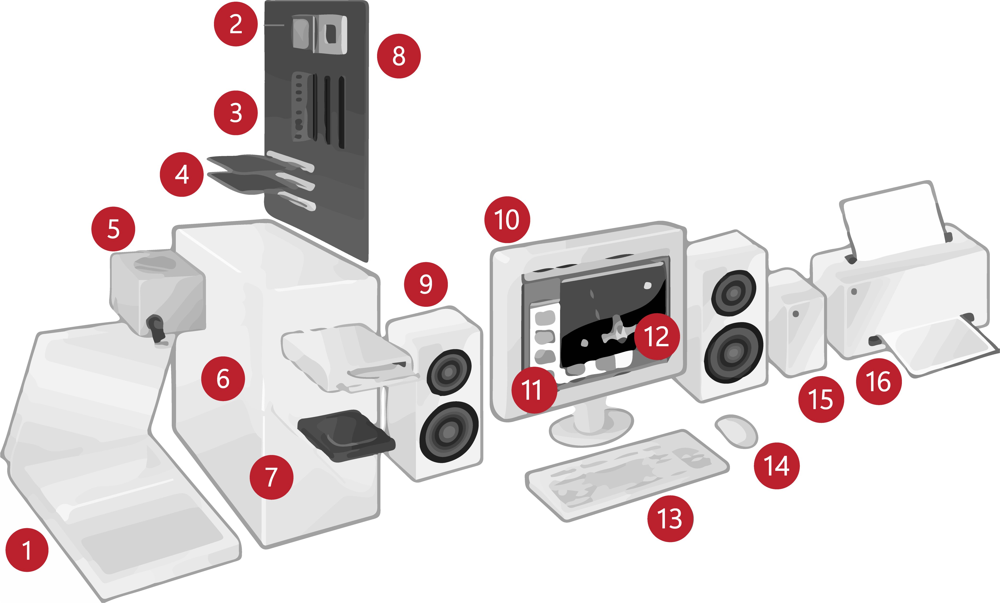

Хардвер
=======

Реч „хардвер” смо већ више пута поменули, а сигурно ти је позната и од раније. Хардвер је физички део рачунара. То су сва она електронска кола, чипови, дискови, каблови, конектори, кућишта, екрани, тастатуре… Када смо говорили о развоју ИКТ, поменули смо Фон Нојманов концепт рачунара. Можеш ли да се сетиш како изгледа?

Основни елементи сваког данашњег рачунара према том концепту су:

- процесор
- меморије (оперативна и спољашња)
- периферни уређаји (улазни и излазни)
- магистрале које повезују ове компоненте

С обзиром на изузетно велику улогу рачунарских комуникација у данашње време, нацртаћемо опет шему рачунарског система, али мало измењену, са још неким елементима:

.. image:: ../../_images/8_fon_nojman_koncept.png
   :width: 780px   
   :align: center

У литератури и на интернету ћеш наићи на различите шеме налик овој. Потражи их и упореди!

Да ли уочаваш нешто заједничко за све те шеме? У чему је разлика? Сада смо, ради истицања њихове важности, комуникационе уређаје на овој шеми издвојили, а заправо и они су периферни уређаји.

То су делови неопходни за рад дигиталног уређаја. 

У свом окружењу вероватно најчешће имаш прилике да видиш и користиш десктоп или лаптоп рачунаре, таблете и мобилне телефоне. Међутим у научним, развојним, истраживачким и сличним установама, државној управи и другим великим организацијама користе се рачунарски системи бољих перформанси, другачије конфигурације и много већих димензија. О њима ћемо говорити касније.

На овом месту објаснићемо детаљније само хардвер **персоналног, „десктоп” рачунара**. Један део компоненти налази се у кутији - кућишту (матична плоча, процесор, оперативна меморија, спољашња меморија, графички процесор, контролери, портови, додатне картице периферних уређаја), док су други видљиви (монитор, миш, тастатура, звучници). Постоји и велики број додатних уређаја (микрофон, камера, скенер, штампач, волан, џојстик и други).

Један целокупан рачунарски систем може да изгледа овако:

    1-скенер, 2-процесор, 3-радна меморија, 4-картице за проширење, 5-напајање, 6–оптички диск, 7–тврди диск, 8–матична плоча, 9–звучник, 10–монитор, 11–системски програм, 12–кориснички програм, 13–тастатура, 14–миш, 15–спољни тврди диск, 16-штампач. User:HereToHelp / CC BY-SA (http://creativecommons.org/licenses/by-sa/3.0/)
    
Најважнији делови дигиталних уређаја смештени су у кућиште. Кућиште је кутија направљена од челика или алуминијума, чија је улога да штити садржај од прашине, механичких оштећења (удараца), статичког наелектрисања, контакта са струјом и кратких спојева. 

.. reveal:: napomena
	:showtitle: Напомена
	:hidetitle: Затвори

	
	
	**Води рачуна да не пролијеш течност по рачунару или телефону, јер течност може да продре у кућиште уређаја и изазове кратак спој, чиме уређај може да буде непоправљиво оштећен.**
	
	
	
.. figure:: ../../_images/8_kućište.png
    :width: 720px
    :align: center

    кућиште савременог персоналног рачунара

**Матична плоча** (system board, motherboard) је основна компонента сваког персоналног рачунара. 

Ово је један веома упрошћен приказ матичне плоче са означеним најважнијим деловима:

.. image:: ../../_images/8_matična_skica.png
   :width: 720px   
   :align: center

А ово је фотографија једне праве матичне плоче са означеним деловима:

.. image:: ../../_images/8_matična_foto.png
   :width: 720px   
   :align: center

Централну улогу на матичној плочи (и у рачунару уопште) има **процесор**. 

Процесор је уређај који управља целокупним радом рачунара и обрађује податке. Често се процесор назива CPU (енгл. central processing unit). По својој унутрашњој организацији, CPU се састоји од два дела: контролне јединице (*CU, control unit*) и аритметичко-логичке јединице (*ALU, arithmetic logic unit*). Аритметичко-логичка јединица, као што јој име каже, извршава логичке и аритметичке операције над разним подацима, тј. обрађује податке. Контролна јединица управља меморијом и периферним уређајима, шаљући им команде у виду сигнала. Осим тога, контролна јединица управља и извршавањем наредби (проналази и прихвата из меморије следећу наредбу коју треба извршити, декодира је, допрема из меморије у регистре процесора аргументе за ту наредбу, актривира одговарајуће коло у другом делу процесора - ALU, које ће ту наредбу да изврши, и смешта резултате операције из процесора у меморију).

Контролна јединица процесора између осталог садржи једно специјално електронско коло, часовник (енгл. clock), које у правилном ритму генерише електричне импулсе ка аритметичко-логичкој јединици процесора и другим деловима рачунара. Ови импулси су управљачки, они активирају разне операције у рачунару. Као што је бубњар на галијама некад давао ритам веслачима, тако часовник процесора помоћу својих импулса даје ритам деловима рачунара. Учесталост импулса часовника се назива **радни такт** и изражава се (као и свака учесталост) у херцима (Hz). У данашњим дигиталним уређајима се користе много веће јединице за учесталост, па се радни такт процесора углавном изражава у гигахерцима (GHz). 1GHz = 1.000.000.000 откуцаја (импулса) у секунди.

У вези са радним тактом је још једна карактеристика процесора, а то је његова брзина. Брзина представља број операција које процесор може да обави у једној секунди и изражава се у милионима операција  – мипсовима (енгл. MIPS, Million Instruction Per Second) или мфлопсовима (енгл. MFLOPS, Million Floating Point Operations Per Second). На разним процесорима различите операције могу да трају по један или више тактова, па радни такт и брзина извршавања операција нису иста ствар.

Дужина процесорске речи је број битова који се једновремено преноси и обрађује унутар процесора. Данашњи рачунари су углавном 64-битни, што значи да одједном (паралелно) може да се преноси по 64 бита податка.

.. questionnote::

 Да ли знаш које су перформансе твог рачунара? Која је брзина процесора? На ком радном такту ради? Колико процесор има језгара? Колика је величина меморије?

.. infonote::

   Важне карактеристике процесора (нпр. при куповини) су: 

   - брзина процесора
   - радни такт
   - број језгара (број логичких процесора у чипу, који могу истовремено да извршавају различите програме)
   - дужина процесорске речи
   - величина и структура интерне кеш меморије

   У овом моменту можда не разумеш све ове појмове, за сада је важно да знаш да од њих зависи брзина рада процесора и целог рачунара, а касније ћеш разумети детаљније њихово значење.

На основној плочи се налазе конектори за прикључивање процесора. Процесор се при раду доста загрева па се на њега монтира хладњак (енгл. cooler, кулер, често изгледа као мали вентилатор).

Још један важан део рачунара је **унутрашња меморија** или **радна меморија**. Капацитет унутрашње меморије изражава се бројем бајтова, тј. углавном мегабајтима и гигабајтима. 

.. infonote::

    Унутрашњу меморију чине:
    
    **РОМ** (енгл. ROM, Read Only Memory) - статички део меморије који може само да се чита. Њен садржај се не губи по искључењу рачунара. Најчешће се користи за складиштење инструкција за покретање рачунара при укључивању.

    **РАМ** (енгл. RAM, Random Access Memory) - меморија у којој се налазе порграми које рачунар (процесор) извршава и подаци које ти програми користе. Програми и подаци се током рада рачунара у РАМ меморију уписују са спољне меморије (диска), која је за неколико редова величине спорија, а резултати рада могу да се упишу из РАМ меморије у спољну меморију. По искључењу рачунара садржај ове меморије се брише. РАМ меморија није саставни део матичне плоче, него се на матичној плочи налазе конектори (слотови) на које се она прикључује.

    **Кеш меморија** (енгл. *cache*) је најбржа меморија у рачунару, која се налази на самом процесору. У њој се смештају подаци који се у датом тренутку интензивно користе, тако да им процесор приступа неколико пута брже него да су у РАМ меморији. 

Информације међу компонентама размењују се путем **а**, које према намени могу бити:

- магистрала података (енгл.data bus) – комуникација између процесора и меморијских локација, 
- адресна магистрала (енгл.address bus) – преноси адресе на које се уписују или са којих се читају подаци који се обрађују, 
- контролна магистрала (енгл.control bus) – преноси управљачке и контролне сигнале на релацији процесор -  компоненте и обрнуто. 

Додатни уређаји прикључују се путем **слотова**. Преко њих се прикључују картице - контролери различитих јединица или саме јединице. 

Периферни уређаји који имају стандардизоване прикључке повезују се са рачунаром путем **портова**. Раније је стандардно постојао велики број различитих врста портова, за тастатуру, миша, штампаче, палице за игру итд. Данас су ови разноврсни портови замењени једним универзалним типом, које се зове *USB* (у-ес-бе, универзални серијски порт за разноврсне уређаје). Монитори и пројектори користе углавном HDMI (ха-де-ем-и) прикључак.

.. image:: ../../_images/8_portovi.png
   :width: 720px   
   :align: center

**Графички контролер** је уређај који служи за приказивање слике на екрану. У данашњим рачунарима је графички контролер најчешће интегрисан у матичну плочу, али често на матичној плочи постоји и посебан слот у који корисник може да постави графичку картицу, уколико му је то потребно. Графичка картица на себи обично има графички процесор (енгл. GPU, graphic processing unit) и додатну радну меморију. Графички процесор може самостално да модификује слику према задатим инструкцијама, што је важно у програмима који интензивно користе графику (програми за професионалну обраду слике и видеа, неке игре). GPU може у додатној меморији да израчуна следећу слику и пре него што дође време за њено прикзивање. Осим тога, графички процесор може да обавља и интензивна нумеричка израчунавања која немају везе са сликом, па се често користи и за тренинг при машинском учењу, рударење криптовалута и друге примене са интензивним рачунањем.

**Звучна картица** је уређај који аналогне податке са микрофона претвара у дигиталне и обрнуто, дигиталне податке из рачунара претвара у аналогне, који на звучницима производе звук. Термин „картица” се користи јер су раније ове компоненте израђиване искључиво као додатне картице. Код савремених рачунара оне су интегрисане у матичну плочу, а за кориснике који рачунар користе на пример за обраду и извођење музике, може да се угради додатна картица бољих перформанси. 

Све компоненте у рачунару раде на једносмерну струју, при напону од 3V, 5.5V и 12V. Да ли знаш каква је струја која долази до рачунара из зидне утичнице и колики је њен напон?

.. reveal:: struja
    :showtitle: Размисли па провери одговор
    :hidetitle: Сакриј прозор
   
    .. infonote:: 
   
        Ако твој одговор није био: "Наизменична струја, 220V", погледај поново лекције физике из основне школе о електричној струји, или потражи другде додатне информације на неком другом месту. Важно је да разликујеш појмове у вези врстом струје и напоном, због своје безбедности и због одржавања исправности уређаја које користиш.

Наизменична струја се трансформише у једносмерну одговарајућег напона у јединици која се зове **напајање**. Ова јединица треба да има довољан број прикључака и снагу за снабдевање свих компоненти унутар рачунара.

.. infonote::
   
   Да резимирамо, матична плоча је основа дигиталног уређаја. Све компоненте: графичка и звучна картица, хард диск, процесор и РАМ меморија се прикључују или постављају на њу, чиме су они повезани у складну целину. На матичној плочи, неки елементи омогућују прикључење осталих елемената и то су разни слотови (унутра) и портови и конектори (споља).

Вратимо се шеми са почетка лекције. Централној јединици са шеме одговарају управо описане функционалности процесора и унутрашње меморије. Стрелицама на шеми одговарају магистрале, слотови и портови.

.. questionnote::

   На слици су две матичне плоче персоналних рачунара. Покушај да на њима препознаш делове који су описани у овој лекцији.

   .. image:: ../../_images/8_dve_matične.png
      :width: 720px   
      :align: center

Спољашње меморије
-----------------

Већ смо описали унутрашњу меморију рачунара и нагласили да  она чува податке само док је под напоном. Када се рачунар искључи, њен садржај се брише. Да подаци не би били изгубљени, потребно је да се чувају на неком трајном медијуму, који памти податке и кад се искључи рачунар. Таква меморија се зове „спољашња меморија”. 

Иако се у пракси користи израз **хард диск** (чврсти диск, тврди диск) постоје два типа основне спољне меорије: **хард диск** (енгл. **HDD**, Hard Disc Drive) и **SSD уређај** (енгл. *SSD* - Solid State Drive, диск без покретних делова). Хард диск се састоји од магнетних дискова који се окрећу и главе која врши упис и читање, дакле има механичке, покретне делове. SSD уређај нема механичке делове (дакле, нема „диск”), већ се састоји од полупроводничких интегрисаних кола. Мада обе технологије постоје већ неколико деценија, SSD је дуго био веома скуп, па су се масовно користили само хард дискови. У последње време SSD уређаји су приступачнији него раније, па због много веће брзине све више потискују хард дискове из употребе. 

.. image:: ../../_images/8_hdd_ssd.png
   :width: 550px   
   :align: center

Због наведених карактеристика, SSD уређај може нпр. да се користи за системски диск, а хард диск за складиштење веома велике количине података.

Рачунар обично има једну или две јединице спољне меморије (SSD, хард диск) унутар кућишта, али и SSD и хард диск могу да буду у својим посебним кућиштима и да се помоћу кабла повежу са рачунаром. У том случају, зовемо их **екстерни хард диск**, односно **екстерни SSD уређај**. Екстерни SSD уређај користи USB порт, па га је лакше прикључивати на различите рачунаре.

Спољашња меморија је и **флеш-меморија**. Често се каже и у-ес-бе флеш меморија, енгл. USB flash, због назива порта путем којег се прикључује на рачунар. 

Све ређе се користе, али на старијим рачунарима се могу видети и уређаји за читање оптичких медијума (*CD*, *DVD*). Пре тога су се користили и магнетни медијуми - дискете, од којих је данас остао само симбол - изглед иконице за чување датотека.

У наредна два видео-прилога погледај како све то изгледа.  Најпре погледај унутрашњост стоног персоналног рачунара (енгл.  desktop PC) релативно слабијих могућности. Видећеш и неке компоненте које полако излазе из употребе:

.. ytpopup:: uforo28cKUs
    :width: 735
    :height: 415
    :align: center

Сада погледај приказ унутрашњости једног новог рачунара, прилично добрих карактеритика:

.. ytpopup:: 4MGZwDzwP7w
    :width: 735
    :height: 415
    :align: center

Улазне јединице
---------------

Улазне јединице (улазни уређаји) омогућују унос података из „спољашњег света” у рачунар (тастатура, миш, микрофон, камера, фотоапарат, тачпед, џојстик, графичка табла, скенер, разни сензори итд.). 

Тастатура је основни уређај за уношење података у рачунар. Тастери су груписани по својој функцији: алфанумерички, нумерички, тастери за померање курсора, функционални и контролни тастери (Esc, Ctrl, Shift, Tab). Неке тастатуре имају и специфичне тастере карактеристичне за конкретан оперативни систем. Зависно од модела тастатуре имају од 80 па до преко 100 тастера. Детаљније ћемо се бавити тастатуром у теми посвећеној обради текста.

Миш је уређај чије кретање по подлози прати показивач на екрану, а помоћу тастера миша задају се команде. Са доње стране се налази сензор за детектовање померања по подлози, а са горње стране се налазе командни тастери. 

Помоћу микрофона  уносимо звук, помоћу камере слику и видео, помоћу скенера уносимо слике папирних докумената, а помоћу разних сензора податке о разним физичким величинама (нпр. температура). Сви ови улази се конвертују у дигиталне податке, који даље могу да се чувају и обрађују у рачунару. 

.. figure:: ../../_images/8_ulazni_uredjaji.png
    :width: 720px
    :align: center

    улазне јединице

Излазне јединице
----------------

Излазне јединице (излазни уређаји) служе да се подаци из рачунара прикажу у облику разумљивом човеку. То су данас монитори, пројектори, штампачи, 3-де штампачи, звучници, плотери, „наочаре” за виртуелну реалност.

Без обзира на то да ли говоримо о **монитору** као самосталном уређају или **екрану** као делу неког уређаја - лаптопа, таблета, телефона, то је компонента која приказује слику. 

Савремени монитори израђују се у три различите технологије: **LCD** (Liquid Crystal Display), монитори се течним кристалом **LED** (Light Emitting Diode) и **GPD** (Gas Plasma Display).

Слика на мониторима се састоји из тачака, пиксела, чија боја зависи од интензитета три светлосне компоненте: црвене, зелене и плаве. По потреби погледај поново део лекције у којем смо говорили о начину представљања слике у рачунару. 

**Резолуција** екрана обично се изражава у броју тачака (пиксела) по ширини и дужини, на пример 800х600, 1024х768, 1920х1080 и сл. Ако приђеш довољно близу монитору, ове тачке (нарочито код јако великих екрана) можеш видети и голим оком или уз помоћ лупе. Осим резолуције, важне карактеристике монитора су и његова величина и број боја које може да прикаже. Величина се изражава дужином дијагонале, најчешће израженој у инчима, као и размером, односно односом ширине и дужине екрана на на пример 4:3, 16:9 итд.

Можда сте негде, уживо или на слици, видели старији тип монитора, који попут старих телевизора приказују слику путем катодне цеви (енгл. **CRT**, Catode Ray Tube), али они се због тога што су гломазни и емитују штетно зрачење повлаче из употребе. 

.. figure:: ../../_images/8_izlazni_uredjaji.png
    :width: 720px
    :align: center

    излазне јединице

Штампачи су првенствено намењени за приказ излазних података на папиру, мада постоје и штампачи који се могу користити за штампу на текстилу, керамици, па чак и на намирницама (јестивим материјалом). Израђују се у некој од три технологије: матрични, ласерски и штампачи са млазницама (инк-џет). Најраспрострањенији су ласерски штампачи.

За коришћење штампача важно је да знаш у којој технологији ради јер од тога зависи и врста папира коју смеш да користиш, као и начин замене тонера (мастила којим штампач оставља траг на папиру).

**Ласерски штампачи** раде слично фотокопир-машинама, имају тонер у праху који се захваљујући статичком електрицитету „лепи” за папир, па се онда врелим ваљком учврсти. Овакви штампачи се израђују у две варијанте: они који штампају само црном бојом и они који штампају у боји. Папир који се користи у оваквим штампачима мора да буде термостабилан - да може да подноси високу температуру ваљка, иначе ће се папир залепити за ваљак и штампач ће морати на поправку. Ако из неког разлога ваљак који учвршћује боју не ради и из штампача изађе папир са прахом који спада, или је касета са тонером неисправна па се прах просипа, немојте га дирати руком или случајно удахнути јер је штетан по здравље. Ласерске штампаче карактерише добар квалитет слике и велика брзина штампања.

**Штампачи са млазницама (инк-џет штампачи)** имају течно мастило и штампају тако што главе за штампање распрскавају ситне капљице мастила. Ови штампачи се најчешће праве за штампу у боји. Нешто су спорији, али дају квалитетне слике и знатно су јефтинији од ласерских штампача у боји.

**Матрични штампачи** имају главу састављену од игала које ударају у папир преко траке натопљене мастилом и тако остављају траг. Ови штампачи се угланвом више не користе за штампање докумената јер су их заменили квалитетнији и бржи ласерски и штампачи са млазницама, али још увек имају примену за брзу штампу малих формата попут аутобуских карти, фискалних рачуна и слично.

**3-де штампач (енгл. 3D printer)** је излазни уређај који формира тродимензионалне објекте тако што глава топи пластику и истискује је пратећи програмске инструкције тако да формира тродимензионални објекат.

Улазно-излазне јединице
-----------------------

**Екран осетљив на додир**, какав се користи за „паметне” телефоне, таблете и неке рачунаре, је истовремено и улазни и излазни уређај. Израђују се у различитим технологијама, а рад са њима заснива се на томе да могу да детектују додир и изврше радњу налик ситуацији када се на рачунару постави курсор миша на одређено место и кликне на тастер.

Прикључивање улазних и излазних јединица
----------------------------------------

Улазне, излазне и улазно-излазне јединице прикључују се најчешће преко портова на матичној плочи или на додатној картици, а све чешће и бежично, путем блутут везе.

.. figure:: ../../_images/8_slušalice.png
    :width: 780px   
    :align: center

    бежичне слушалице и слушалице за 3,5 mm прикључком („џек”)

Комуникационе јединице
----------------------

Уређаји у рачунару који служе за повезивање рачунара у мрежу и комуникацију са другим рачунаром су **мрежне картице** (за жичну или бежичну, најчешће WiFi мрежу), **уређаји за остваривање блутут везе**, затим **3g/4g/5g модем** за конекцију са мрежом мобилне телефоније и други. Картице се постављају у одговарајуће слотове на матичној плочи, а блутут уређаји и мобилни модеми се прикључују углавном на USB порт.

.. questionnote::
    Врати се сада на лекцију Рачунарске мреже и интернет и у њој прочитај поново део *Прикључење на интернет*. Који се појмови појављују и тамо и у претходном пасусу? У ком својству се спомињу у свакој од ове две лекције? Покушај да објасниш везу између ова два аспекта и да је представиш цртежом.

.. questionnote::
   На  слици су бројевима од 1 до 5 означени делови дигиталних уређаја. Да ли знаш под којим бројем је који уређај? 

   .. image:: ../../_images/8_L2S18.png
      :align: center
      :width: 700px

.. questionnote::
   На  слици су бројевима од 1 до 8 означени делови рачунарског система.  Да ли знаш под којим бројем је који уређај? 

   .. image:: ../../_images/8_L2S17.png
      :align: center
      :width: 700px
