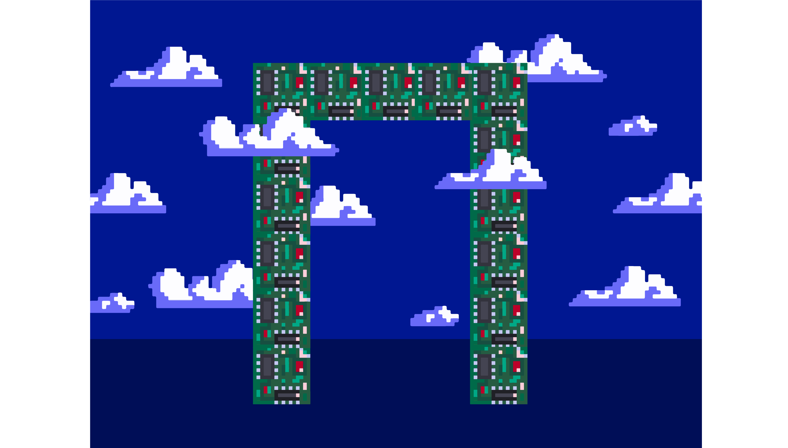

Садржај лекције 2.3
===================

На овом часу упознаћеш се са хардверским компонентама рачунарских система.

Садржај:

- Хардверске компоненте рачунарских система

Када успешно савладаш ову лекцију бићеш у стању да разликујеш компоненте дигиталног уређаја и наведеш њихове основне карактеристике и улогу.

