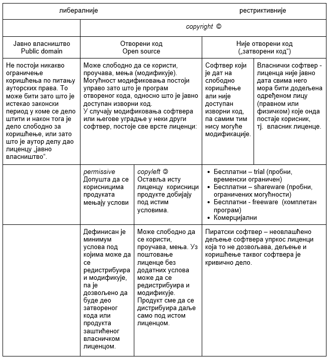

Софтверске компоненте рачунарских система
=========================================

Сви рачунарски програми се називају заједничким именом „софтвер” (енгл. Software).
Сигурно се сећаш из основне школе да програме према намени класификујемо у три групе: оперативни систем, системски програми и кориснички програми (апликативни софтвер, апликације).

|

**Оперативни систем** се увек прави за конкретан хардвер, а чине га програми који омогућују коришћење хардвера. Они чине да кад се рачунар укључи, може да прихвати команде са тастатуре, врши читање са спољашње меморије  и упис на њу, прикаже слику на екрану, покреће програме, усклађује рад свих компоненти рачунарског система и још много тога, чега ми користећи рачунар нисмо ни свесни. Без оперативног система хардвер не би могао да ради ништа.

|

**Системски програми** су, на неки начин надоградња оперативног система. Ту спадају драјвери - програми који омогућују комуникацију одређеног периферног уређаја са рачунаром, антивирусни програми који штите рачунар од злонамерног софтвера, програми преводиоци, који служе да програме написане на неком програмском језику преводе на машински језик како би се могли извршити на рачунару.

|

**Кориснички програми**, које називамо још и **апликативни софтвер** или, чешће, кад је реч о мобилним телефонима кажемо **апликације** су програми креирани за решавање неког конкретног проблема, за обављање неког конкретног посла, за потребе крајњих корисника рачунара. То су програми за обраду текста, преглед веба, за математичке прорачуне, цртање, компоновање, игре, израду презентација, пројектовање у техници, рад са базам података и друге конкретне послове.

.. questionnote::
    Размисли и сети се, а ако не знаш, потражи на интернету корисничке програме за сваку од наведених категорија. Знаш ли за неке корисничке програме који припадају категоријама које нисмо овде навели?
    
    Шта мислиш, да ли су „апликације” које инсталираш на „паметни” мобилни телефон такође кориснички програми? Поразговарај о овоме са вршњацима, размените међусобно спискове програма које сте направили и упоредите их. Да ли има преклапања? А неслагања, у смислу да сте исти програм сврстали у групе за различите намене? Зашто се то десило?

|

**Злонамерни програми и програми за заштиту од злонамерног софтвера** су незаобилазни део приче о софтверу. Злонамерни програми (енгл. malvare - malicious software) направљени су са циљем да нанесу штету. Ова штета може да буде уништење или спречавање коришћења  програма и података, откривање или крађа поверљивих података и лозинки, загушење протока на мрежи, нападе на системе ради уцењивања и слично. Ради заштите рачунара и података користи се разни заштитни програми, о чему ће бити више речи касније.

|

**Програми за архивирање** користе се да неку датотеку или више њих компресујемо и „спакујемо” у једну датотеку. Ово се ради или ако хоћемо да уштедимо меморијски простор на диску или ако датотеке шаљемо - да би пошиљка била мања и да би била у облику једне датотеке - уколико се шаље већи број датотека, овај је начин удобнији. О начину рада са овим програмима ће бити више речи касније.

|

Лиценце програма
----------------

Свако ауторско дело, па и софтвер, представља интелектуалну својину аутора. Kопирајт је традиционални назив за законска права власника интелектуалне својине, који је изведен из речи које означавају право на копирање, а односи се на разне облике коришћења. Ознака © поред назива аутора или компаније означава носиоца ауторских права.

Kад је реч о уметничкој слици, књизи, компакт-диску са снимљеном музиком ми купујемо медијум са уметничким делом и дефинисаним правима у вези са копирањем и емитовањем.

Kада се преузме програм са интернета или се добије на компакт-диску уз неки уређај, то још увек нама не даје право да радимо са тим софтвером шта нам је воља, већ је то одређено лиценцом. Лиценца значи дозволу коју носилац ауторских права даје некоме везано за коришћење ауторског дела.

.. infonote::
    Пре него што проучиш табелу која следи, ево једног кратког подсећања: програм се пише у неком програмском језику, и то је изворни код. Да би се програм извршио преводи се у машински код, тј. у извршну верзију коју „разуме„ рачунар. Модификације програма раде се у изворном коду. Извршни код човек не може да разуме нити да га модификује.

.. infonote::
    Реч „копилефт” (енгл. Copyleft) је непреводива игра речи која би значила отприлике: „остави исти копирајт ако нешто мењаш”
    Идеја ГНУ заједнице (која је творац овог појма) је да се формира посебан  „екосистем” софтвера који је отвореног кода и да сви који су у том екосистему праве нови софтвер отвореног кода од другог софтвера отвореног кода. То је довело је до тога да је неки начин „подељен„ свет софтвера отвореног кода и власничког софтвера.
 

Верзије и модификације програма
-------------------------------

При изради софтвера, обично постоје верзије за тестирање (алфа и бета). Након отклоњених грешака објављује се верзија за дистрибуцију корисницима. Та прва верзија обично има и ознаку 1.0. Ситније модификације означавају се бројевима иза тачке, а веће модификације у виду нове верзије програма означавају се бројем испред тачке.

|

