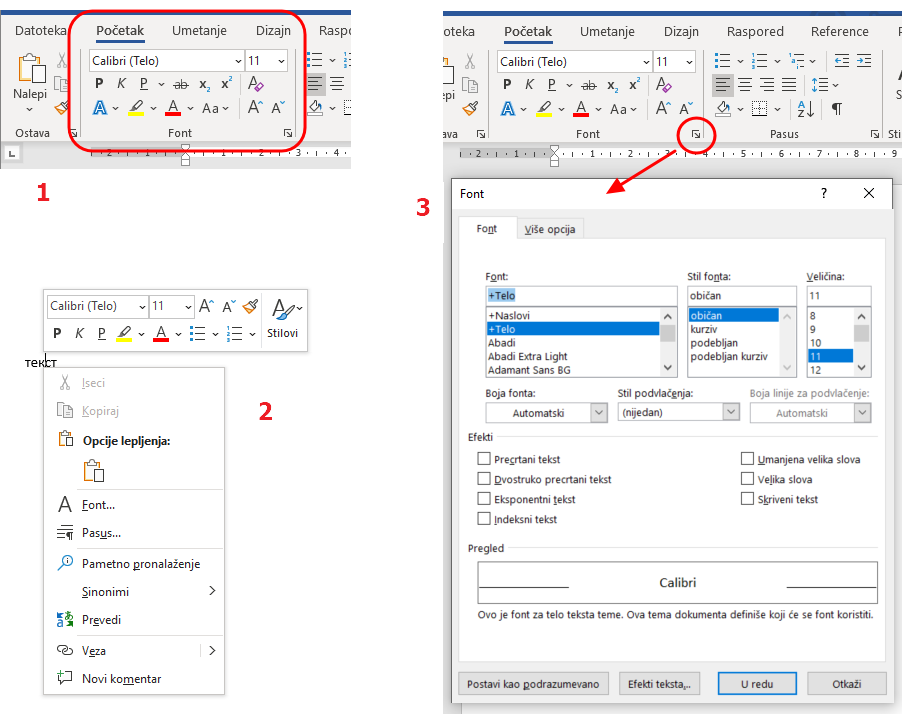
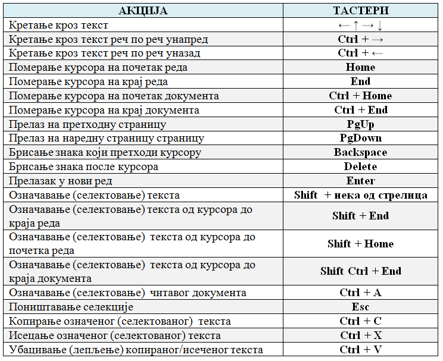

Форматирање дигиталних текстова
===============================

Форматирање текста се односи на облик и боју карактера (карактер је један типографски симбол: слово, цифра, специјални знак, размак, па чак , на неки начин, можемо сматрати и ентер), ефекте у изгледу, размак између слова, између редова и удаљеност од маргина.

Пре него што наставиш да читаш ову лекцију и испобаваш могућности ворда описане у њој, погледај овај кратки видео у којем су приказани основни поступци при форматирању карактера.

.. ytpopup:: HpwRgGNa5Ik
    :width: 735
    :height: 415
    :align: center 

|

Када куцамо текст не куцамо ентер сваки пут кад дођемо до краја реда већ дозвољавамо да Ворд аутоматски преломи ред. Он ће преломити ред управо на месту где смо откуцали размак (спејс) или пак ако желимо да поравнамо текст лево и десно равномерно он ће аутоматски проширити по мало сваки размак да би текст имао леп, равномеран изглед. Приликом промене величине фонта, аутоматски прелом ће се сам променити. Због тога је изузетно важно да поштујеш дигитални правопис како ти се не би десило да размаци буду превелики или да се ред заврши на пример отвореном заградом или почне зарезом или тачком...

Важно је да, осим дигиталног правописа, поштујеш још два важна правила тако да касније са лакоћом форматираш текст:

- Размаке између слова и речи (или увлачење текста) немој правити узастопним куцањем размака више пута.

- Размаке између редова  немој повећавати нити направити прелаз на другу страну тако што куцаш тастер ентер више пута узастопце.

Кренимо редом... 

Откуцај неколико произвољних реченица у празном Ворд-документу и на њима испробај све могућности наведене у овој лекцији тако да разумеш значење сваке приказане могућности. Тај документ сними под називом proba.docx и користи га увек за испробавање могућности у Ворду.

Као што смо већ написали, форматирање документа се односи на промену изгледа документа, односно на обликовање елемената документа.

**Текст (или његови делови) се може уређивати на два начина:** 

- прво се подеси формат па се онда куца текст;

- прво се унесе текст па се онда форматира. 

У сваком случају, тексту се може мењати формат безброј пута, све док документ не добије изглед који корисник жели. Уколико се мења формат на тексту који већ постоји, елементе који се форматирају најпре треба означити (селектовати).

Форматирању текста можемо приступити 

1) кликом на алатке у оквиру групе *Фонт* (Font) на картици *Почетак* (Home), 

2) десним кликом на радну површину документа или 

3) користећи прозор за уређивање фонта који се добија кликом на ознаку у доњем десном углу групе *Фонт* на картици *Почетак* (Home).

|

Приликом форматирања текста могућа је промена: фонта, величине фонта, стила фонта, боје, ефеката...

Користећи **прозор за уређивање фонта**, основна подешавања да се врше на картици *Фонт*. Промена фонта, стил величина и боја врше се избором из одговарајућих падајућих листа. 

Стил слова (да ли су подебљана, или искошена слова), врши се у делу Style.

Падајућа листа *Стил подвлачења* (Underline Style) подвлачи текст линијом која се изабере. Чим корисник изабере линију постаје активна и падајућа листа *Боја линије за подвлачење* (Underline Color), у којој корисник може да мења боју линије која подвлачи текст. Алатка *Подвучено* (Underline) из блока *Фонт* увек подвлачи текст бојом у којој су и сами карактери који се подвлаче.

Величина слова се изражава у тачкама (point, pt). Оријентације ради, величина слова од 72 pt одговара словима величине 2.54 cm (1 инч).

Следи целина *Ефекти* (Effects) са опцијама којима се може доста променити приказ слова. Најбоље је да испробаш сваки од ових ефеката. Прва два се односе на прецртавање текста. 

Од ових ефеката, врло често се користе *Експонентни текст* (Superscript) и *Индексни текст* (Subscript), који постављају слова у индекс (као у :math:`H_2O`) или на степен (као у :math:`m^2`).

Следећи ефекти су: *Умањена велика слова* (Small caps) који свим словима даје изглед великих слова (capitals) али им задржава величину, док *Велика слова* (All caps) приказује сва слова као велика. *Скривени текст* (Hidden) скрива селектована слова.

.. image:: ../../_images/w1_smalcaps.png
   :width: 400px   
   :align: center

У неким верзијама Ворда пронаћи ћеш  и друге ефекте као што су: Shadow – сенка, Outline – оивичена слова, Emboss – испупчена слова, Engrave – удубљена слова.

Друга картица *Više opcija* (Advanced) се користи за подешавање различитих опција у вези са размаком и позицијом карактера у оквиру реда.

.. image:: ../../_images/w1_font11.png
   :width: 400px   
   :align: center

*Размера* (Scale) равномерно повећава или смањује селектован текст, на пример: 150% или 200%. Ова опција се веома ретко користи, јер утиче на квалитет слова.
Често коришћена опција је *Размак између редова* (Spacing) која омогућава промену размака између слова на *Размакнуто* (Expended) или *Збијено* (Condensed) за жељену вредност која се уноси у листу *За* (By).

.. image:: ../../_images/w1_font12.png
   :width: 350px   
   :align: center

Често се наслови за којe желимо да буду визуелно већи, погрешно "сређују" тако што се ставља размак између сваког слова. То је погрешно зато што Ворд у том случају свако слово третира као засебну реч што вам умногоме отежава и селектовање и рад са тим делом текста. Правилно је користити управо ово подешавање које вам да регулишеш и величину тог размака између слова, а да та слова и даље чине заједно једну реч.

Испод ове опције налази се опција Position која пружа могућност да речи или чак појединачна слова подигнута изнад (Raised) или спуштена испод нормалне линије текста (Lowered), за жељену вредност која се уноси у листу By.

.. image:: ../../_images/w1_font13.png
   :width: 350px   
   :align: center

|

Најчешће коришћене пречице са тастатуре
---------------------------------------

До сада, текст смо едитовали користећи миша и тастатуру. Mиш није неопходан за акцију уноса текста. Едитовање текста помоћу тастатуре није тежак посао. Потребно је да овладамо са неколико од основних комбинација тастера:

Промена језика за унос текста
-----------------------------

Када смо говорили о поставкама оперативног система, приказали смо како се додаје језик за унос. Индикатор актуелног језика налази се на линији задатака, и језик се може променити кликом мишем али и пречицом са тастатуре: леви Alt + Shift

Чување текстуалног документа
----------------------------

Након уноса, текст можемо да сачувамо комбинацијом тастера Ctrl + S. Комбинацијама тастера на тастатури постижемо исте ефекте као када текст едитујемо коришћењем миша.

Видео-верзија ове лекције 
-------------------------

Ову лекцију са приказом практичног рада у ворду можеш да погледаш у  видео-лекцији:

.. ytpopup:: E-4xdEbnUNI
    :width: 735
    :height: 415
    :align: center 

