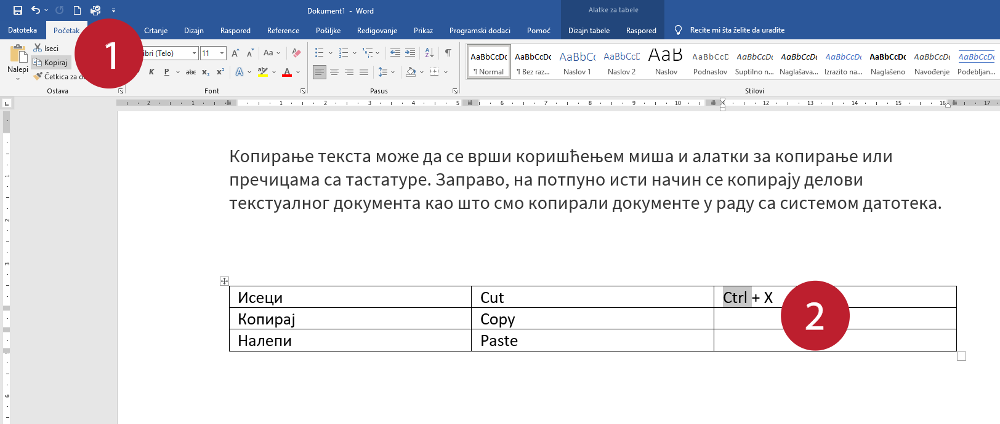
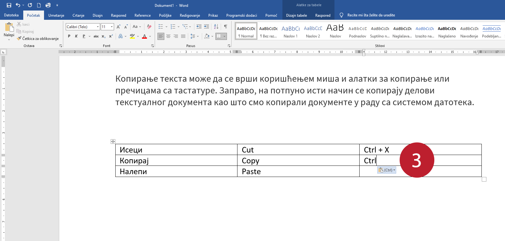
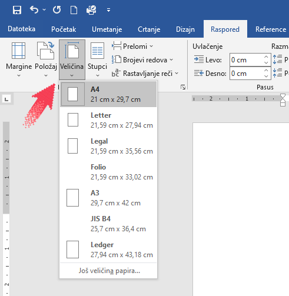
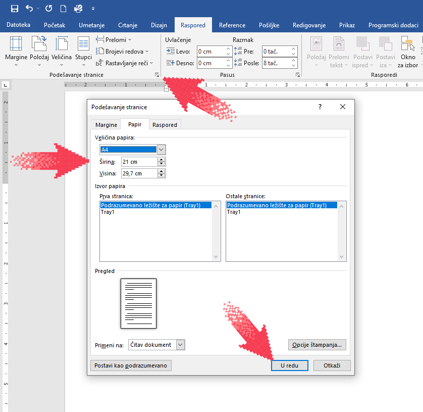
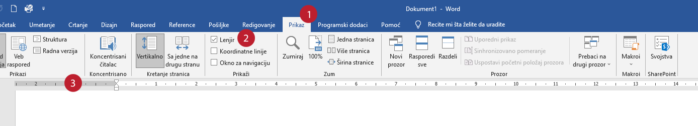
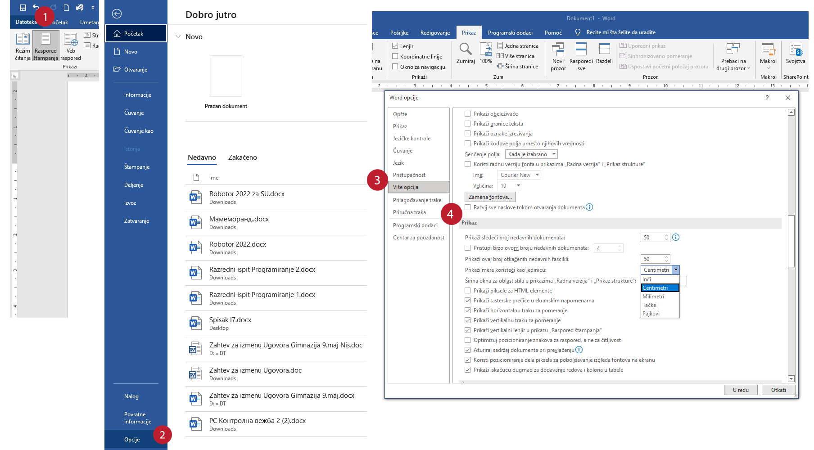

Креирање и уређивање дигиталних текстова
========================================

Куцање текста је саставни део рада у различитим програмима и ситуацијама:

- *Notepad*

- *Wordpad*

- *Microsoft Word*

- *LibreOffice Writer* (Текст)

- Гугл документи

- Презентације, електронска пошта, чет (ћаскање), поруке, итд. 

- Уређивање сајтова (веб-дизајн, уређивање Википедије и сл.)

- Програмирање

- итд.

Програми за унос и обраду текста називају се још и текст-процесори. Најчешће коришћен је *Microsoft Office Word* (MS Word, у тексту ћемо писати само *Ворд*). За коришћење овог програма потребно је да имамо лиценцу (програм се плаћа). Поред MS Word-а, често се користе и бесплатни програм *Libre Office Writer* (LO Writer) и сервис *Google Docs* (Гугл документи). Радом у једном од ових програма стичемо знања и вештине за рад у другим програмима исте намене.

Значајно је нагласити да није важно у ком програму за рад са текстом радимо. Свако ко познаје принцип рада у једном, способан је да користи сваки од њих!

Ми ћемо обраду текста илустровати на примеру програма Ворд из пакета Офис 365 (*Office 365*), локализованом на српски језик, а само у неким примерима, где је разлика значајна, даћемо истовремено и приказ у Ворду из верзије Офиса 2013 (*Office 2013*), локализованом на енглески. Добро је да знаш да користиш овај програм и са српском и са енглеском локализацијом.

Основни појмови
---------------

Да се подсетимо најпре из основне школе:

Обрадити текст значи изменити га. Када су измене у питању, важно је да знамо да постоје две основне категорије – едитовање (од енгл. *edit*, уређивање, приређивање) и форматирање (од енгл. *format*, слагање слога, припремање за штампу).

**Едитовање** је суштинско мењање текста. Ако прочитамо текст пре и после едитовања, видећемо да његов садржај није исти.

.. ytpopup:: VI0o0geLYNs
    :width: 735
    :height: 415
    :align: center

**Форматирање** је промена изгледа текста. Ако прочитамо текст пре и после форматирања, видећемо да је садржај остао исти.

.. ytpopup:: yBgWBYZQel8
    :width: 735
    :height: 415
    :align: center

Пре него што применимо едитовање или форматирање на неки део текста морамо да га означимо. То ћемо урадити тако што ћемо означити (каже се и одабрати, селектовати) текст који желимо, а онда применити акцију едитовања или форматирања.

Текст означавамо тако што кликнемо испред првог знака и, држећи притиснут леви тастер миша, обележимо све што желимо.

Да резимирамо, програми за обраду текста, односно текст-процесори, омогућују едитовање и форматирање текста.

Основни „алат“ нам је тастатура.

Тастатура и унос текста
-----------------------

.. figure:: ../../_images/w1_tastatura.jpg
   :width: 780px   
   :align: center

Осим слова, неопходни тастери су: цифре, специјални знаци, размак (*space*), ентер (*enter*), шифт (*shift*), капслок (*Caps Lock*), контрол(*ctrl*), алт, (*alt*), графички алт (*Alt Gr*), дилит (*del*), бекспејс (*backspace*), таб (*tab*), искејп (*esc*), курсорскe стрелице...

Не изгледају све тастатуре као на овој слици - постоје незнатне разлике међу тастатурама (најуочљивија је разлика према облику тастера „Ентер“ - све тастатуре са истим изгледом овог тастера имају и остале тастере распоређене на исти начин).

Сигурно знаш како се користи тастатура, али само да подсетимо - тастери Alt, Shift и Ctrl никада се не користе самостално већ увек у комбинацији са другим тастерима, тако што се прво притисне тај тастер па се онда, не пуштајући њега, притисне неки алфанумерички тастер. То се, ако је потребно у неком објашњењу, записује са знаком „+“ између.

.. suggestionnote:: Ако хоћеш да знаш детаљније...
   
   \....можеш да прочиташ на `овом линку <https://support.microsoft.com/sr-latn-me/help/17073/windows-using-keyboard>`_.

Корисна вештина је брзо, слепо куцање. Можеш да га вежбаш помоћу `апликације „Слово“ <https://web.archive.org/web/20180109123109/http://www.microsoftsrb.rs/download/obrazovanje/pil/slovo/Slovo_[SR].zip>`_ или да одеш на онлајн курс слепог куцања https://www.typingstudy.com/sr/, на којем можеш да учиш куцање различитим језицима тастатуре.

Текст може да се уноси различитим писмима. Врло је практично да на рачунару имаш инсталирана два „језика тастатуре“: ћирилицу и латиницу - промена језика тастатуре врши се мишем или комбинацијом леви *Alt+Shift* (или *Windows+Space*). Како се додају или уклањају различити језици тастатуре било је речи на једном од претходних часова.

Језик тастатуре утиче само на текст који се куца. Ако желиш да промениш писмо већ откуцаног текста то можеш да урадиш неком веб-апликацијом за пресловљавање, односно транслитерацију, на пример: https://eprevodilac.com/latinica-cirilica, http://www.konvertor.co.rs/ и многи други.

Уз помоћ тастера Shift добијају се велика слова и специјални знаци записани изнад цифара. Знаци који се налазе у доњем десном углу неких тастера добијају се комбинацијом тог тастера са левим Alt тастером (на пример знаци @, {, } итд.).

Брисање делова текста врши се тастерима Delete (брише десно од курсора) и Backspace (брише лево од курсора).

Дописивање је једноставно - само поставиш курсор унутар текста и при куцању текст се размиче. Ако пак притиснеш тастер Insert, нови текст ће заменити стари.

Копирање и одсецање текста се врши коришћењем оставе (*Clipboard*) на исти начин као што смо то радили, на пример, са датотекама и фасциклама и знатно је брже при уређивању текста користити тастатурне команде него миша.

Када куцањем дођеш до краја реда, курсор ће сам прећи у следећи ред - то је аутоматски прелом. Ако притиснеш тастер *Ентер*, ред ће се на том месту преломити. 

Погледај видео-прилог у којем је све то практично приказано:

.. ytpopup:: -9idiDJOVqo
    :width: 735
    :height: 415
    :align: center

Дигитални правопис
------------------

Већ смо га спомињали у теми о правилима комуникације на интернету. Односи се пре свега на то да куцаш одговарајућим писмом (за српски језик или ћирилицом или латиницом, користећи дијакритичке карактере č, ć, ž, š, đ), поштујући граматичка правила говорног језика, уз правилно куцање размака (спејс, енгл. *Space*) у односу на знаке интерпункције и још нека правила.

   
.. infonote::
   
   Јако је важно да се и у дигиталном и у реалном свету правилно изражавамо и говорним и писаним путем.

   Дигитално писмена особа примењује сва граматичка правила, и има знања везана за дигитални свет.

   Дигитално писмен човек:

   - после знакова интерпункције (зареза, тачке, узвичника, упитника, тачке-зареза, итд.) увек куца један размак (спејс, бланко);

   - испред и иза заграде куца размак - први знак (слово, број или било који други знак) у загради приљубљен је уз отворену заграду, а последњи знак уз затворену заграду;

   - испред и иза наводника куца размак - први знак оставља приљубљен уз отворене наводнике, а последњи знак уз затворене наводнике;

   - наводници се употребљавају „на овај начин“, куцањем знакова наводника комбинацијом Shift и 2. Уколико су правилно уређена језичка подешавања, знаци ће аутоматски на почетку да се поставе доле, а на крају горе. Погрешно је уместо доњих наводника куцати два зареза! 
    
   - косу црту пише без размака пре и после ње ако жели да раздвоји две речи;

   - косу црту пише са размаком пре и после ње ако жели да раздвоји две фразе које се састоје од више речи;

   - цртицу пише без размака пре и после ње када жели да напише полусложенице које садрже две речи или слово и реч;

   - цртицу пише са размаком пре и после ње када жели да напише полусложенице које садрже више речи. 

А може и овако:

.. suggestionnote:: Погледај инфографик о дигиталном правопису.
   
   Посети `овај линк <http://www.istokpavlovic.com/blog/digitalni-pravopis/>`_. 

Уколико ти је тако лакше да разумеш, погледај видео-прилог о дигиталном правопису:

.. ytpopup:: mRxjmeKFEbc
    :width: 735
    :height: 415
    :align: center

Кретање кроз текст
------------------

За почетак, покрени једноставан едитор текста (Бележница, *Notepad*) и испробај ефекте свих тастера. Откуцај неколико реченица и испробај кретање кроз текст и селектовање користећи само тастатуру. Ова техника је врло практична када се куца и уређује текст јер је брже, када су нам руке већ на тастатури, „прескочити“ неколико речи или означити их тастатуром него узимањем миша. 

Кретање кроз текст карактер по карактер врши се курсорским стрелицама. У комбинацији са Ctrl курсор се премешта реч по реч, а ако томе додамо и Shift онда се сав текст преко којега је прешао курсор означи (селектује).

Испробај и како функционише опција *Пронађи/Замени* (Find/Replace).

Копирање - клипборд (остава)
-----------------------------

Копирање текста може да се врши коришћењем миша и алатки за копирање или пречицама са тастатуре. Заправо, на потпуно исти начин се копирају делови текстуалног документа као што смо копирали документе у раду са системом датотека.

Најпре се означи (селектује) део текста, а затим се командом *исеци* (енгл. *Cut*) или *копирај* (енгл. *Copy*) направи копија у *остави* (клипборду, енгл. *clipboard*), одакле може произвољан број пута да се *налепи* (енгл. *Paste*) на друго место.

То у пракси изгледа овако:

.. ytpopup:: NAJEyH5N98o
    :width: 735
    :height: 415
    :align: center

Основна подешавања у програму Ворд
----------------------------------

Пре самог рада са документом потребно је подесити његове димензије (величину, маргине, оријентацију). Ове опције можеш подешавати и током рада.
У документу прво треба подесити жељену величину стране. Уколико су правилно уређена регионална подешавања у Поставкама (*Settings*), вероватно ће ти и у Ворду бити аутоматски подешена димензија папира А4, што је стандард који се користи у Србији. 
Ако није, подеси димензије странице. На картици Распоред (*Page Layout*), у групи Подешавање странице (*Page Setup*) изабери опцију Величина (*Size*) и у оквиру ње једну од предефинисаних величина папира, или неку коју одредиш под опцијом Још величина папира (*More Paper Sizes*).

Друга могућност је кликом на доњи десни квадратић у групи Подешавање странице (*Page Setup*): отвара се прозор са три картице. Једна од њих је са опцијама за подешавање величине папира

Док не промениш, маргине су подешене по стандарду A4 формата, то јест 2,54 cm за сваку страницу. Међутим, ако желиш величину маргина да подесиш како теби одговара бирај у прозору приказаном на претходној слици картицу Маргине (*Margins*) или у главном менију на картици Распоред (*Page Layout*) у групи Подешавање странице (*Page Setup*) опцију Маргине.

Ако у листи понуђених величина маргина нема оне која ти одговара, можеш изабрати опцију на дну листе Прилагођене маргине (*Custom Margins*). Отвориће се прозор дијалога Подешавање странице (*Page Setup*) и на картици Маргине можеш подесити њихову величину. У овом дијалогу подешавају се величине леве (*Left*), десне (*Right*), горње (*Top*) и доње маргине (*Bottom*), као и величина и положај простора који се може користити за повезивање папира (коричење) - Размак између стубаца (*Gutter*) и Положај књиговезачке маргине (*Gutter position*).

.. figure:: ../../_images/w1_margine.png
   :width: 800px   
   :align: center
   :class: screenshot-shadow

Уколико не видиш „лењир“ по хоризонтали и вертикали, можеш га укључити / искључити кликом на квадратић испред опције Лењир (Ruler).

Уколико су мерне јединице у Ворду изражене у инчима, пребаци их у милиметре или центиметре овако:

Пре него што кренеш даље, на други део лекције, покрени Ворд и подеси страницу на А4, са свим маргинама од по 3cm, „портрет“ оријентације и укључи лењир.

