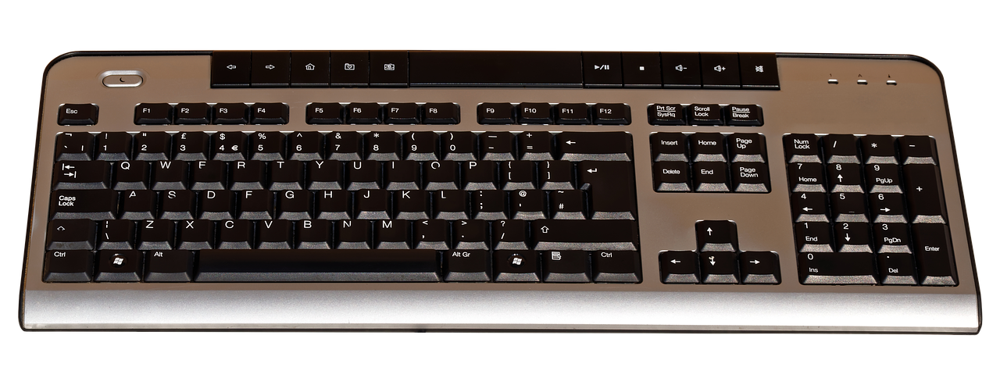

Креирање, уређивање и форматирање дигиталних текстова
=====================================================

Куцање текста је саставни део рада у различлитим програмима и ситуацијама:

- Notepad

- Wordpad

- Microsoft Word

- LibreOffice Writer (Текст)

- Гугл документи

- Презентације, електронска пошта, чет (ћаскање), поруке...

- Уређивање сајтова (вебдизајн, уређивање Википедије и сл.)

- Програмирање

- итд.

Основни „алат” нам је тастатура.

Тастатура
---------

Из основне школе знаш како се користи тастатура. Ако ти је потребно, можеш да се подсетиш на `овом линку <https://support.microsoft.com/sr-latn-me/help/17073/windows-using-keyboard>`_.

Осим слова, неопходни тастери су: цифре, специјални знаци, размак (space), ентер (enter), шифт (shift), капслок (Caps Lock), контрол(ctrl), алт, (alt), графички алт (Alt Gr), дилит (del), бекспејс (backspace), таб (tab), искејп (esc), курсорскe стрелице...

Корисна вештина је брзо, слепо куцање. Можеш да га вежбаш помоћу ове `апликације „Слово” <https://web.archive.org/web/20180109123109/http://www.microsoftsrb.rs/download/obrazovanje/pil/slovo/Slovo_[SR].zip>`_.

Унос текста
-----------

- ћирилица, латиница - промена језика тастатуре (мишем или Alt+Shift)

- пресловљавање https://eprevodilac.com/latinica-cirilica, http://www.konvertor.co.rs/ и многи други...  

- разлика између "Ентер" и аутоматског прелома

- постоје незнатне разлике међу тастатурама (најуочлљивија је разлика према облику тастера "Ентер")

Дигитални правопис
------------------

Већ смо га спомињали у теми о правилима комуникаицје на интернету. Ако желиш да се подсетиш, посети `овај линк <http://www.istokpavlovic.com/blog/digitalni-pravopis/ >`_.

Основна подешавања у програму Ворд
----------------------------------

Пре самог рада са документом потребно је подесити његове димензије (величину, маргине, оријентацију). Ове опције можете подешавати и током рада.
У документу прво треба подесити жељену величину стране. Уколико сте правилно уредили регионална подешавања у Контролном панелу вероватно ће вам и у Ворду бити аутоматски подешена димензија А4, што је стандард који се користи у Србији. Ако није, подесите димензије странице. На картици Page Layout, у групи Page Setup изаберите опцију Size и у оквиру ње једну од предефинисаних величина папира, или неку коју сами одредите под опцијом More Paper Sizes.
Друга могућност је кликом на доњи десни квадратић у групи Page Setup: отвара се картица са опцијама за подешавање величине папира
Док не промените, маргине су подешене по стандарду A4 формата, то јест 2.54cm за сваку страницу. Међутим, ако желите величину маргина да подесите како вама одговара бирате на картици Page Layout у групи Page Setup  опцију Margins.

Ако у листи понуђених величина нема величине које вама одговарају можете изабрати опцију на дну листе Custom Margins. Отвориће се прозор Page Setup дијалога и на картици Margins можете подесити величину маргина. У овом дијалогу подешавају се величине леве (Left), десне (Right), горње (Top) и доње маргине (Bottom), као и величина простора која се може користити за коричење (Gutter).
Уколико не видите "лењир" по хоризонтали и вертикали, можете га укључити / искључити кликом на квадратић испред опције Ruler.

Пре него што кренете даље кроз лекцију, покрените Ворд и подесите страницу на А4, са свим маринама од по 3cm, "портрет" оријентације и укључите лењир.

|

Форматирање текста
--------------------

Форматирање текста се односи на облик и боју карактера (карактер је један типографски симбол: слово, цифра, специјални знак, размак, па чак , на неки начин, можемо сматрати и ентер), ефекте у изгледу, размак између слова, између редова и удаљеност од маргина.

Када куцамо текст не куцамо ентер сваки пут кад дођемо до краја реда већ дозвољавамо да Ворд аутоматски преломи ред. Он ће преломити ред управо на месту где смо откуцали размак (спејс) или пак ако желимо да поравнамо текст лево и десно равномерно он ће аутоматски проширити по мало сваки размак да би текст имао леп, равномеран изглед. Приликом промене величине фонта, аутоматски прелом ће се сам променити. Због тога је изузетно важно да поштујемо дигитални правопис (са којим сте се упознали претходног часа) како нам се не би десило да размаци буду превелики или да нам се ред заврши на пример отвореном заградом или почне зарезом или тачком...

Важно је да, осим дигиталног правописа, поштујете још два важна правила како би сте касније са лакоћом форматирали текст:

Размаке између слова и речи (или увлачење текста) немојте правити узастопним куцањем размака више пута.
Размаке између редова  немојте повећавати тако што куцате тастер ентер више пута узастопце (нити да би направили прелаз на другу страну).
Кренимо редом... 

Откуцајте неколико произвољних реченица у празном ворд-документу и на њима испробајте све могућности наведене у овој лекцији како би сте разумели значење сваке приказане могућности. Тај документ снимите под називом proba.docx и користите га увек за испробавање могућности у Ворду.

Као што смо већ написали, форматирање документа се односи на промену изгледа документа, односно на обликовање елемената документа.
Текст се може форматирати на два начина: прво подесите формат па куцате или прво унесете текст па га онда форматирате. У сваком случају, текст се може форматирати и мењати формат  безброј пута, све док документ не добије изглед који корисник жели. Уколико мењате формат на тексту који већ постоји, елементе које форматирате најпре селектујте.

Форматирању текста можемо приступити на више начина. Алаткама се приступа кликом на алатке у оквиру Font групе на картици Home, или десним кликом на радну површину документа

Прозор за уређивање фонта добија се и кликом на ознаку у доњем десном углу групе "Font" на каритци "Home".

Приликом форматирања текста могућа је промена:
фонта, величине фонта, стила фонта, боје, ефеката...

Основна подешавања фонта се врше на картици Font. Промена фонта врши се у падајућој листи Font.

Падајућа листа Underline Style подвлачи текст линијом која се изабере. Чим корисник изабере линију постаје активна и падајућа листа Underline Color, у којој корисник може да мења боју линије која подвлачи текст. Алатка Underline из Font блока увек подвлачи текст бојом у којој су и сами карактери који се подвлаче.

Боја слова се мења у листи Font Color.

Величина слова подешава се у делу Size. Величина слова се изражава у тачкама (point, pt). На пример, величина слова од 72 pt одговара словима величине 2.54 cm.

Копирање и премештање делова текста -клипоборд 
----------------------------------------------

.. ytpopup:: 5Aoqhp_iOKQ
    :width: 735
    :height: 415
    :align: center 

|

Форматирање текста у Ворду
--------------------------

.. ytpopup:: 9xDDBLxe2eo
    :width: 735
    :height: 415
    :align: center

|

Чување текстуалног документа
----------------------------

.. ytpopup:: rGgwSdBzZ2Y
    :width: 735
    :height: 415
    :align: center

