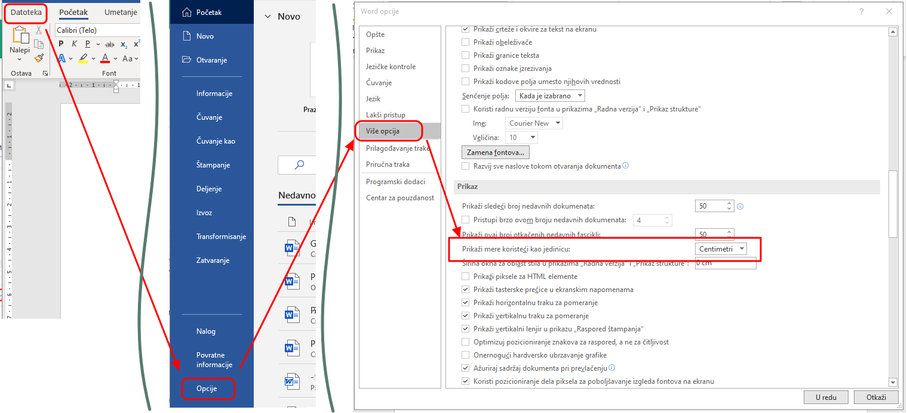

Креирање, уређивање и форматирање дигиталних текстова
=====================================================

Куцање текста је саставни део рада у различитим програмима и ситуацијама:

- Notepad

- Wordpad

- Microsoft Word

- LibreOffice Writer (Текст)

- Гугл документи

- Презентације, електронска пошта, чет (ћаскање), поруке...

- Уређивање сајтова (вебдизајн, уређивање Википедије и сл.)

- Програмирање

- итд.

Програми за унос и обраду текста су бројни. Најчешће коришћен је Microsoft Office Word (MS Word). За коришћење овог програма потребно је да имамо лиценцу (програм се плаћа). Поред MS Word-а, често се користе и бесплатни програм Libre Office Writer (LO Writer) и сервис Google Docs. Рад у једном од оваквих програма стичемо знања и вештине за рад у другим програмима исте намене.

Значајно је нагласити да није важно у ком програму за рад са текстом радимо. Свако ко познаје принцип рада у једном, способан је да користи сваки од њих!

Да се подсетимо најпре из основне школе:

Обрадити текст значи изменити га. Када су измене у питању, важно је да знамо да постоје две основне категорије – едитовање (енг. edit) и форматирање (енг. format).

**Едитовање** је суштинско мењање текста. Ако прочитамо текст пре и после едитовања, видећемо да његов садржај није исти.

**Форматирање** је промена изгледа текста. Ако прочитамо текст пре и после форматирања, видећемо да је садржај остао исти.

Пре него што применимо едитовање или форматирање, морамо да означимо на који део текста се те активности односе. То ћемо урадити тако што ћемо означити (каже се и одабрати, селектовати) текст који желимо, а онда применити акцију едитовања или форматирања.

Текст означавамо тако што кликнемо испред првог знака и, држећи притиснут леви тастер миша, обележимо све што желимо.

Основни „алат” нам је тастатура.

|

Тастатура и унос текста
-----------------------

.. image:: ../../_images/w1_tastatura.jpg
   :width: 720px   
   :align: center

Осим слова, неопходни тастери су: цифре, специјални знаци, размак (space), ентер (enter), шифт (shift), капслок (Caps Lock), контрол(ctrl), алт, (alt), графички алт (Alt Gr), дилит (del), бекспејс (backspace), таб (tab), искејп (esc), курсорскe стрелице...

Не изгледају све тастатуре као на овој слици - постоје незнатне разлике међу тастатурама (најуочлљивија је разлика према облику тастера „Ентер” - све тастатуре са истим овим тастером имају и остале тастере распоређене на исти начин).

Сигурно знаш како се користи тастатура, али само да подсетимо - тастери Alt, Shift и Ctrl никада се не користе самостално већ увек у комбинацији са другим тастерима, тако што се прво притисне тај тастер па онда не пиштајући њега притисне неки алфанумерички тастер. То се, ако је потребно у неком објашњењу,  записује са знаком „+” између.

.. reveal:: tastaura
   :showtitle: Ако хоћеш да знаш детаљније
   :hidetitle: Сакриј прозор
   
   .. infonote::
   
    Можеш да прочиташ на `овом линку <https://support.microsoft.com/sr-latn-me/help/17073/windows-using-keyboard>`_.

Корисна вештина је брзо, слепо куцање. Можеш да га вежбаш помоћу `апликације „Слово” <https://web.archive.org/web/20180109123109/http://www.microsoftsrb.rs/download/obrazovanje/pil/slovo/Slovo_[SR].zip>`_ или да одеш на онлајн курс слепог куцања https://www.typingstudy.com/sr/ на којем можеш да учиш куцање различитим језицима тастауре.

Може да се уноси текст различитим писмима. Врло је практично да на рачунару имаш инсталирана два „језика тастауре”: ћирилицу и латиницу - промена језика тастатуре врши се мишем или комбинацијом леви Alt+Shift. Како се додају или уклањају различити језици тастатуре било је речи на једном од претхоних часова.

Језик тастауре утиче само на текст који се куца. Ако желиш да промениш писмо већ откуцаног текста то можеш да урадиш неком веб-апликацијом за пресловљавање, односно транслитерацију, на пример: https://eprevodilac.com/latinica-cirilica, http://www.konvertor.co.rs/ и многи други...  

Уз помоћ тастера Shift доbијају се велика слова и специјални знаци записани изнад цифара. Знаци који се налазе у доњем десном углу неких тастера добијају се комбинацијом тог тастера са левимAlt тастером (на пример знаци @, {, } итд.).

Брисање делова текста врши се тастерима Delete (брише десно од курсора)  Backspace (брише лево од курсора).

Дописивање је једноставно - само постаивмо курсор унутар текста и при куцању текст се размиче. Ако пак притиснемо тастер Insert нови текст ће заменити стари.

Копирање и одсецање текста се врши коришћењем оставе (Clipboard) на исти начин као што смо то радили на пример са датотекама и фасцикалма и знатно је брже при уређиивању текста користити тастатурне команде него мишем.

Када куцањем дођеш до краја реда, курсор ће сам прећи у следећи ред, то је аутоматски прелом. Ако откуцаш  "Ентер" ред ће се на том месту преломити. 

|

Дигитални правопис
------------------

Већ смо га спомињали у теми о правилима комуникације на интернету. Покушај да се сетиш, односи се пре свега на то да куцаш одговарајућим писмом језика (српски или ћирилицом или латиницом користећи дијакритичке карактере č, ć, ž, š) и сва граматичка правила говорног језика, када се куца размак (спејс, енгл. Space) у односу на знаке интерпункције и још нека правила.

   
.. infonote::
   
   Јако је важно да се и у дигиталном и реалном свету правилно изражавамо и говорним и писаним путем.

   Дигитално писмена особа, примењује сва граматичка правила, и има знања везана за дигитални свет.

   Дигитално писмен човек:

   - после знакова интерпункције (зареза, тачке, узвичника, упитника, тачке зареза,…) увек куца један размак (спејс, бланко);

   - испред и иза заграде куца размак - први знак (слово, број или било који други знак) у загради приљубљен је уз отворену заграду, а последњи знак уз затворену заграду;

   - испред и иза наводника куца размак - први знак оставља приљубљен уз отворене наводнике, а последњи знак уз затворене наводнике;

   - наводници се употребљавају „на овај начин“ куцањем знакова наводника комбинацијом shift и 2. Уколико сте правилно уредили језичка подешавања, знаци ће аутоматски на почетку да се поставе доле, а на крају горе. Погрешно је уместо доњих наводника куцати два зареза! 
    
   - косу црту пише без размака пре и после ње ако жели да раздвоји две речи;

   - косу црту пише са размаком пре и после ње ако жели да раздвоји две фразе које се састоје од више речи;

   - цртицу пише без размака пре и после ње када жели да напише полусложенице које садрже две речи или слово и реч;

   - цртицу пише са размаком пре и после ње када жели да напише полусложенице које садрже више речи. 

А може и овако:

.. reveal:: дигиталнип
   :showtitle: Погледај инфографик о дигиталном правопису
   :hidetitle: Сакриј прозор
   
   .. infonote::
   
    Посети `овај линк <http://www.istokpavlovic.com/blog/digitalni-pravopis/>`_. 

|

Кретање кроз текст
------------------

За почетак, уђи у једноставан едитор текста (Бележница, Notepad) и испробај ефекте свих тастера. Откуцај неколико реченица и испробај кретање кроз текст и селетовање користећи само тастатуру. Ова техника је врло практична када се куца и уређује текст јер је брже, када су нам руке већ на тастатури „прескочити” неколико речи или означити их тастатуром него узимањем миша. 

Кретање кроз текст карактер по карактер врши се курсорским стрелицама, у комбинацији са Ctrl курсос се премешта реч по реч, а ако томе додамо и Shift онда се сав текст преко којега је прешао курсор означи (селектује).

Испробај и како функционише опција Пронађ/Замени (Find/Replace).

|

Основна подешавања у програму Ворд
----------------------------------

Пре самог рада са документом потребно је подесити његове димензије (величину, маргине, оријентацију). Ове опције можеш подешавати и током рада.
У документу прво треба подесити жељену величину стране. Уколико су правилно уређена регионална подешавања у „Поставкама” вероватно ће ти и у Ворду бити аутоматски подешена димензија папира А4, што је стандард који се користи у Србији. Ако није, подеси димензије странице. На картици Page Layout, у групи Page Setup изабери опцију Size и у оквиру ње једну од предефинисаних величина папира, или неку коју одредиш под опцијом More Paper Sizes.

.. image:: ../../_images/w1_velicinastranice.png
   :width: 350px   
   :align: center

Друга могућност је кликом на доњи десни квадратић у групи Page Setup: отвара се картица са опцијама за подешавање величине папира

.. image:: ../../_images/w1_pagesetup.png
   :width: 500px   
   :align: center

Док не промениш, маргине су подешене по стандарду A4 формата, то јест 2,54 cm за сваку страницу. Међутим, ако желиш величину маргина да подесиш како теби одговара бирај на картици Page Layout у групи Page Setup  опцију Margins.

Ако у листи понуђених величина нема величине која ти одговара можеш изабрати опцију на дну листе Custom Margins. Отвориће се прозор Page Setup дијалога и на картици Margins можеш подесити величину маргина. У овом дијалогу подешавају се величине леве (Left), десне (Right), горње (Top) и доње маргине (Bottom), као и величина простора која се може користити за коричење (Gutter).

.. image:: ../../_images/w1_margine.png
   :width: 600px   
   :align: center

Уколико не видиш „лењир” по хоризонтали и вертикали, можеш га укључити / искључити кликом на квадратић испред опције Лењир (Ruler).

.. image:: ../../_images/w1_ruler.png
   :width: 350px   
   :align: center

Уколико су мерне јединице у Ворду изражене у инчима, пребаци их у милметре или сантиметре овако:

Пре него што кренеш даље кроз лекцију, покрени Ворд и подеси страницу на А4, са свим маргинама од по 3cm, „портрет” оријентације и укључи лењир.

|

Форматирање текста
--------------------

Погледај најпре овај кратки видео у којем су приказани основни поступци при форматирању карактера (али и да сазнаш шта у овом контексту означава термин „карактер”).

.. ytpopup:: HpwRgGNa5Ik
    :width: 735
    :height: 415
    :align: center 

|

У наредном тексту ћемо називе опција писати на енглеском, јер ако ти је окружење већ на српском називи су сасвим очигледни.

Форматирање текста се односи на облик и боју карактера (карактер је један типографски симбол: слово, цифра, специјални знак, размак, па чак , на неки начин, можемо сматрати и ентер), ефекте у изгледу, размак између слова, између редова и удаљеност од маргина.

Када куцамо текст не куцамо ентер сваки пут кад дођемо до краја реда већ дозвољавамо да Ворд аутоматски преломи ред. Он ће преломити ред управо на месту где смо откуцали размак (спејс) или пак ако желимо да поравнамо текст лево и десно равномерно он ће аутоматски проширити по мало сваки размак да би текст имао леп, равномеран изглед. Приликом промене величине фонта, аутоматски прелом ће се сам променити. Због тога је изузетно важно да поштујеш дигитални правопис како ти се не би десило да размаци буду превелики или да се ред заврши на пример отвореном заградом или почне зарезом или тачком...

Важно је да, осим дигиталног правописа, поштујеш још два важна правила тако да касније са лакоћом форматираш текст:

- Размаке између слова и речи (или увлачење текста) немојт правити узастопним куцањем размака више пута.

- Размаке између редова  немој повећавати нити направити прелаз на другу страну тако што куцаш тастер ентер више пута узастопце.

Кренимо редом... 

Откуцај неколико произвољних реченица у празном ворд-документу и на њима испробај све могућности наведене у овој лекцији тако да разумеш значење сваке приказане могућности. Тај документ сними под називом proba.docx и користи га увек за испробавање могућности у Ворду.

Као што смо већ написали, форматирање документа се односи на промену изгледа документа, односно на обликовање елемената документа.

**Текст се може форматирати на два начина:** прво подесиш формат па куцаш или прво унесеш текст па га онда форматираш. У сваком случају, текст се може форматирати и мењати формат безброј пута, све док документ не добије изглед који корисник жели. Уколико мењаш формат на тексту који већ постоји, елементе које форматираш најпре означи (селектуј).

Форматирању текста можемо приступити кликом на алатке у оквиру Font групе на картици Home, десним кликом на радну површину документа или користећи прозор за уређивање фонта добија се и кликом на ознаку у доњем десном углу групе Font на картици Почетак (Home).

Приликом форматирања текста могућа је промена: фонта, величине фонта, стила фонта, боје, ефеката...

Користећи **прозор за уређивање фонта**, основна подешавања да се врше на картици Font. Промена фонта врши се у падајућој листи Font.

Стил слова (да ли су подебљана, или искошена слова), врши се у делу Style.

Падајућа листа Underline Style подвлачи текст линијом која се изабере. Чим корисник изабере линију постаје активна и падајућа листа Underline Color, у којој корисник може да мења боју линије која подвлачи текст. Алатка Underline из Font блока увек подвлачи текст бојом у којој су и сами карактери који се подвлаче.

Боја слова се мења у листи Font Color.

Величина слова подешава се у делу Size. Величина слова се изражава у тачкама (point, pt). На пример, величина слова од 72 pt одговара словима величине 2.54 cm.

Следи целина Effects, у питању су различити ефекти који могу доста променити приказ слова. Прва два ефекта су Strikethrough и Double Strikethrough који прецртавају текст једном односно дуплом линијом.

Наредне две опције се најчешће користе. У питању су Superscript и Subscript, који поставлјају слова у индекс (као у :math:`H_2O`) или на степен (као у :math:`m^2`).

Следећи ефекти су: Small caps који свим словима даје изглед великих слова (capitals) али им задржава величину, док All caps приказује сва слова као велика. Hidden скрива селектована слова.

.. image:: ../../_images/w1_smalcaps.png
   :width: 400px   
   :align: center

У неким верзијама Ворда пронаћи ћеш  и друге ефекте као што су: Shadow – сенка, Outline – оивичена слова, Emboss – испупчена слова, Engrave – удубљена слова.

Друга картица Advanced се користи за подешавање различитих опција у вези са размаком и позицијом карактера у оквиру реда.

.. image:: ../../_images/w1_font11.png
   :width: 400px   
   :align: center

Scale равномерно повећава или смањује селектован текст, на пример: 150% или 200%. Ова опција се веома ретко користи, јер утиче на квалитет слова.
Често коришћена опција је Spacing која омогућава повећање (Expended) или смањење (Condensed) размака између слова за жељену вредност која се уноси у листу By.

.. image:: ../../_images/w1_font12.png
   :width: 300px   
   :align: center

Често се наслови за који желимо да буду визуелно већи, погрешно "сређују" тако што се ставља размак између сваког слова. То је погрешно зато што Ворд у том случају свако слово третира као засебну реч што вам умногоме отежава и селектовање и рад са тим делом текста. Правилно је користити управо ово подешавање које вам да регулишеш и величину тог размака између слова, а да та слова и даље чине заједно једну реч.

Испод ове опције налази се опција Position која пружа могућност да речи или чак појединачна слова подигнута изнад (Raised) или спуштена испод нормалне линије текста (Lowered), за жељену вредност која се уноси у листу By.

.. image:: ../../_images/w1_font13.png
   :width: 300px   
   :align: center

|

Пречице са тастатуре за едитовање текста
----------------------------------------

До сада, текст смо едитовали користећи миша и тастатуру. Mиш није неопходан за акцију уноса текста. Едитовање чистог текста помоћу тастатуре није тежак посао. Потребно је да овладамо са неколико од основних комбинација тастера:

.. image:: ../../_images/w1_precice.png
   :width: 700px   
   :align: center

Промена језика за унос текста
-----------------------------

Када смо говорили о поставкама оперативног система, приказали смо како се додаје језик за унос. Индикатор актуелног језика налази се на линији задатака, и језик се може променити кликом мишем али и пречицом са тастатуре: леви Alt + Shift

Чување текстуалног документа
----------------------------

Након уноса, текст можемо да сачувамо комбинацијом тастера Ctrl + S. Комбинацијама тастера на тастатури постижемо исте ефекте као када текст едитујемо коришћењем миша.

Видео-верзија ове лекције 
-------------------------

Ову лекцију са приказом практичног рада у ворду можеш да погледаш у  видео-лекцији:

.. ytpopup:: E-4xdEbnUNI
    :width: 735
    :height: 415
    :align: center 

