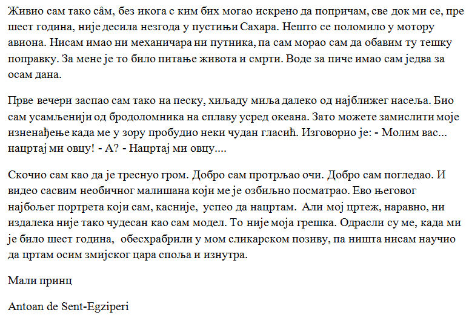

Задаци за вежбу 4.1
===================

1. задатак
----------

У програму Бележница (Notepad или одговарајући за креирање неформатираног текста) прекуцај ћирилицом следећи текст:

Преслови цео текст на латиницу и латиничну копију постави испод ћириличне у истом документу. Обрати пажњу при снимању на „кодирање“ (encoding)

Пошаљи урађен рад наставнику.

2. задатак
----------

Ископирај на свој рачунар игрицу "Слово" за учење слепог куцања. `Преузми је са овог линка <https://web.archive.org/web/20180109123109/http://www.microsoftsrb.rs/download/obrazovanje/pil/slovo/Slovo_[SR].zip>`_) 
и распакуј.

Вежбај куцање кроз различите делове програма:

- отвори постојеће лекције

- изабери писмо

- прођи кроз модуле "Учење куцања", "Временско куцање" и "Игрица". 

- уради скриншот једне добро урађене вежбе у модулу "Учење куцања" и свог најбољег резултата у "Игрици" и пошаљи та два скриншота наставнику.

|

