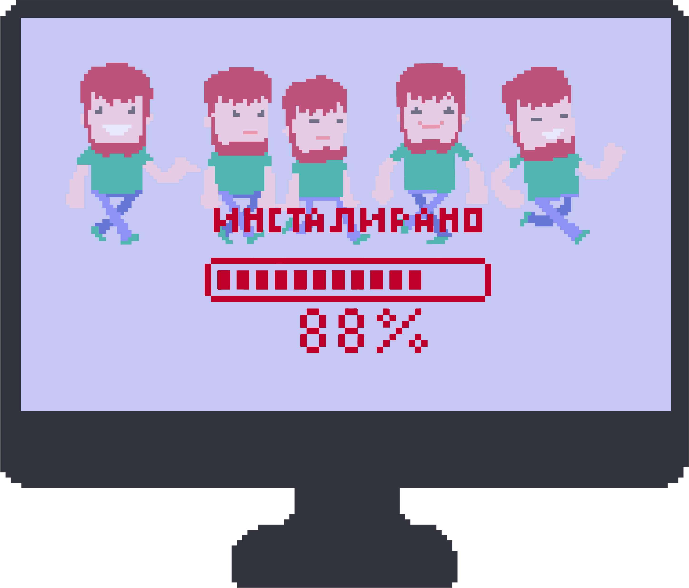

Садржај лекције 4.10
====================
На овом часу разумећеш разлику између приступа уређивања текста коришћењем приступа „што видиш то и добијеш” (WYSIWYG) и језика за обележавање и уопзнати неке такве језике.

Садржај:

- О језицима за обележавање

- HTML

- Markdown

- Wikitext 

Када успешно савладаш ову лекцију бићеш у стању да разумеш начин функционисања и препознаш ситуације у којима треба употребити језике за обележавање, као и да уређујеш на елементарном нивоу текст применом нотација за обележавање.

