Форматирање параграфа
=====================

Претходни час смо завршили форматирањем текста у програму за обраду текста. Текст смо форматирали применом алатки на карактере у тексту.

Кад уређујемо текст, много је ефикасније да поједине операције форматирања примењујемо на читаве параграфе (пасусе). А знаш ли шта уопште називамо пасусом у програмима за обраду текста?

Параграф (пасус)
----------------

Текст откуцан између два знака *Ентер* назива се пасус или параграф. У овом тексту ћемо равноправно користити оба термина. Будући да тастер *Ентер* нема графичку репрезентацију, а често нам је важно да видимо где је откуцан *Ентер* а где је дошло до аутоматског прелома или прелома стране, могуће је укључити „невидљиве" симболе.

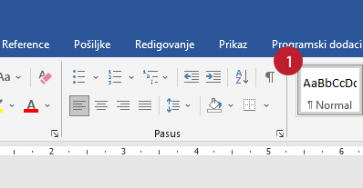

Укључи „невидљиве симболе" (параграф знак, „Пи знак") на тексту са претходног часа и погледај шта се све појавило - тамо где је откуцан ентер, размак, табулатор...

Ови симболи који су се појавили служе само да би се на екрану приказали „невидљиви" симболи. Они се не виде при штампању.

Форматирање параграфа и подешавање страница омогућују ти да промениш изглед целокупног документа. 

Алатима за форматирање страница и параграфа можеш да приступиш на више начина:

1) кликом на *Распоред* (Page Layout),

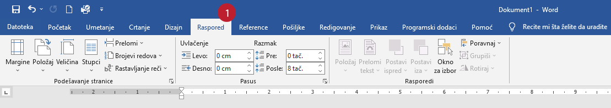

2) кликом на доњи десни угао групе *Пасус* (Paragraph)  на картици *Почетак* (Home),

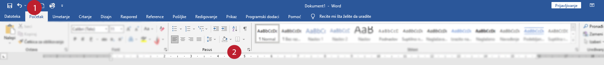

3) користећи прозор за форматирање пасуса који се добија кликом на ознаку у доњем десном углу групе *Пасус*  (Paragraph)   на картици *Почетак* (Home).

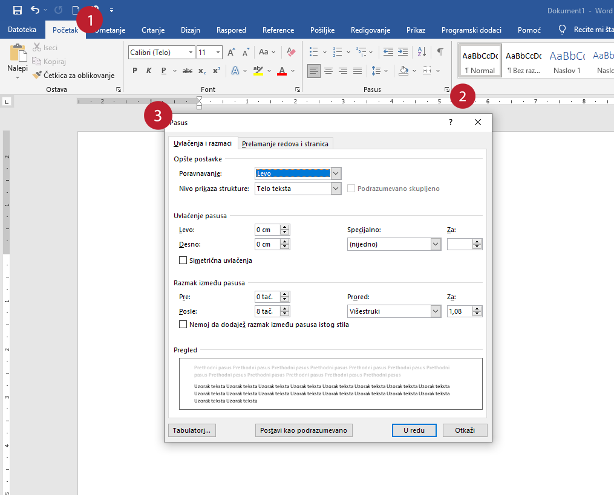

Приликом форматирања пасуса могућа је промена:

- поравнања пасуса;

- увлачење пасуса;

- проред (размак) између пасуса;

- проред између редова унутар пасуса;

- „понашање” текста при прелому реда или странице.

**Поравнање текста - Alignment**

Поравнање текста параграфа ти омогућава да подесиш како желиш да изгледају десна и лева ивица текста.

Да би се променило поравнање потребно је кликнути на *Почетак* (Home) картицу, и одабрати одговарајуће дугме за поравнање параграфа у групи *Пасус* (Paragraph):

- *Поравнај лево* (Align Text Left), текст је поравнат у односу на леву маргину;

- *Центрирај* (Center Text), текст је центриран унутар маргина;

- *Поравнај десно* (Align Text Right), текст је поравнат у односу на десну маргину;

- *Обострано поравнај* (Justify), текст је поравнат у односу на обе маргине.

.. figure:: ../../_images/w2_par2.png
   :width: 200px   
   :align: center
   :class: screenshot-shadow

**Увлачење параграфа - Indentation**

Увлачење текста омогућава да подесиш растојање ивице текста од маргина. Постоји неколико начина за увлачење:

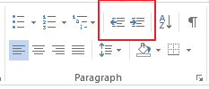

**Први начин:**

На картици *Пасус* (Paragraf) налазе се дугмад *Смањи увлачење* (Decrease Indent) и *Повећај увлачење* (Incerease Indent). Овим алаткама се мења растојање леве ивице текста од маргине.

**Други начин:**

На лењиру (Ruler) налазе се граничници текста чијим повлачењем се одређују лева и десна граница текста.

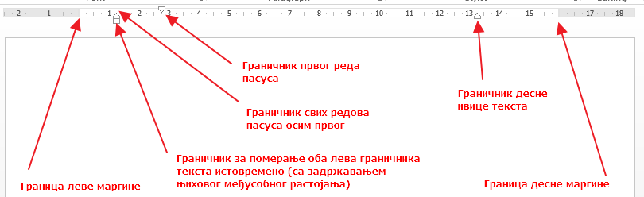

Обратите пажњу како они утичу на изглед текста:

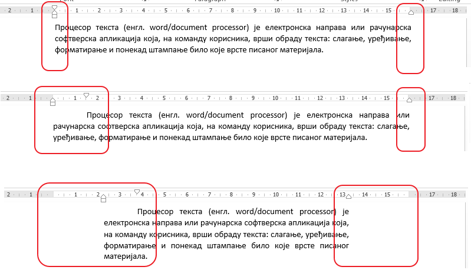

**Трећи начин:**

Помоћу дијалога групе *Пасус* (Paragraf) у којој се налазе опције за поравнање, увлачење, размак између редова параграфа и између параграфа и за „понашање” делова параграфа при прелазу на другу страну.

**Проред - Spacing**

Помоћу алатке за проред, али и помоћу Параграф-дијалога могуће је подешавање празног простора изнад и испод параграфа (тј размака између два суседна параграфа)- на слици уоквирено љубичасто.

Такође, могуће је одабрати проред унутар параграфа - на слици уоквирено зелено.

Посебно, треба обратити пажњу на опцију "Немој да додајеш размак између пасуса истог стила" што је погодно, на пример, да пасус текста буде више одмакнут од наслова него од другог пасуса текста.

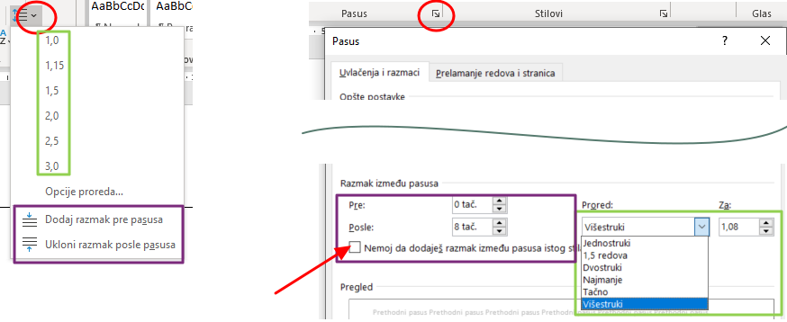

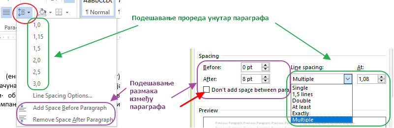

**Параграф - дијалог**

Картица *Увлачења и размаци* (Indents and Spacing) садржи све претходне групе опција:

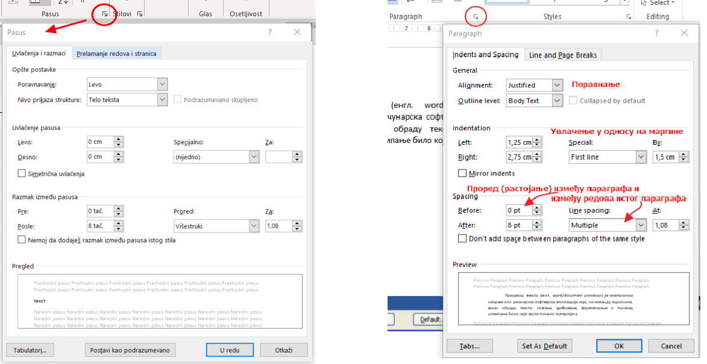

Kартица *Преламање редова и страница* (Line and Page Breaks) помаже код прелома између страница:

- *Контрола удовица и сирочића* (Widow/Orphan control) – спречава појављивање само једног реда параграфа на једној страни док је остатак на другој (први ред и остатак текста или читав текст без последњег реда који је на следећој страни)

- *Повежи са наредним пасусом* (Keep with next) – два пасуса остају на истој страни

- *Задржи редове заједно* (Keep lines together) – сви редови једног пасуса остају на истој страни

- *Прелом странице пре овог пасуса* (Page break before) – принудни прелом стране пре пасуса

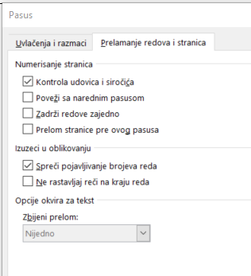

**Oквири и сенчење**

Параграф се може истаћи и повлачењем линија са леве и/или десне стране параграфа, прављењем оквира око параграфа и/или сенчењем позадине.

Да би се креирали оквири, уради следеће:

- Изаберите део текста где желиш ивицу или сенчење;

- Кликни на стрелицу поред дугмета *Ивице* (Borders) у групи *Пасус* на картици *Почетак* (Home)

- Изабери неки до понуђених оквира или изаберите *Ивице и сенчење* (Borders and Shading) ради додатних подешавања.

Прозор *Ивице и сенчење* (Borders and Shading) садржи три картице:

- *Ивица* (Borders) садржи опције за подешавање оквира;

- *Ивица странице* (Page border) садржи опције за подешавање оквира целе странице;

- *Сенчење* (Shading) садржи опције за сенчење.

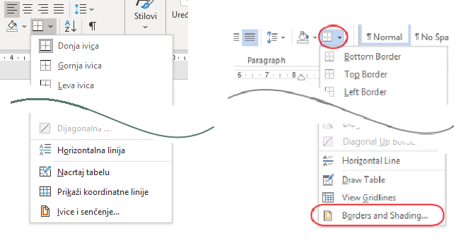

**Картица Borders**

- *Поставка* (Setting) – дефинише облик оквира

- *Стил* (Style) – бира се стил линије за оквир

- *Боја* (Color) – боја линије оквира

- *Ширина* (Width) – дебљина линије оквира

- *Примени на* (Apply to) – примењено на параграф или текст

- *Опције* (Options) – дефинисање удаљености ивичних линија од текста

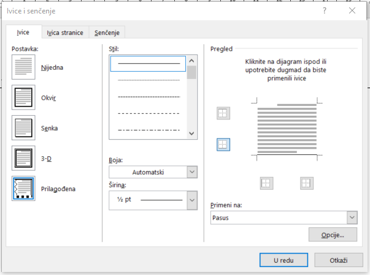

**Картица Shading**

- *Попуна* (Fill) – Бира се одговарајуће сенчење

- *Шаре* (Patterns) – *Стил* (Style) – избор начина шрафирања у процентима

- *Шаре* (Patterns) – *Боја* (Color) – Одабир жељене боје

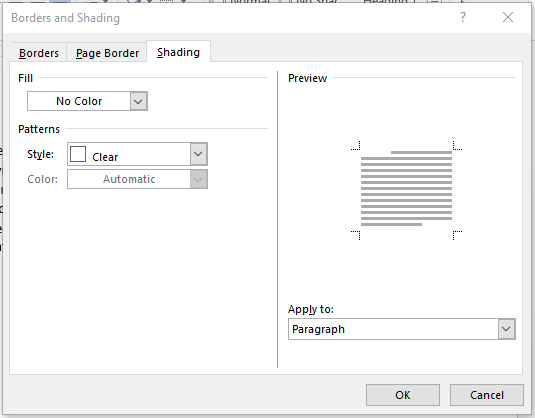

Прелом реда и прелом стране
---------------------------

Разне операције форматирања параграфа се најчешће примењују на цео текући параграф у којем се налази курсор, на пример не морамо да селектујемо цео пасус да бисмо подесили поравнање. 
Некада, међутим, имамо потребу да преломимо ред а да ипак останемо у истом пасусу - на пример ако куцамо поезију - стихови обично нису такви да заузму цео ред већ је потребно да ред преломимо раније, а опет више стихова чине строфу (као што у прози имамо пасус).

Када преламамо ред, тако да и наредни остане у истом параграфу на крају реда куцам Shift + Enter, на пример на крају строфе. На крају стиха куцамо ентер и тиме завршавамо тај параграф и прелазимо у следећу строфу.
Погледај како је преломљена ова песма Чика-Јове Змаја:

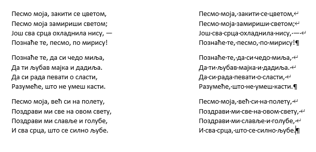

Прелазак на нову страницу пре него што смо попунили претходну вршимо командом *Прелом странице* или пречицом Ctrl + Enter.
Симбол који се том приликом уграђује у текст је, наравно такође "невидљив" као и Ентер.

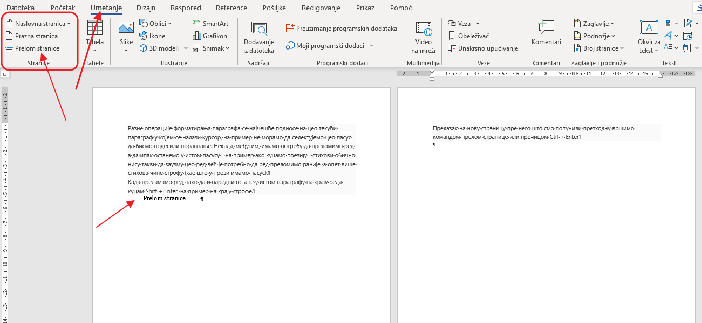

Структуирање текста коришћењем нумерисаних и ненумерисаних листа
----------------------------------------------------------------

Врло често у текстовима нешто набрајамо или посебним ознакама желимо да истакнемо поједине ставке у тексту. Такав формат називамо "листа".

Листе могу да буду:

- ненумерисане (енгл. Bulleted list) где на почетку сваког реда стоји неки симбол, најчешће црта, звездица или велика тачка;

- нумерисане (енгл. Numbered list) код којих редови започињу редним бројевима или словима иза којих следи обично тачка или затворена заграда;

- са више нивоа (енгл. Multilevel list), најчешће је то комбинација нумерисаних листа са бројевима и словима (попут нумерације на пример у збирци задатака из математике, где су побројани задаци, а у сваком имамо варијанте под а, б, в, г...)

Скуп алата за форматирање листа налазе се у групи алатки за форматирање параграфа:

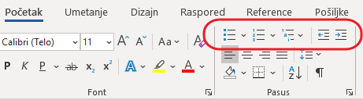

Без обзира у којој врсти листе се налази курсор, последње две алатке у уоквиреном низу на горњој слици - *Смањи увлачење* и *Повећај увлачење*  ће "померати" ставке листе по нивоима. Испробај да видиш шта се дешава кад употребиш ове две алатке! 

Погледај како смо се поиграли са листама на још једној Чика-Јовиној песмици:

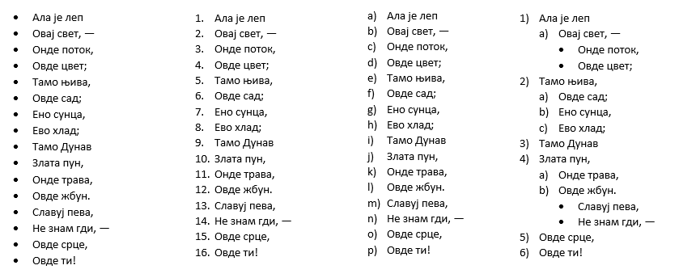

Кликом на стрелицу поред сваке од ових алатки отвориће ти се могућност да прилагођаваш изглед ознака којима почињу ставке у листи. Испробај!
Рад са листама ћеш најбоље научити ако откуцаш неки произвољан текст и испробаш што више различитих могућности комбиновањем алатки за рад са листама.

Најважније делове ове лекције погледај у следећем видео-прилогу:

.. ytpopup:: N6hVVziCQyU
    :width: 735
    :height: 415
    :align: center

