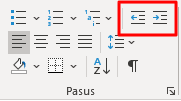
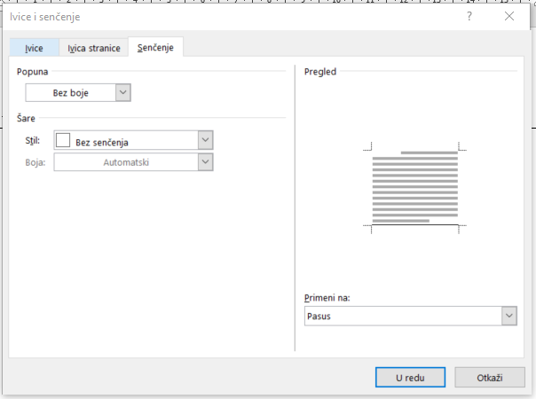

Форматирање параграфа
=====================

Да се подсетимо, претходни час смо завршили форматирањем текста у програму за обраду текста.

.. ytpopup:: 4UYX5yXgnFE
    :width: 735
    :height: 415
    :align: center

Параграф (пасус)
----------------

.. ytpopup:: jcu52hHEYE0
    :width: 735
    :height: 415
    :align: center

Текст откуцан између два знака "Ентер" назива се пасус или параграф. Будући да тастер "Ентер" нема графичку репрезентацију, а често нам је важно да видимо где је откуцан Ентер а где је дошло до аутоматског прелома или прелома стране, могуће је укључити "невидљиве" симболе.

.. image:: ../../_images/w2_paragraf.png
   :width: 200px   
   :align: center

Укључите "невидљиве симболе" (параграф знак, "Пи знак") на тексту који сте откуцали на претходном часу и погледајте шта се све појавило - тамо где сте куцали ентер, размак, табулатор...

Ови симболи који су се појавили служе само да би смо на екрану видели где се налазе "невидљиви" симболи. Они се не виде при штампању.

.. image:: ../../_images/w2_par1.png
   :width: 700px   
   :align: center

Форматирање параграфа вам омогућава да промените изглед целокупног документа. Можете приступити многим од алата за форматирање кликом на Page Layout или кликом на доњи десни угао Paragraph групе на картици Home.
Приликом форматирања пасуса могућа је промена:
поравнања пасуса;
увлачење пасуса;
проред (размак) између пасуса;
проред између редова унутар пасуса

|

**Поравнање текста - Alignment**

Поравнање текста параграфа вам омогућава да подесите како желите да изледају десна и лева ивица текста.

Да бисте променили поравнавање потребно је да кликнете на Home картицу, и да одаберете одговарајуће дугме за поравнање параграфа у групи Paragraph;

Align Text Left: текст је поравнат са левом маргином
Center Text: текст је центриран унутар ваших маргина
Align Text Right: поравнава текст са десном маргином
Justify: поравнава текст и са левом и са десном маргином.

.. image:: ../../_images/w2_par2.png
   :width: 200px   
   :align: center

|

**Увлачење параграфа - Indentation**

Увлачење текста омогућава да подесите растојање ивице текста од маргина. Постоји неколико начина за увлачење:

**Први начин:**

На картици Paragraf налазе се дугмад Decrease Indent (смањи увлачење) и Incerease Indent (повећај увлачење. Овим алаткама се мења растојање леве ивице текста од маргине.

**Други начин:**

На лењиру (Ruler) налазе се граничници текста чијим повлачењем се одређују лева и десна граница текста.

Обратите пажњу како они утичу на изглед текста:

.. image:: ../../_images/w2_par4.png
   :width: 700px   
   :align: center

**Трећи начин:**

Помоћу дијалога групе Paragraf у којој се налазе опције за поравнање, увлачење, размак између редова параграфа и између параграфа и за "понашање" делова параграфа при прелазу на другу страну.

|

**Проред - Spacing**

Помоћу алатке за проред, али и помоћу Параграф-дијалога могуће је подешавање празног простора изнад параграфа (тј размака од параграфа изнад текућег), као и подешавање праног простора испод параграфа (тј. размака од текућег до параграфа испод њега) - на слици уоквирено љубичасто.

Такође, могуће је одабрати проред унутар параграфа - на слици уоквирено зелено.

**Параграф - дијалог**

Картица Indents and Spacing (увлачење и проред) саржи све претходне групе опција:

.. image:: ../../_images/w2_par6.png
   :width: 500px   
   :align: center

Kартица Line and Page Breaks помаже код прелома између страница:

- Widow/Orphan control – спречава појављивање само једног реда параграфа на једној страни док је остатак на другој (први ред и остатак текста или читав текст без последњег реда који је на следећој страни)

- Keep lines together – сви редови једног пасуса остају на истој страни

- Keep with next – два пасуса остају на истој страни

- Page break before – принудни прелом стране пре пасуса

- Suppress line numbers – искључивање нумерисање редова ако је укључена функција Line numbering

- Don’t hyphenate – не преламају се речи на крају реда

.. image:: ../../_images/w2_par9.png
   :width: 300px   
   :align: center

**Oквири и сенчење**

Параграф се може истаћи и повлачењем линија са леве и/или десне стране параграфа, прављењем оквира око параграфа и/или сенчењем позадине.

Да бисте креирали оквире, урадите следеће:

- Изаберите део текста где желите ивицу или сенчење;

- Кликните на дугме Borders у групи Paragraph на картици Home

- Изаберите оквире и сенчење

- Изаберите одговарајуће опције

Прозор Borders and shading садржи три картице:

- Borders садржи опције за подешавање оквира

- Page border садржи опције за подешавање оквира целе странице

- Shading садржи опције за сенчење

.. image:: ../../_images/w2_par10.png
   :width: 300px   
   :align: center

**Картица Borders**

- Setting – дефинише облик оквира

- Style – бира се стил линије за оквир

- Color – боја линије оквира

- Width – дебљина линије оквира

- Apply to – примењено на параграф или текст

- Horizontal Line – убацивање хоризонталне линије у документ

- Options – дефинисање удаљености ивичних линија од параграфа

.. image:: ../../_images/w2_par11.png
   :width: 300px   
   :align: center

**Kartica Shading**

- Fill – Бира се одговарајуће сенчење

- Patterns – Style – избор начина шрафирања у процентима

- Patterns – Color – Одабир жељене боје

- Horizontal Line – убаивање хоризонталне линије у документ

