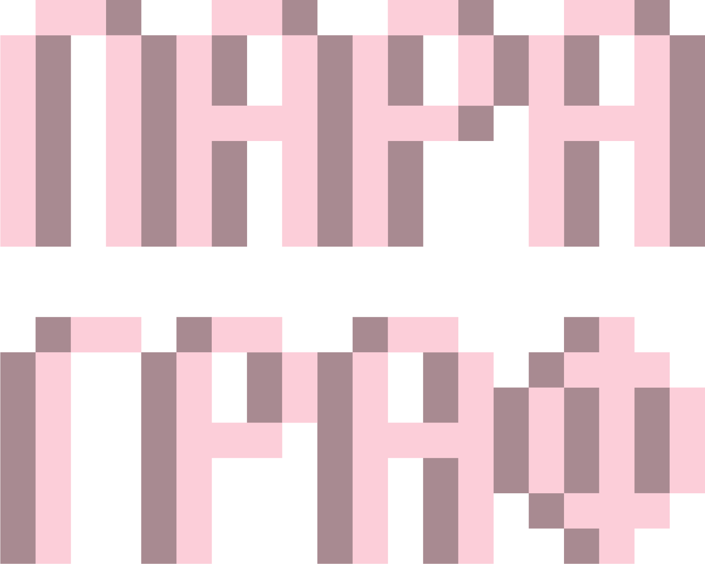

Садржај лекције 4.2
===================

|

На овом часу научићеш шта је то параграф, како се форматира текст читавог параграфа и како се праве листе у тексту.

|

Садржај:

- Шта је параграф (пасус)

- Поравнање, увлачење

- Прелом реда и прелом стране

- Структуирање текста коришћењем нумерисаних и ненумерисаних листа

|

Када успешно савладаш ову лекцију, бићеш у стању да примењујеш елементе форматирања параграфа и структуирања текста.

|
|
|
|
|

Brought to you by `Designs.ai <https://>`_