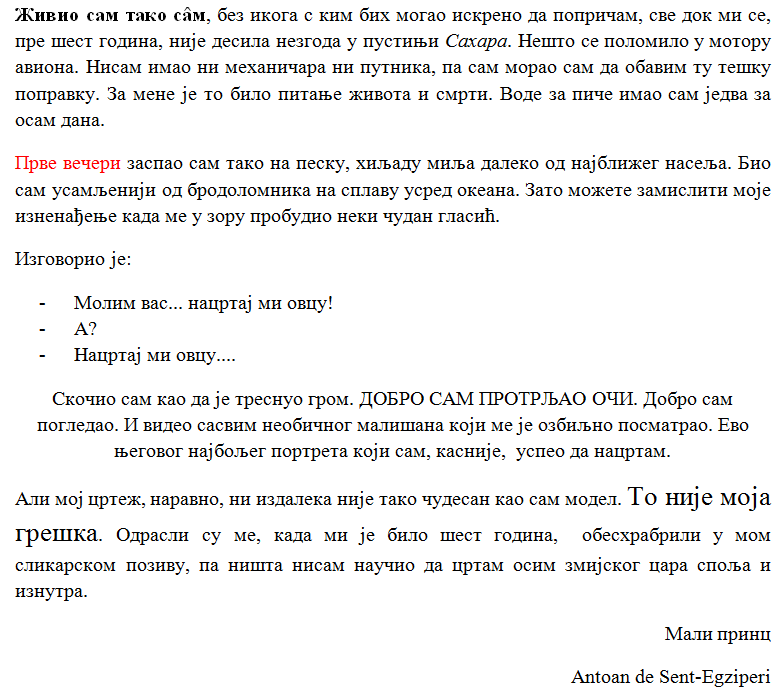

Задаци за вежбу 4.2
===================

1. задатак
----------

1. Покрени програм за обраду текста (Word) и у њега ископирај текст из првог задатка са претходног часа.

2. Форматирај га да изгледа овако: 

|

Решење задатка погледај овде:

.. ytpopup:: kDD1F0UJYF8
    :width: 735
    :height: 415
    :align: center

