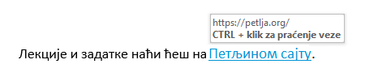

Уметање хиперлинкова, симбола и формула
=======================================

Хиперлинкови (Hyperlink)
------------------------

Хиперлинк (хипервеза, линк) представља начин прослеђивања са једне тачке документа на неку интернет страницу или одређени део документа. Могу се везати за реч, реченицу или слику, а креирају се коришћењем опције *Хиперлинк* (енгл. Hyperlink) из картице Уметни (енгл. Insert). Најпре селектуј реч или слику за коју хоћеш да вежеш хиперлинк и одабери опцију за креирање хиперлинка:

Отвориће се прозор:

1 - Избор на шта ће указивати хиперлинк: документ, веб-страницу, одређено место у документу, имејл адресу;

2 - Текст који ће бити означен као хиперлинк;

3 - Избор документа уколико хилерлинк треба да указује на други документ у рачунару;

4 - Веб адреса уколико хиперлинк указује на веб-страницу.

Када завршиш креирање хиперлинка означени део текста биће аутоматски обојен у плаво и подвучен. Хиперлинкове активираш кликом миша држећи при томе *Ctrl* тастер притиснут. Хиперлинкови су видљиви када се пређе преко њих курсором миша.

|

Уметање једноставних симбола
----------------------------

Поред слике, интересантно је и уметање симбола. Потребно је да се позиционира курсор тамо где желимо да уметнемо симбол и одаберемо опцију *Уметанје → Симбол → Још симбола → одабир симбола → Уметни* (Insert → Symbol → More Symbols → одабир симбола → Insert).

Уметање формула
---------------

На истом месту као и за симболе, на картици „Уметање” налази се и алатка за уметање математичких формула:

.. image:: ../../_images/w3_formula.png
   :width: 500px   
   :align: center

Постоје већ уграђене формуле, али можемо и сами да креирамо формуле какве су нам потребне. Важно је да знаш, математичке формуле нису део текста. То су посебни објекти унутар текста и уређују се тако што се кликне на формулу и "уђе" у посебан оквир у којем се уређује формула.

|

|

Кликом на алатку "једначина" отвара се палета алатки за креирање и уређивање једначина. 

|

Позиције елемената означене су маркерима од "тачкастих" линија у које се уносе елементи и тако се формира формула.

|
