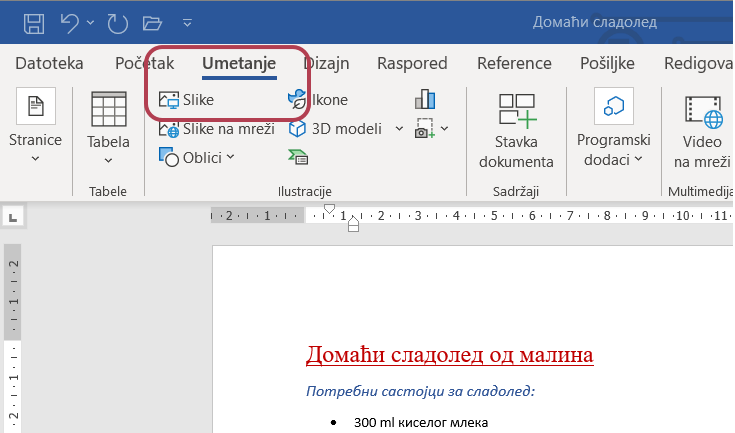
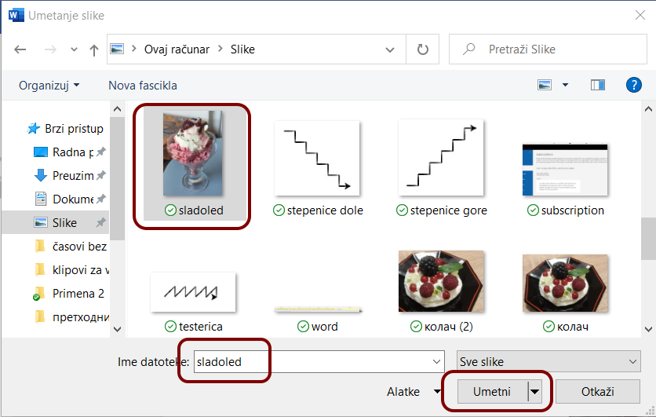
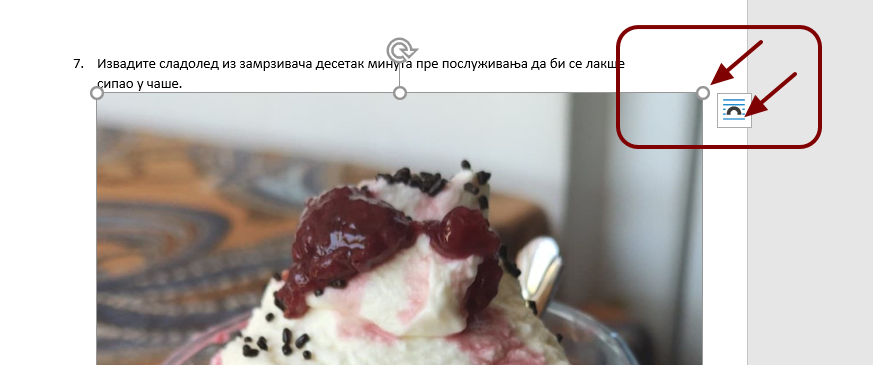
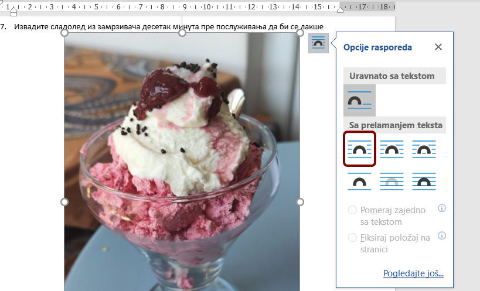
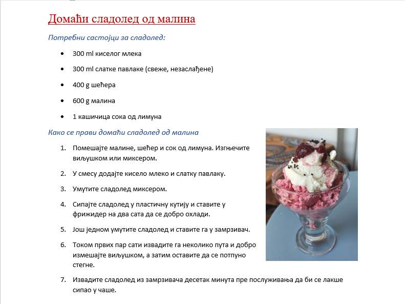
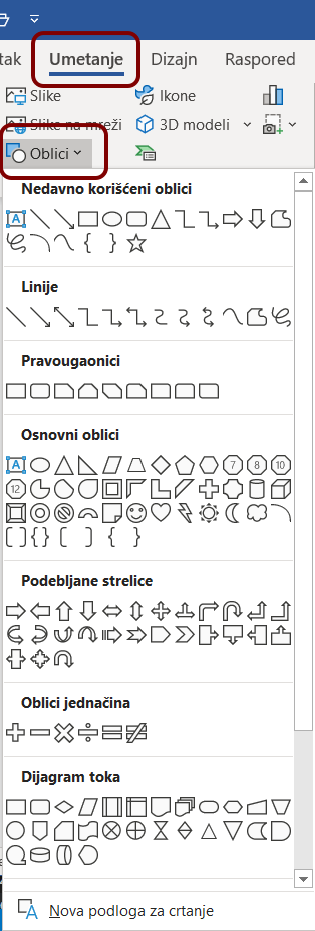

Уметање слика и облика
======================

Уметање слика
-------------

На картици *Уметање* (Insert) налазе се алатке за уметање слика са рачунара или са веба, геометријских облика, графикона итд.

При избору алатке за уметање слике отвара се дијалог у којем проналазимо слику коју желимо да уметнемо у текст.

Уметнутој слици мењамо величину тако што мишем „ухватимо” неки од кружића (најбоље неки од кружића на угловима јер се тако неће променити пропорције слике)

Опцијама распореда подешавамо прелом текста у односу на слику.

Слику можемо да позиционирамо унутар текста једноставним превлачењем мишем.

Погледај сада видео-прилог који ће те подсетити неких поступака из претходне лекције, али у којем ћеш видети поступак додавања слике и њеног уређивања, на примеру обраде једног текста:

.. ytpopup:: hnDUHZbtBTo
    :width: 735
    :height: 415
    :align: center

|

Уметање геометријских облика
----------------------------

Разноврсни геометријски облици умећу се слично као и слике:

Поступак уметања геометријских облика и подешавање њихове боје попуне и линије као и промена величине и прелом околног текста детаљно је описан и у следећем видео-прилогу:

.. ytpopup:: bEHl_kwiGS4
    :width: 735
    :height: 415
    :align: center

