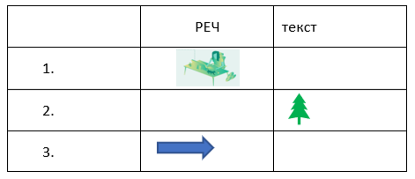
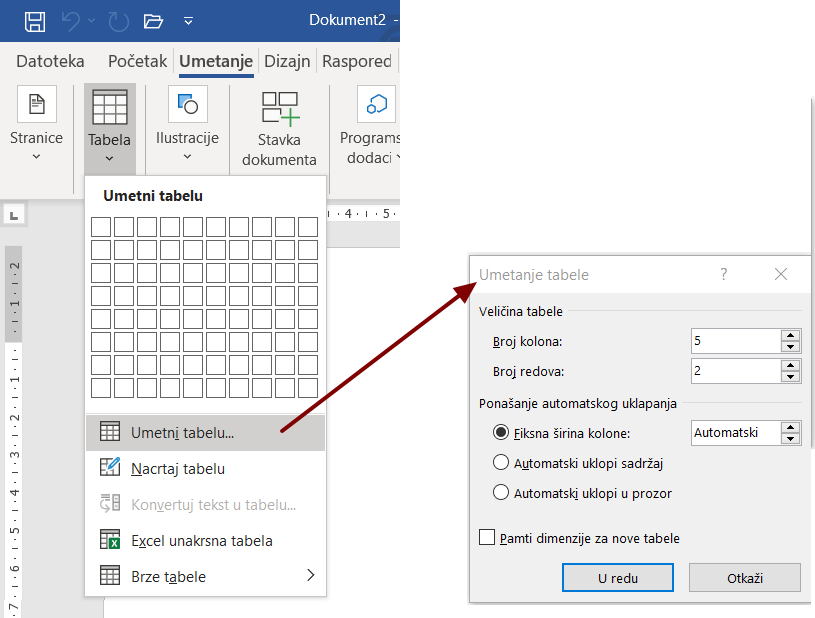
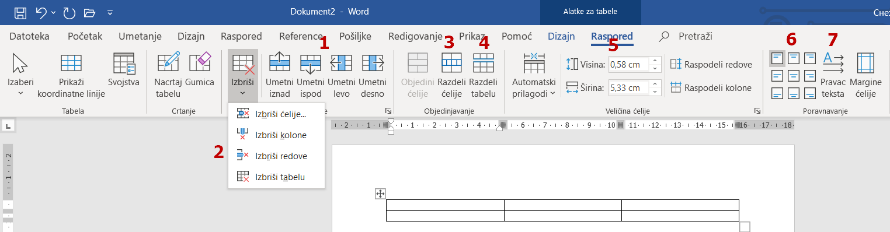
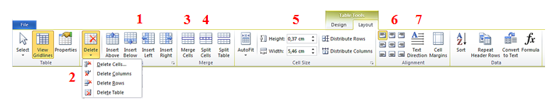

Уметање табела
==============

Креирање и форматирање табела у Ворду
-------------------------------------

Многи сматрају да је табеларни приказ података прегледнији и лакши за било коју врсту анализе. Табела нам омогућава да се лакше снађемо са великом количином података и брже нађемо онај који нам треба.

Tабела је дводимензионална мрежа која се састоји од врста (редова) и колона у чијим пресецима се налазе ћелије

.. image:: ../../_images/w3_red_kolona_c.png
   :width: 400px   
   :align: center

**Колоне** су представљене вертикално (усправно), а **врсте** хоризонтално (положено).

Пресек колоне и врсте представља **ћелију**. Колоне и врсте у табелама су одвојене линијма које чине мрежу ћелија.

У ћелију постављамо било какав садржај (текст, слику или други објекат)

Садржај уносимо као да су ћелије мали документи – скоро сва правила едитовања и форматирања текста која важе за читав текстуални документ, важе и за ћелију. Колона има ширину, а врста висину. Кретање кроз табелу вршимо стрелицама или тастером Tab на тастатури. Важно је да се у табели не користи тастер Enter.

Уметање табеле
--------------

Табелу креирамо тако што се позиционирамо (кликнемо мишем) на жељено место у текстуалном документу и одаберемо опцију Insert → Table → Insert Table.

У дијалогу Insert Table наводимо број колона и редова. Кликом на ОК, формираће се табела која се пружа од једне до друге маргине и у којој су колоне једнаке ширине.

Форматирање табеле
------------------

Форматирање табеле подразумева мењање изгледа постојеће табеле.

Да би форматирање било могуће, неопходно је кликнути у постојећу табелу. У менију ће се појавити две нове картице – Design и Layout.

У картици Design налазе се опције мењење изгледа табеле (боја ћелија, оквира, унапред дефинисани стилови,…).

У картици Layout налазе се опције за:

   

Да би наведене акције форматирања табеле било могуће спровести, неопходно је означити (селектовати) ћелије на које се оне односе.

У табелу је могуће уметнути слику. Довољно је да кликнемо у ћелију у коју желимо да поставимо слику и одаберемо опцију Insert → Picture → одабир слике → Insert. Слика се умеће у ћелију табеле на исти начин на који се умеће у текстуални документ.

Опис поступка за уметање и форматирање табеле у текстуални документ можеш погледати на доњем видеу:

.. ytpopup:: v-znjhOiGWY
    :width: 735
    :height: 415
    :align: center

Креирање и форматирање табела у Гугл-документу
----------------------------------------------

Као и други поступци при креирању и уређивању текста, рад у Ворду и Гугл-докменту је сличан:

.. ytpopup:: qoh4gXHzc7o
    :width: 735
    :height: 415
    :align: center

