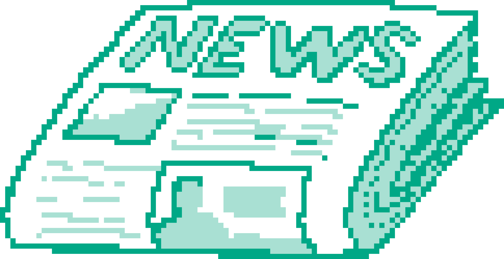

Садржај лекције 4.3
===================
На овом часу научићеш како се у текст убацују слике, табеле и формуле 

Садржај:

- Уметање табела

- Уметање слика

- Уметање једноставних математичких симбола

- Уметање формула

- Заједничке карактеристике уређивања текста у различитом окружењима

Када успешно савладаш ову лекцију бићеш у стању да поставиш напредне текстуалне и нетекстуалне елементе у креирани документ.

|
|
|
|
|

Brought to you by `Designs.ai <https://>`_