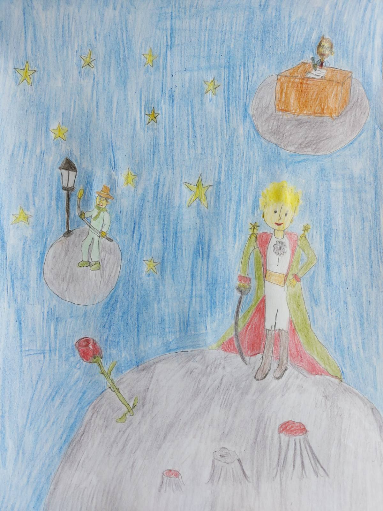
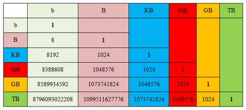

Задаци за вежбу 4.3
===================

1. задатак
----------

У текст из задатка са претходног часа уметни следећу слику: 

тако да слика буде окружена са свих страна текстом.

Слику преузми са овог  `линка <../../_images/Mali_Princ.jpg>`_

2. задатак
----------

Направи табелу којом ћеш представити свој распоред часова.

3. задатак
----------

Покрени програм за обраду текста и креирај табелу као на слици. 

|

Решење 1. задатка погледај овде:

.. ytpopup:: kDD1F0UJYF8
    :width: 735
    :height: 415
    :align: center