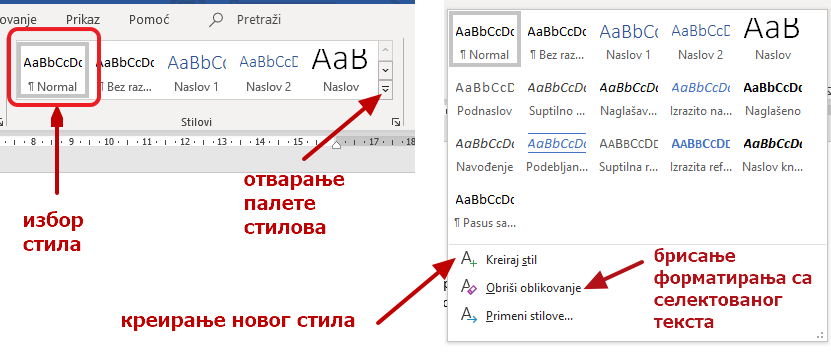

Логичка структура текстуалног документа
=======================================

Логичка структура документа
---------------------------

Текст се врло често састоји од више поглавља, она имају наслове, понекад је потребно прекинути страну пре него што се попуни текстом јер наставак текста треба да почне на следећој страници, некад на истој страници постоје делови текста написани различитим фонтовима, са различитом проредом...

Ако су у питању текстови од више страна или чак више десетина или стотина страна на којима има делова текста са различитим форматирањима, било би удобно да не морамо сваки пут да подешавамо све параметре (фонт, величину, проред, поравнање, набрајање итд.) већ да некако тај формат "ископирамо" или да скуп форматирања сачувамо и искористимо по потреби.

Пре свега, ако радимо фина подешавања важно је да на тексту који уносимо не постоје претходна форматирања, нарочито ако га копирамо из другог текста. Тад је најбоље да га ископирамо без форматирања, као "Необликовани текст" (Unformatted Text):

Ако у тексту (у истом или другом документу) већ имамо део форматиран онако како желимо да форматирамо и новоископирани текст, читав скуп формата можемо да пренесемо помоћу алатке "Четкица за обликовање" (Format Painter) тако што поставимо курсор у изворни формат, изаберемо четкицу а затим "префарбамо" курсором текст на који преносимо формат. Испробајте!

.. image:: ../../_images/w4_painter.png
   :width: 250px   
   :align: center

До сада смо на тексту радили примењујући акције едитовања и форматирања. Тачније, бавили смо се мењањем садржаја и изглед текста, односно бавили смо се визуелном презентацијом текста.

У овој лекцији бавићемо се логичком структуром или логичким изгледом текста, односно бавићемо се организацијом садржаја текста (дефинисање наслова, поднаслова, пасуса).

Да би читаоцу текстуални документ био прегледан важно је да има главни наслов, да буде подељен на одељке (наслове појединачних прича) и поднаслове.

|

Коришћење, креирање и модификација стилова у Ворду
--------------------------------------------------

Да би текст био логички структуиран потребно је да дефинишемо стилове. **Стилови** представљају скуп правила која омогућавају брзо обликовање текста, односно доследно форматирање елемената текста (нпр. свих наслова, поднаслова…). Једноставније речено, главни наслов читавог документа има свој стил (фонт, величину, боју, позицију…), наслови одељака (прича) свој стил (фонт, величину, боју, позицију…) различит од стила главног наслова, поднаслови свој стил различит од претходна два, итд.

Поступак означавања стилова своди се на означавање (селектовање) дела текста и одабир одговарајућег стила из палете уграђених стилова, која се налази у менију **"Почетак" (Home)**.

|

Ако са неког текста треба укинути сва форматирања и вратити на основни стил тела текста, *Нормал* (Normal)  то је такође могуће избором одговарајуће алатке.

|

Уграђене стилове могуће је изменити у палети стилова, десним кликом на одабрани стил и одабиром опције Измени (Modify).

|

Отвориће се прозор "Мењање стила" (Modify Style), у оквиру којег је могуће изменити фонт, величину, поравнање, боју и друге атрибуте уграђеног стила.

|

Избором опције за креирање стила можемо да, засновано на неком постојећем стилу, подешавањем атрибута форматирања креирамо потпуно нови стил.

.. image:: ../../_images/w4_novi_stil.png
   :width: 800px   
   :align: center

|

Користећи стилове можете да организујете текст хијерархијски, по целинама и њиховим деловима: главни наслов документа (Title) и поднаслови (Heading 1,2,3...). 

Напомена: Промена стила важи само у оквиру документа у којем је извршена. Нови документ имаће само уграђене стилове.

|

Опис поступка за примену и прилагођавање стила можеш погледати у овом видео-запису:

.. ytpopup:: VGH23rVr2d8
    :width: 735
    :height: 415
    :align: center

Коришћење стилова у Гугл-документу
----------------------------------

Све поменуте акције могу се извести и у програмима Google Doc.

.. image:: ../../_images/w4_gugl_stil.png
   :width: 700px   
   :align: center

|

Опис поступка за примену и прилагођавање стила у Гугл-документу можеш погледати у овом видео-запису:

.. ytpopup:: N1Fn-ISVPkQ
    :width: 735
    :height: 415
    :align: center

|

Генерисање садржаја уз употребу стилова
---------------------------------------

Ако је текст логички организован тако што су наслови и поднаслови урађени помоћу стилова онда се и табела садржаја врло лако прави. На картици Референце (References) налази се алатка Садржај (Table of Contents):

.. image:: ../../_images/w4_reference.png
   :width: 500px   
   :align: center

|

Избором уграђеног, аутоматског садржаја одмах се добија списак наслова са бројевима страница. Ово се даље може и подешавати по питању фонта, прореда, "дубине" - до ког нивоа ће бити приказани поднаслови.

|

Опис поступка примене стилова и уградње садржаја можеш погледати у овом видео-запису:

.. ytpopup:: A22NKCXi3ZA
    :width: 735
    :height: 415
    :align: center