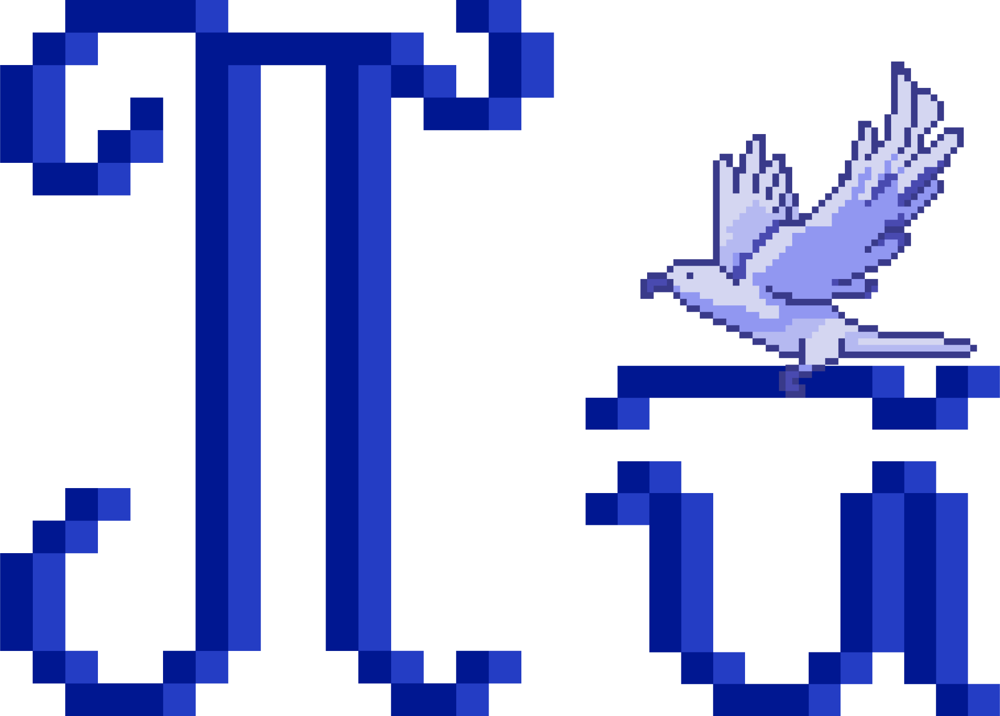

Садржај лекције 4.4
===================
На овом часу научићеш шта је логичка структура текста, шта су и како се користе стилови 

Садржај:

- Коришћење стилова

- Модификација и израда стилова

- Генерисање садржаја

Када успешно савладаш ову лекцију бићеш у стању да користиш основне параметре стилизовања текста на нивоу карактера, параграфа и страница, користиш и креираш именоване стилове, користиш елементе у тексту који се аутоматски ажурирају.

