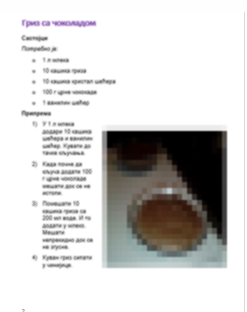
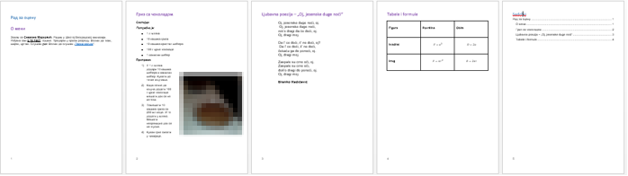

Задаци за вежбу 4.4
===================

1. задатак
----------

Покрени програм за обраду текста и модификуј стил Heading 1 тако што ћеш му променити:

-  врсту фонта у Times New Roman;
-  боју у зелену;
-  фонт у искошен;
-  поравнање у центрирано.

2. задатак
----------

Покрени програм за обраду текста и креирај стил MojStil са овим карактеристикама:

-  врсту фонта у Courier New;
-  боју у црвена;
-  фонт у подебљана и сва слова су велика;
-  поравнање у леву страну.

3. задатак
----------

Преузми ове четири датотеке:

- слику `сервиси <../_static/servisi.jpg>`_
- слику `јединице меморије <../_static/jedinice_memorije.png>`_
- неформатиран ворд документ са `линка <../_static/Vezba_neformatiran.docx>`_
- форматиран ворд документ `са линка <../_static/Vezbe_sredjen.pdf>`_

и по узору на документ који је сређен уреди стилове, додај слике, табелу и садржај у приложеном неформатираном документу.

4. задатак
----------
1.	Подеси димензију папира на А5 
2.	Подеси маргине на Narrow (све по 1,27см)
3.	Убаци број стране доле лево.
4.	Откуцај наслов (Headnig 1): Рад за оцену 
5.	Откуцај поднаслов (Heading 2): О мени 
6.	Откуцај један пасус (Normal - Font: Arial 10, Left, Line spacing:  Single, размак од горњег парaграфа: 6 pt параграфа испод: 12 pt)  од три - четири реченице у којима ћеш написати како се зовеш, у коју школу и разред идеш, када и где си рођен/а и чиме се бавиш у слободно време (хоби, спорт и слично, наводећи назив клуба где тренираш и музику  коју радо слушаш...). При куцању поштуј и језички и дигитални правопис. Име подебљај. Датум рођења подвуци. Називе спортова или музичких правца напиши искошеним словима. На назив клуба или музичара ставити хиперлинк ка одговарајућој веб-страници.
7.  Откуцај поднаслов: Гриз са чоколадом, тако да друга страна документа започне тим поднасловом. 
8.	Пронађи на вебу и ископирај рецепт за гриз са чоколадом.
9.	Пресловити текст рецепта на ћирилицу и уреди као на слици (фонт Calibri, 11, Italic и  Regular, листе за набрајање и бројчане листе,  размаци пре параграфа 0pt, после параграфа 6pt – то су и размаци између ставки у листама).

10.	Уметни слику гриза са чоколадом.
11.	Модификуј стил наслова Heading 2 да буде љубичасте боје, Calibri 14, лево поравнат, размаци пре параграфа 18pt, после параграфа 12pt.
12.	Пронађи на сајту http://www.antologijasrpskeknjizevnosti.rs/ неку песму по сопственом избору
13.	За песму направи нови стил и назови га „Pesma“: Arial, 12pt,  Single проред, размак између параграфа-строфа песме 12 pt. Цела строфа је један параграф. Удаљеност од леве маргине 2 cm
14.	Четврту страну започни насловом „Табеле и формуле“ и направи табелу као на слици и подеси ширину преко целе стране, а висину редова табеле  2 cm. 

.. image:: ../../_images/w4_tabela_formule.png
   :width: 200px   
   :align: center

15.	На петој страни направи садржај. Цео документ треба да изгледа овако:

