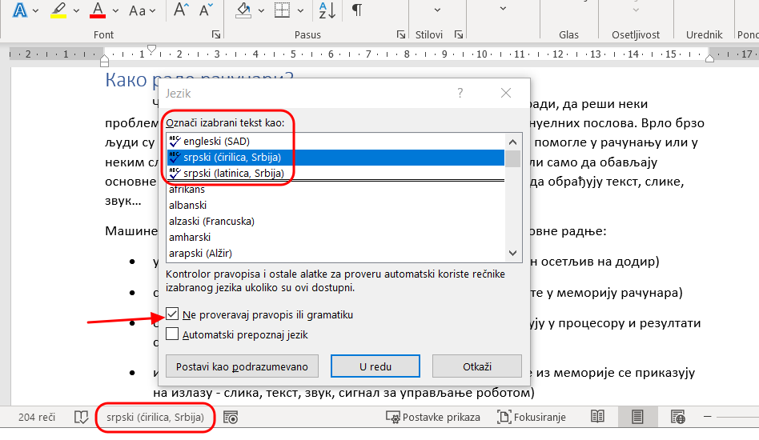
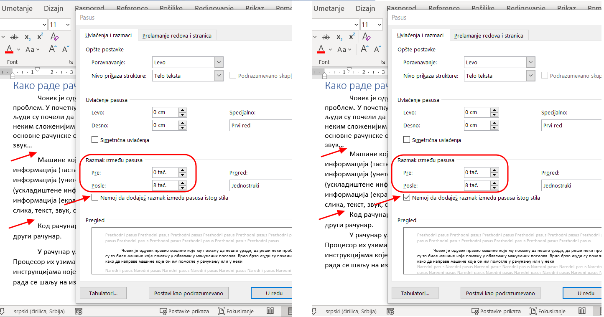

Обликовање документа, штампање
==============================

У програмима за обраду текста постоји могућност провере правописа па чак и граматике. То може да буде корисно јер нам открива ако смо направили грешке у куцању.

Вероватно ти се дешавало да су у тексту све (или само неке) речи подвучене таласастим црвеним, зеленим, плавим линијама иако није форматирано подвлачење. У питању је провера правописа. У статусној линији видећеш исписано који је тренутно језик подешен у Ворду. Уколико је Енглески (*English*) и при томе није укључена опција Не проверавај правопис или граматику (*Do not check spelling or grammar*) а ти куцаш ћирилицом све речи које не припадају енглеском језику биће означене. Кликом на ознаку у статусној линији отвара се прозор у којем се могу извршити подешавања прoвере правописа (ово само под условом да је генерално у Ворду под Датотека/Опције/Језик (*Filе/Options/Language*) постављен жељени језик у делу Језици за креирање и проверу у систему Офис (*Office authoring lenguages and proofing*). Када се подеси језик, биће подвучене само речи које су неправилно откуцане у том језику.

Веома је корисно да буде укључена провера правописа и граматике како бисмо уочили и отклонили грешке до којих је дошло приликом креирања текста.

Можда су се неки од вас намучили како да у „рецепту” из задатка од претходног часа подесе размаке као у задатку. Ево решења: обрати пажњу да у подешавању размака за пасус постоји опција Немој да додајеш размак између пасуса истог стила (*Don't add space between paragraphs of the same style*). Кад је означена без обзира на величину размака у подешавањима, између пасуса ће бити исти размак као и између редова унутар пасуса. Уколико скинтет ознаку са те опције, размаци ће се појављивати и између пасуса истог стила.

.. suggestionnote::
   
   Да лакше уочиш логичку организацију текста, укључи „невидљиве“ симболе и среди прелом текста.

Погледај овај видео и уради задатак који је у њему описан.

.. ytpopup:: 6QEEjScJMOI
    :width: 735
    :height: 415
    :align: center

Циљ у изради претходног задатка је био да одштампамо документ. Документ можемо да „одштампамо” тако што га сачувамо у датотеци која има тип .pdf или да га заиста одштампамо уколико имамо прикључен штампач. 

Датотеке овог типа се углавном користе када желимо да формирамо документ који дистрибуирамо, али од прималаца не очекујемо да га модификује (мада је и то могуће) већ да га прегледа на екрану или одштампа. У овом формату је добро припремити документ и у случају да немамо штампач него га шаљемо или носимо на флеш-меморији у фотокопирницу да га тамо одштампају. Ворд-документ .docx ће можда у том случају претрпети неке измене у зависности од димензије папира и подешавања штампача, али .pdf документ ће бити одштампан тачно онако како смо га снимили.

У случају да имамо штампач, поступак је следећи:

.. ytpopup:: w0RPXVxxFmQ
    :width: 735
    :height: 415
    :align: center

