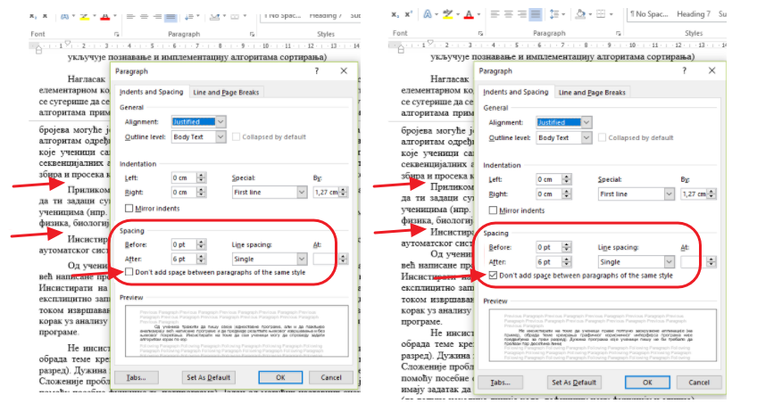

Обликовање документа, штампање
==============================

У програмима за обраду текста постоји могућност провере правописа па чак и граматике. То може да буде корисно јер нам открива ако смо направили грешке у куцању.

Вероватно ти се дешавало да су у тексту све (или само неке) речи подвучене таласастим црвеним, зеленим, плавим линијама иако није форматирано подвлачење. У питању је провера правописа. У статусној линији видећете  исписано који је тренутно језик подешен у вашем Ворду. Уколико је English и при томе није укључена опција Do not check spelling or grammar а ви куцате ћирилицом све речи које не припадају енглеском језику биће означене. Кликом на ознаку у статусној линији отвара се прозор у којем се могу извршити подешавања прoвере правописа (ово само под условом да је генерално у Ворду под Filе/Options/Language подешен Editing language и  Proofing за жељени језик. Када се правилно подеси биће подвучене само речи које су неправилно откуцане.

.. image:: ../../_images/w5_pravopis.png
   :width: 700px   
   :align: center

|

Можда су се неки од вас намучили како да у „рецепту” из задатка од претходног часа подесе размаке као у задатку. Ево решења: обратите пажњу да у подешавању размака за пасус постоји опција Don't add space between paragraphs of the same style. Кад је означена без обзира на величину размака у подешавањима, између пасуса ће бити исти размак као и између редова унутар пасуса. Уколико скинтет ознаку са те опције, размаци ће се појављивати и између пасуса истог стила.

|

Савет: Да лакше уочиш логичку организацију текста, укључи "невидљиве" симболе и среди прелом текста.

|

Погледај овај видео и уради задатак који је у њему описан.

.. ytpopup:: 6QEEjScJMOI
    :width: 735
    :height: 415
    :align: center

|

Циљ у изради претходног задатка је био да одштампамо документ. Документ можемо да „одштампамо” тако што га сачувамо у датотеци која има тип .pdf или да га заиста одштампамо уколико имамо прикључен штампач. Уколико је потребно да документ одштампамо негде другде, на пример у фотокопирници или шаљемо некоме да штампа, најбоље је да документ шаљемо у .pdf формату јер је то сигуран начин да ће документ изгледати на папиру онако како смо ми уредили без обзира на подешавња штампача и папира.

Датотеке овог типа се углавном користе када желимо да формирамо документ који дистрибуирамо, али од прималаца не очекујемо да га модификује (мада је и то могуће) већ да га прегледа на екрану или одштампа. У овом формату је добро ппрпремити документ и у случају да немамо штампач него га шаљемо или носимо на флеш-меморији у фотокопирницу да га тамо одштампају. Ворд-документ .docx ће можда у том случају претрпети неке измене у зависности од димензије папира и подешавања штампача, али .pdf документ ће бити одштампан тачно онако како со га снимили.

У случају да имамо штампач, поступак је следећи:

.. ytpopup:: w0RPXVxxFmQ
    :width: 735
    :height: 415
    :align: center

