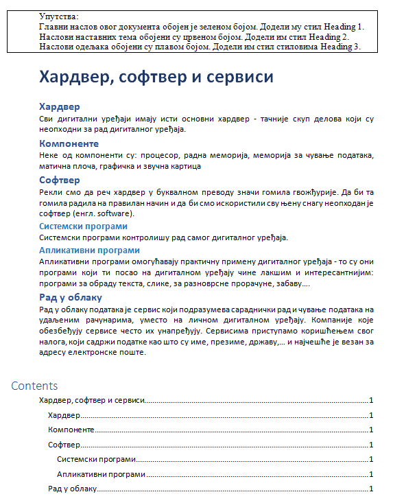

Задаци за вежбу 4.5
===================

1. задатак
----------

Преузми датотеку Stilovi.docx, која се налази на `линку <../../_images/Stilovi.docx>`_. Сачувај је на свом рачунару, а затим је отвори.

Пратећи упутства дата у документу, означи главни наслов, наслове наставних тема и наслове одељака стиловима Title, Heading 1 и Heading 2, респективно.

Модификуј стил Heading 2 тако што ћеш му променити:

- величину фонта на 16;

- боју у црвену;

- поравнање у центрирано.

креирај садржај на крају документа. Сачувај документ користећи само тастатуру.

|

2. задатак
----------

Преузми датотеку Vezba1.docx, која се налази на `овом линку <../../_images/Vezba1.docx>`_. Сачувај је на свом рачунару, а затим је отвори датотеку.

Измени датотеку тако да изгледа као документ са слике.

Kреирај садржај на крају документа. 

Сачувај документ користећи само тастатуру.