Рад у дељеном текстуалном документу
===================================

Да се подсетимо:

Рачунарство у облаку је начин да путем рачунара или телефона повезаног на интернет, само користећи прегледач (браузер), користиш меморијски простор или програм на неком удаљеном серверу, а да никакав додатни програм не инсталираш на свом рачунару. Добре особине оваквог начина рада на документима су што им се може приступити са било ког уређаја који има приступ интернету и што више корисника може истовремено да ради на једном документу.

Рад у дељеном документу - Гугл документ
---------------------------------------

Типичан пример за дељење докумената је твој Гугл-простор: Кад отвориш Џимејл налог имаш на располагању 15GB простора за своје мејлове, слике, документе... 

Кад се пријавиш на свој Џимејл, горе десно видећеш иконицу која води ка менију за избор Гугл апликација (1).

Изабери *Диск* (Drive) и даље ћеш се лако снаћи - то је твоје „парче” диска на Гугловом серверу, којем можеш да приступиш путем интернета (2).

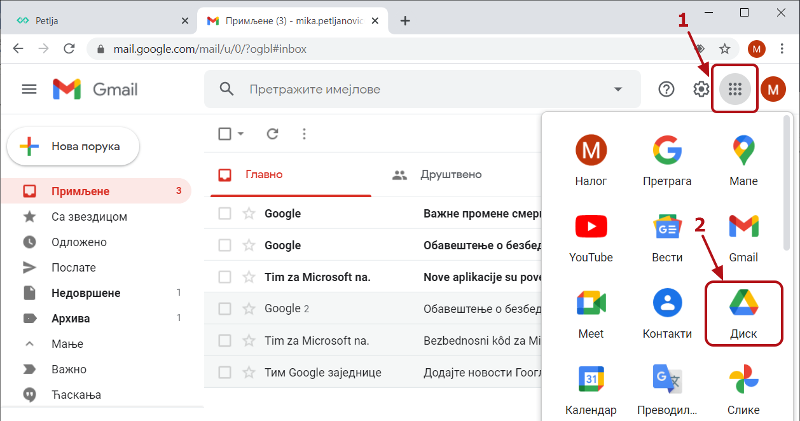

|

За започињање новог документа одабери из менија са стране опцију "Ново".

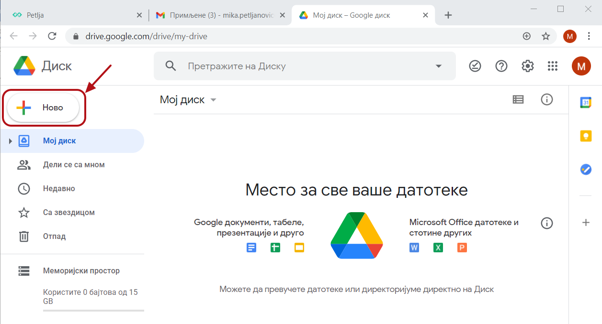

|

Одабери "Гугл документи" - то је програм за обраду текста.

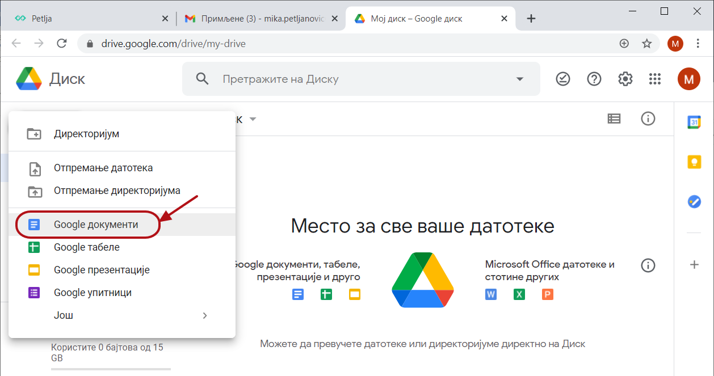

|

Радно окружење ти је можда познато из проласка кроз претходне лекције, ако не користиш Мајкрософт офис. Сви текст-процесори имају веома сличне ознаке алатки за форматирање текста (1).

Тема ове лекције је "Рад у дељеном текстуалном документу". Ево шта то значи: документ се налази "у облаку" односно на неком серверу на интернету и више корисника истовремено може да му приступи и ради на њему. Да би то било могуће, "власник" документа треба да га подели са другима (2). 

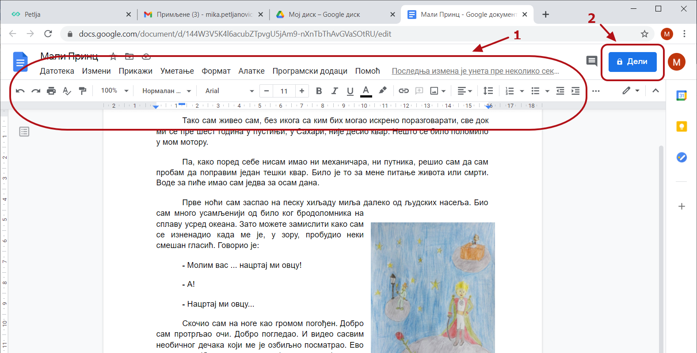

|

Документ може да се подели са одређеним особама и у том случају потребно је унети њихове Гугл мејл-адресе (1). Особе са којима делиш документ ће о томе добити обавештење путем мејла. Можеш и да копираш линк (2) и пошаљеш им.

Уколико желиш да поделиш са више других корисника, можеш и да промениш начин дељења тако да документу може да приступи свако са линком.

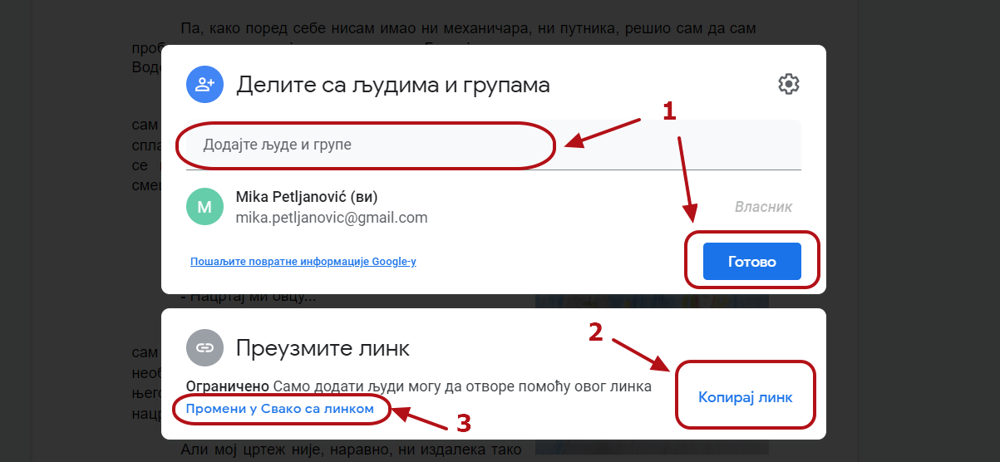

|

Кад додаш адресу корисника са којим желиш да поделиш документ, додатно можеш да одредиш каква ће он имати права на том документу - да га само види, да коментарише или да га уређује. Такође, можеш му написати и поруку коју ће добити у обавештењу о дељењу документа.

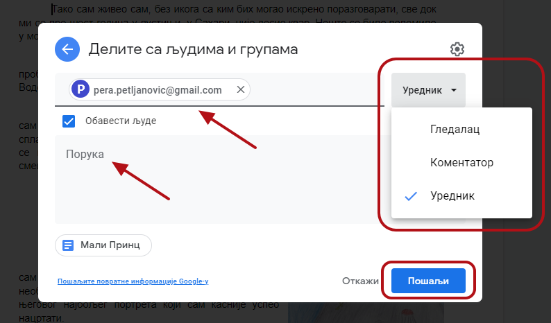

|

Када више корисника ради на дељеном документу истовремено, сви корисници ће видети курсор осталих корисника:

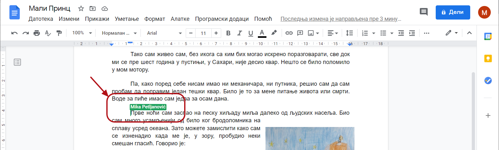

|

Уколико желиш да имаш копије својих докумената и локално (на свом рачунару), тако да су ти доступни и када рачунар није повезан на интернет, можеш да инсталираш Гугл-диск за локални рачунар. Измене које направиш у локалној копији синхронизоваће се са верзијом у облаку при повезивању на интернет.

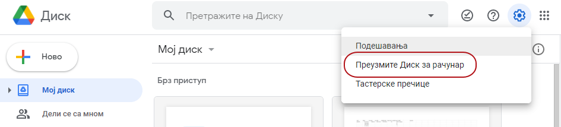

|

Рад у дељеном документу - Офис 365
----------------------------------

Ако имаш Мајкрософт налог и пријавиш се на `office.com <https://office.com>`_ добићеш приступ свом простору *Уандрајв* (енгл OneDrive) и *Офис 365* (енгл. Office 365) апликацијама:

.. image:: ../../_images/w6_office_com.png
   :width: 500px   
   :align: center

Ако при томе радиш на ОС Виндоуз и имаш инсталиран Офис 365 на свом рачунару онда ћеш у *Истраживачу датотека* (Windows Explorer) видети линк ка облаку *Уандрајв* (OneDrive).

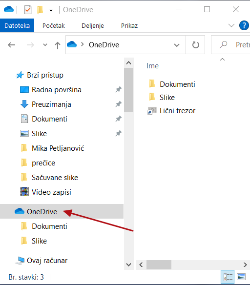

|

При чувању документа можеш да се определиш да се документ сачува на локалном диску или у услузи *Уандрајв* (енгл. OneDrive).

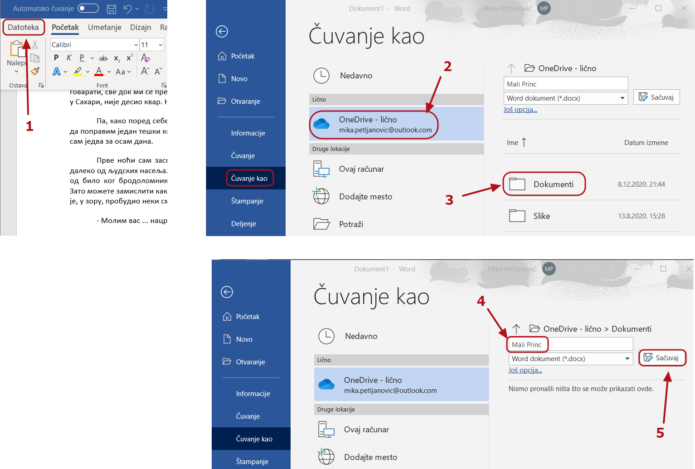

|

Документ ће бити снимљен на локални диск:

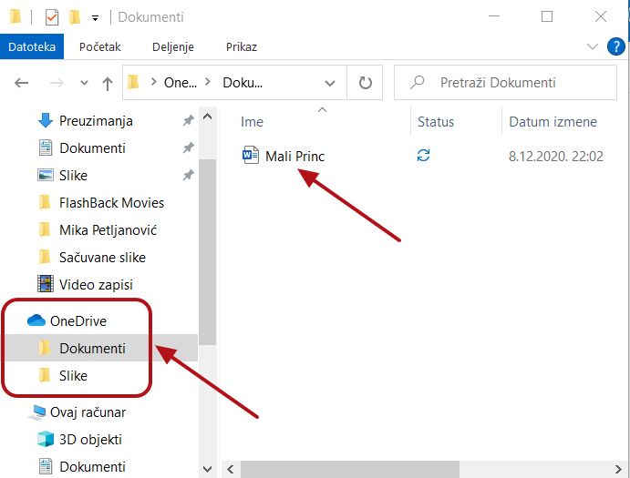

|

али ће бити и "у облаку":

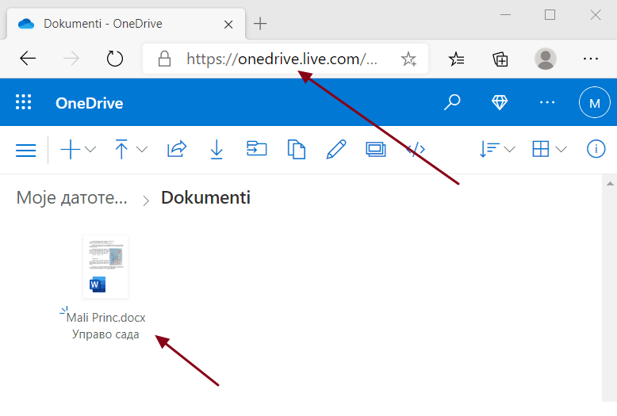

|

Као што смо већ навели, добра особина документа у облаку је могућност дељења: одређивањем права и слањем поруке (1) или копирањем и слањем линка (2).

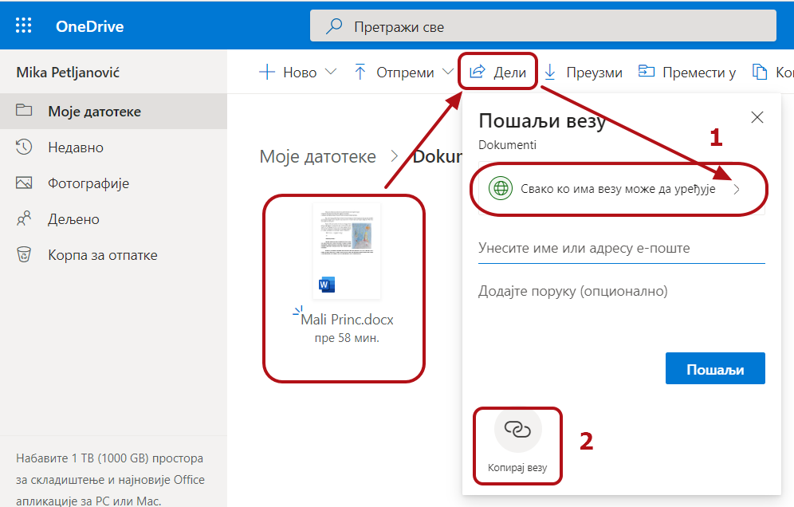

|

И у овом случају, као и код Гугл-диска можемо да одаберемо да ли ће документ видети свако ко има линк или само одређене особе, као и да дозоволимо уређивање или само гледање документа, 

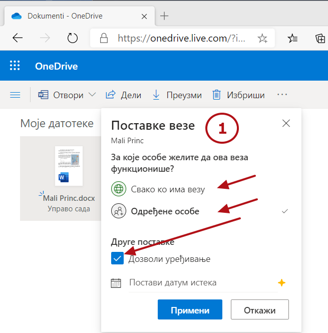

|

односно да ископирамо линк и пошаљемо га другим корисницима:

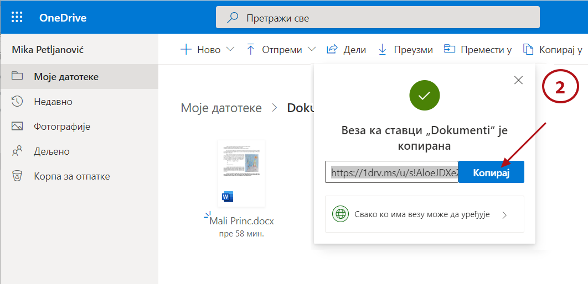

|

Када више корисника истовремено уређује текст, означене су позиције курсора сваког корисника.

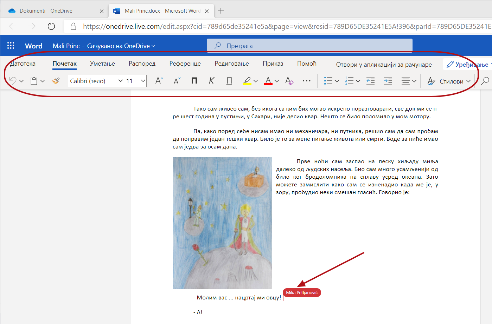

|

Видео-лекција о раду у дељеном документу - Гугл документ
--------------------------------------------------------

.. ytpopup:: HVfwjBP8Xbg
    :width: 735
    :height: 415
    :align: center

Видео-лекција о форматирању у Гугл документу
--------------------------------------------
.. ytpopup:: GTt0bjarp7g
    :width: 735
    :height: 415
    :align: center

Видео-лекција о раду у дељеном документу - Офис 365
---------------------------------------------------

.. ytpopup:: mmUOn6KrCnI
    :width: 735
    :height: 415
    :align: center

