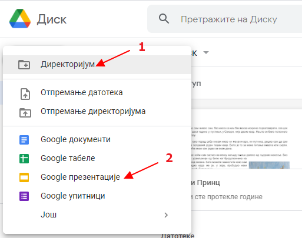
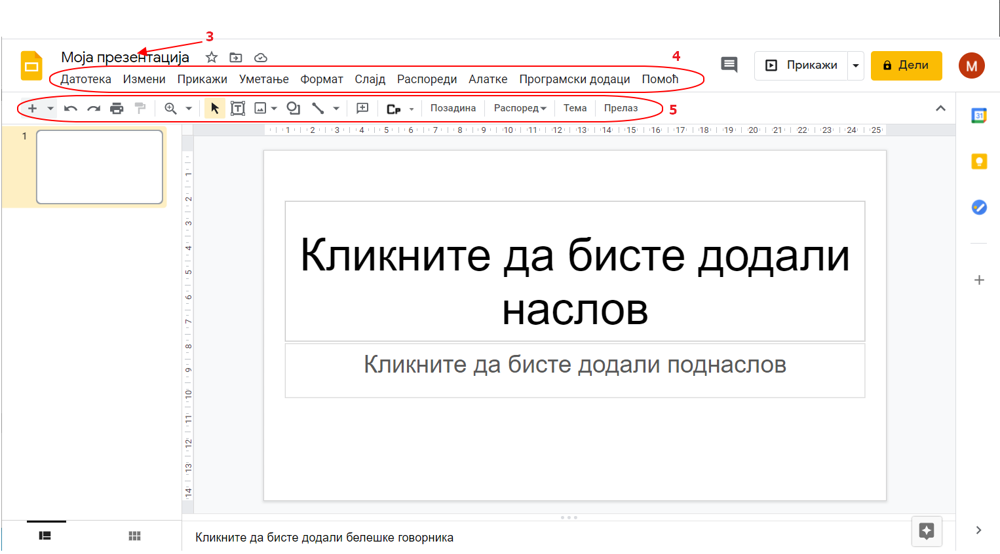
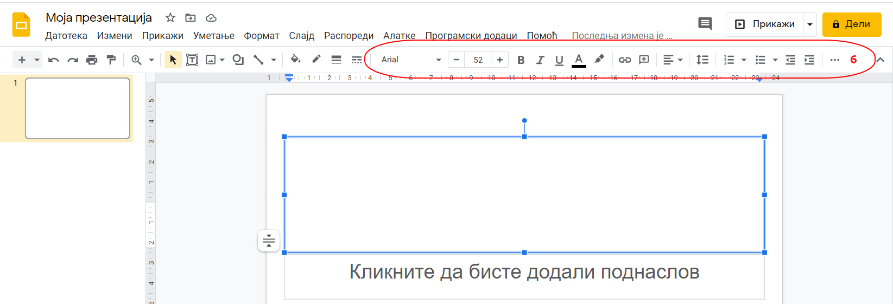
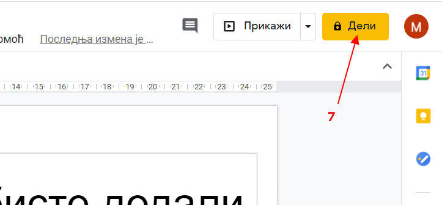
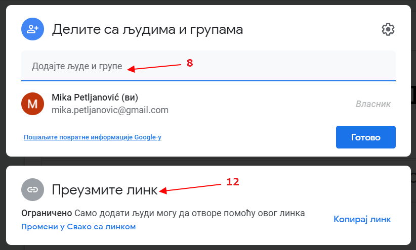
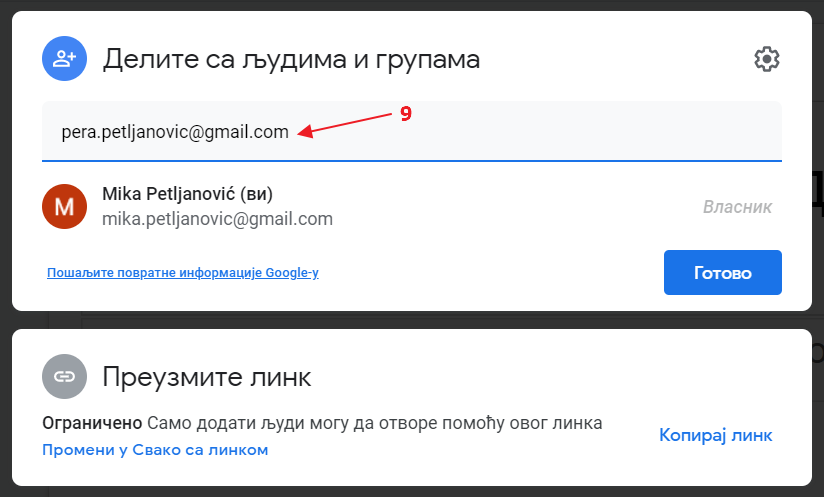
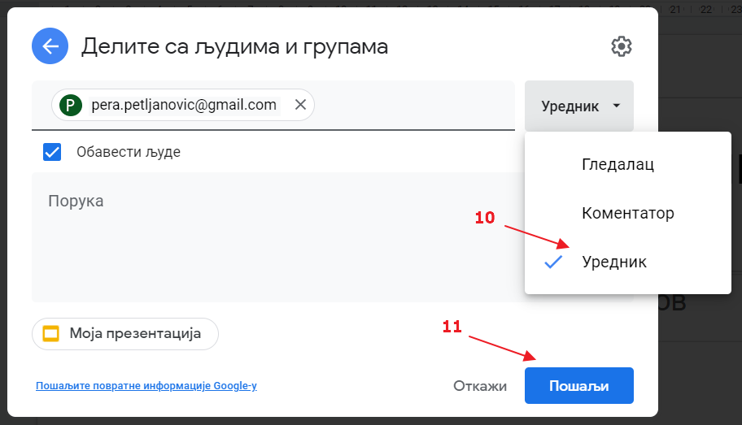
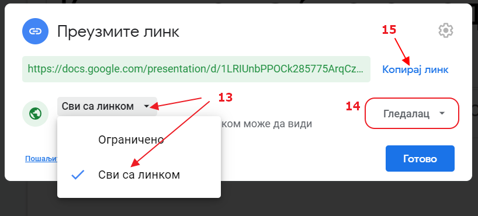

Слајд - презентације у дељеном документу
========================================

Као и код уређивања текста у дељеном документу, и слајд-презентације можеш да радиш сараднички на Уандрајву, у Офису 365, користећи програм *Пауерпоинт* (енгл. PowerPoint) и на Гугл-диску, у Гугл-апликацијама користећи Гугл-презентације. 

У изради слајд-презентација можда већ имаш неког искуства из основне школе. Вероватно је свако од вас бар једном правио презентацију у Пауерпоинту за неки предмет. 

Сада ћемо прво, уз примену знања о Пауерпоинту из основне школе, да видимо како се праве слајд-презентације на Гугл-диску, а онда ћеш у сарадњи са још неким вршњаком из одељења да направиш презентацију.

Пријави се на свој Гугл-налог и иди на Гугл-диск. Формирај директоријум (фолдер) (1) који ћеш назвати "Презентације" и у њему креирај нови документ, Гугл презентацију (2).

За потребе вежбе на часу, за своју презентацију изабери тему коју желиш - може то да буде презентовање неког твог хобија, неке лекције, неке интересантне појаве и слично. Тема је слободна, али ипак, немој да то буду биографије музичара, глумаца, спортиста... Покушај да креираш нешто оригинално!

Дај својој презентацији назив (3) и направи  презентацију у којој ћеш користити све оно што знаш од раније, из основне школе, о раду у програму Пауер поинт. Прегледај најпре главни мени (4) и отвори све падајуће меније, а затим прегледај и дугмиће са алаткама у палети алата (5). Тако ћеш се подсетити које опције имаш на располагању.

Обрати пажњу, када на слајду куцаш текст у палети алата ће се појавити алатке за форматирање текста (6).

Покушај да откријеш где се у Гугл-презентацијама налазе команде и алатке које знаш из Пауерпоинта:

- Додавање, дупликат и брисање слајда

- Избор распореда елемената слајда – изглед слајда

- Уметање слике, текста, облика, табеле, графикона, ворд-арта, анимације, броја слајда

- Форматирање текста, табеле и слике

- Промена позадине и дизајн-теме слајда и прелаз између слајдова

- Презентацију радите у пару, подешавањем дељења (7) 

и додавањем мејл адресе ученика са којим радиш у пару  

да обоје (8, 9)

можете да уређујете (10, 11) презентацију:

- Да би наставник и остали ученици могли да виде презентацију (али не и да је уређују) подеси да свако са линком може да види презентацију (12, 13, 14) и тај линк (15) постави у конверзацију (чет) овде, на Петљи, а затим прегледај презентације других ученика.

|

Кратко упутство за рад са Гугл презентацијама можеш да погледаш у следећем видео-прилогу.

.. ytpopup:: UzCy4AcyzYg
    :width: 735
    :height: 415
    :align: center  