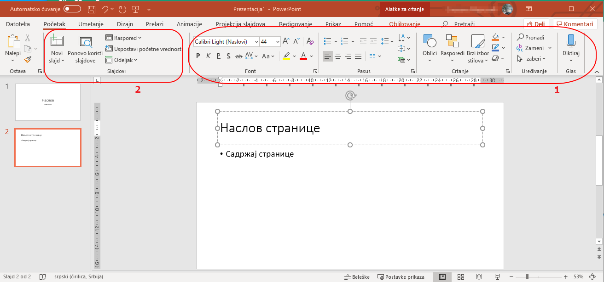

Преузимање слајд-презентације са Гугл-диска и конвертовање у Пауерпоинт презентацију
====================================================================================

Презентација се са Гугл-диска преузима на рачунар на следећи начин:

.. image:: ../../_images/w8_konvertovanje.png
   :width: 600px   
   :align: center

|

У менију који се појавио под "Преузми као" погледај у каквим све форматима може да се преузме. 

Преузми своју Гугл-презентацију као Пауерпоинт презентацију и сними је у свој фолдер у оквиру фолдера "Документи".

Отвори је и погледај да ли се разликује од оне на Гугл--диску? Ако се разликује, покушај да откријеш у чему се разликује?

|

**Пауерпоинт - подсетник**
--------------------------

Правећи Гугл-презентацију на прошлом часу, подсетили сте се и рада у програму Пауерпоинт. 

Пауерпоинт радно окружење има много сличности са окружењем у Ворду. Алатке за форматирање текста су исте, на исти начин се додају слике, графички облици, графикони...(1) Основна разлика између странице у ворду и слајда је што на слајду не постоји "основни текст" који се "прелива" на следећу страну (тј. слајд) када се попуни цео слајд, већ текст "излази изван" слајда. Да бисте на слајд стављали текст, треба да имате оквир за текст.

На почетној траци са алатима одмах се уочава група алтки које не постоје у Ворду - алатке за рад са слајдовима (2).

|

Погледај и друге траке са алатима - на пример Уметање, Дизајн  и препознаћеш алатке које  су ти познате од раније. Видећеш и неке специфичне, у вези са напредним коришћењем програма Пауерппоинт, али то је тема следеће лекције.

|

Ако се ипак нечега не сећаш, ево малог видео-подсетника:

|

Додавање новог слајда и уређивање слајдова
------------------------------------------

.. ytpopup:: PYx59pBNloo
    :width: 735
    :height: 415
    :align: center 

|

Додавање слике на слајд
-----------------------

.. ytpopup:: 2o-tzRQJOeg
    :width: 735
    :height: 415
    :align: center 

|

Додавање звучног записа у презентацију
--------------------------------------

.. ytpopup:: OwAUUkZo3yA
    :width: 735
    :height: 415
    :align: center 

|

Додавање видео записа у презентацију
------------------------------------

.. ytpopup:: y-7Qp_FWNuM
    :width: 735
    :height: 415
    :align: center 

|

Чување презентације
--------------------

.. ytpopup:: p6ImC-1gr0k
    :width: 735
    :height: 415
    :align: center 

|

Чување презентације за рад на свим дигиталним уређајима
-------------------------------------------------------

.. ytpopup:: xKui0wev_QM
    :width: 735
    :height: 415
    :align: center 
