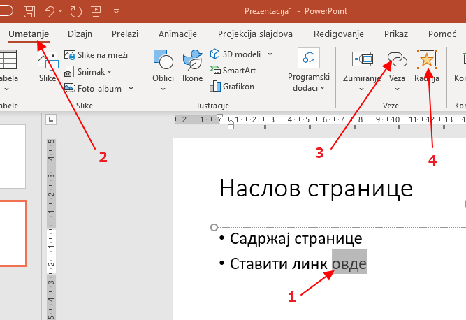
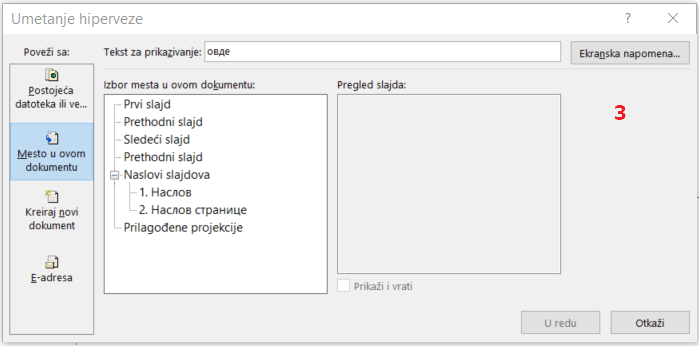
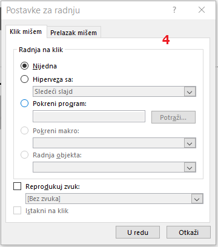
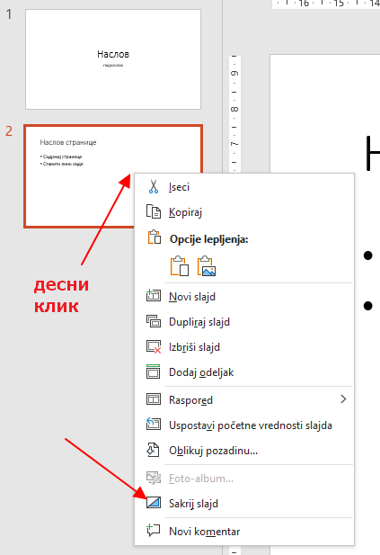
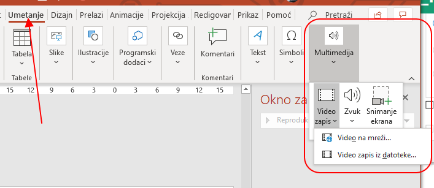
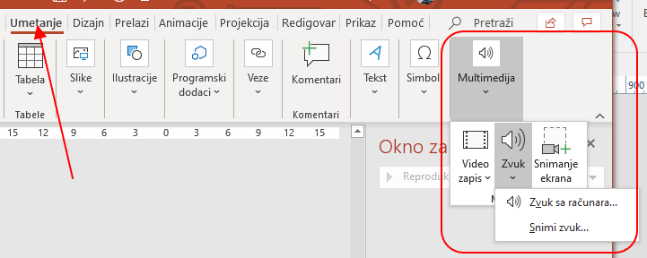
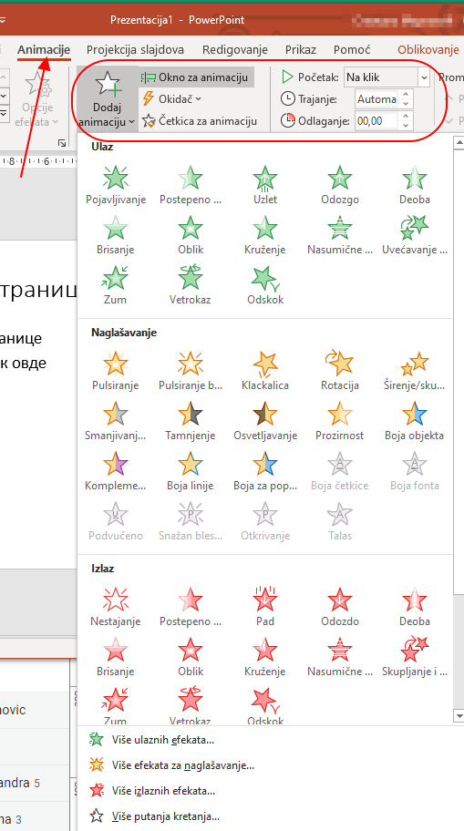
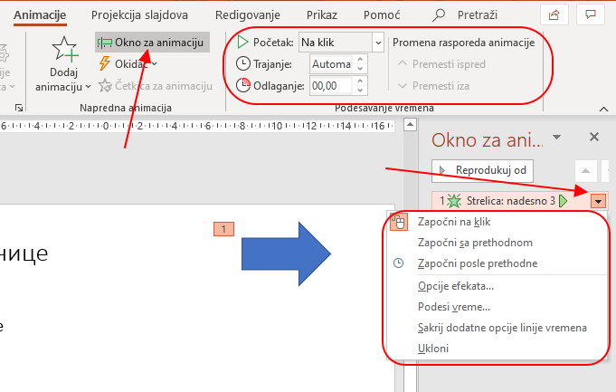
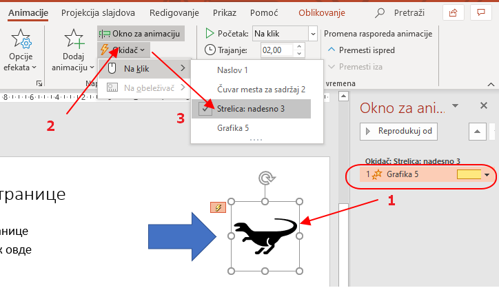

Напредне технике израде слајд презентација
==========================================

Под напредним техникама за израду презентације овде мислимо на израду интерактивних презентација и употребу анимација уз подешавање ефеката, времена и окидача. Ове анимације и ефекти не би требало да буду сами себи циљ, већ да помоћу њих креираш ефектну навигацију кроз презентацију или да илуструјеш неки појам који се боље објашњава уз употребу анимација и интеракције. 

Проучи ову лекцију, а онда прегледај и проучи како су направљене презентације дате кроз задатке на наредној страни.

Нелинеарне презентације
-----------------------

Уколико унутар презентације постоје хиперлинкови ка другим слајдовима (а не само ка слајду који непосредно следи), ка другим документима или чак ка веб-страницама, имамо такозвану "нелинеарну" презентацију. 

Хиперлинкови се убацују слично као у Ворду. Хиперлинк можеш, као и у Ворду, да ставиш на неку реч, али и на слику или неко "дугме" које нацрташ на слајду и на тај начин направиш навигацију у оквиру своје презентације.

Након што селектујеш објекат (1) на који желиш да ставиш хиперлинк, са траке алата "Уметање" (2) изабери алатку "Хиперлинк" (3) или алатку "Радња" (4): 

а онда у прозору који се отворио подеси куда ће водити хиперлинк:

односно неку другу радњу (покретање програма, репродукција звука и слично):

|

Уколико имаш "разгранату" презентацију и не желиш да се на неке слајдове дође линеарним проласком кроз презентацију, потребно је да такве слајдове "сакријеш" - hide slide

Мултимедија
-----------

Видео-клип можеш да уградиш са свог рачунара, али и са интернета без преузимања (под условом да је рачунар онлајн у току презентовања).

Звук може да се дода у слајд убацивањем уграђених ефеката или уградњом звучне датотеке.

Анимације
---------   

Са сваком новом верзијом програма Пауерпоинт, могућности су све веће. 

|

Нека те не збуни то што неке операције можеш да урадиш кроз различите меније и опције у њима:

Анимација неког објекта се најчешће подешава тако да се покрене кликом на тај објекат. Међутим, окидач (trigger) за неки ефекат може да буде и друга радња.

Примера ради, овде смо ефекат повећавања придружили диносаурусу (Grafika 5), али тај ефекат се активира кликом на стрелицу (Strelica: nadesno 3). Селектован је најпре диносаурус и додата му је анимација (1), а затим је додат окидач (2) као клик на стрелицу (3).

|

Уколико ти је потребно више детаља, погледај упутство `за употребу окидача у анимацијама <https://support.microsoft.com/sr-latn-rs/office/aktiviranje-efekta-animacije-651726d6-9454-4bfd-b8e5-11d84767a6da?ui=sr-latn-rs&rs=sr-latn-rs&ad=rs>`_. 

Ако желиш да знаш више, можда најбоље упутство за Пауерпоинт је направио управо произвођач овог софтвера, а налази се `на овом линку <https://support.microsoft.com/sr-latn-rs/office/obuka-za-powerpoint-za-windows-40e8c930-cb0b-40d8-82c4-bd53d3398787?wt.mc_id=otc_home&ui=sr-latn-rs&rs=sr-latn-rs&ad=rs>`_.

