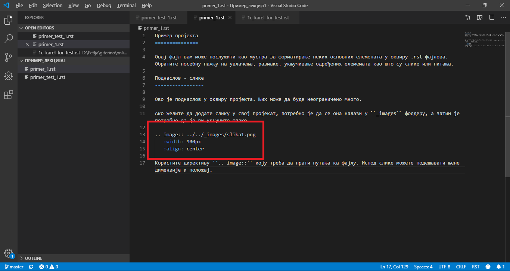

Наслов лекције
==============

Поднаслов лекције
-----------------

Пример писања текста

.. questionnote:: test1

 

   This is a qestionnote directive example

 

.. infonote:: test2

 

   This is a infonote directive example

Ако желите да додате слику у свој пројекат, потребно је да се она налази у ``_images`` фолдеру, а затим је потребно да је ви укључите овако 

Ако желите да се неки елемет приказује само када кликнете на њега, то можете урадити овако 

.. reveal:: sakrivanj
   :showtitle: Кликните овде за приказ
   :hidetitle: Сакриј прозор
   
   .. infonote:: Ову директиву сакривамо
    
        Унутар ове директиве налази се текст који треба приказати или сакрити. Обратите пажњу на назубљивање када се у оквиру одређених директива (у овом случају ``..reveal::``) налазе друге директиве (``..infonote``).

.. fillintheblank:: ppitanje
		    
      Колико пинова се налази на ивици микробита? aab (Написати број цифрамаaa) |blank|

      -     :25: Тачно!
            :x: Нетачно.

.. dragndrop:: dnd-ex-1
   :feedback: Feedback that is displayed if things are incorrectly matched.
   :match_1: Draggable element text|||Dropzone to be matched with text
   :match_2: Drag to Answer B|||Answer B
   :match_3: Draggable text|||Text of dropzone

   The question goes here.

.. parsonsprob:: pa-ex1

   Construct a block of code that correctly implements 
   the <b>accumulator</b> pattern.
   -----
   x = 0
   for i in range(10):
       x = x + 1

.. clickablearea:: ca-ex3
    :question: Click on all the statements that are part of the body of the while loop.  If you make a mistake you can click on the statement again to unhighlight it.
    :iscode:
    :feedback: Remember, the body of a loop is all the statements between the { and } after the while keyword or single statement following the while if there are no {}.
    
    :click-incorrect:int x = 5;:endclick:
    :click-incorrect:while (x > 0):endclick:
    :click-incorrect:{:endclick:
        :click-correct:System.out.println(x);:endclick:
        :click-correct:x = x - 1;:endclick:
    :click-incorrect:}:endclick:

.. clickablearea:: question1
   :question: Click the rainbow color(s)
   :iscode:

   :click-correct:Red:endclick:
   :click-incorrect:Gold:endclick:
   :click-correct:Blue:endclick:
   :click-incorrect:Black:endclick:   