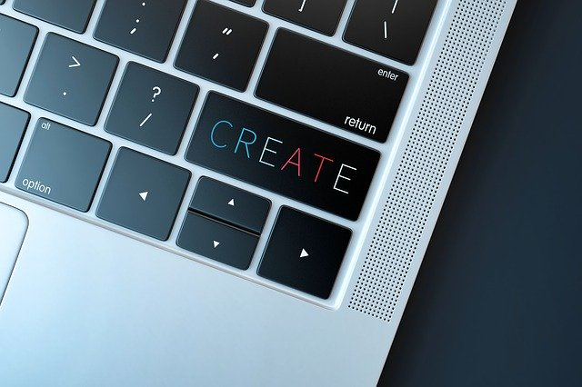

Креирање и уређивање дигиталних докумената
==========================================

|

- У оквиру ове теме ученици  се упознају са основама рада са дигиталним документима - текстовима и слајд-презентацијама.

- Ова тема изучава се 20 часова, односно 10 недеља.

|

Шта су дигитални документи?
---------------------------

Када на рачунару откуцаш и уредиш неки текст, направиш слику, презентацију, снимиш музику или видео, напишеш програм и то сачуваш на диску креирана је једна датотека или документ. Кажемо још и „дигитални документ” да би га разликовали од документа у папирном облику, јер је ово документ израђен и сачуван унутар дигиталног рачунара. О томе смо говорили на уводим часовима. 

У овој теми креираћемо дигиталне текстове и презентације. Најпре обичне текстове у једноставном текст-едитору, затим текстове „богатијег” изгледа у програму за обраду текста и то локално, на рачунару и „у облаку”.
Затим, креираћемо слајд-презентације. Да, презентације сте често правили у основној школи као домаће задатке из разних предмета. Сада ћеш научити неке напредније технике како да добијеш занимљиве, интерактивне презентације. И ове документе ћемо радити и локално и „у облаку”.
На крају упознаћемо те са једним занимљивим и корисним начином за запис текста који нам омогућује да правимо неке сложеније записе немњене математичким текстовима, веб страницама и Википедији.

